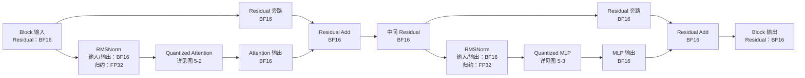
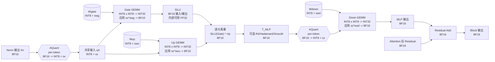

# LLM Quantization Notes

本文用于系统整理大语言模型量化相关知识，重点关注量化在真实推理系统中的作用，包括数据格式、量化原理、常见算法、权重与激活及 KV Cache 的计算路径、硬件算子支持、NPU 量化特性、量化工具链，以及算法精度与实际性能收益之间的关系。

本文是一份面向工程实践的知识总结，不以逐篇介绍量化论文为目标。对于每一种量化方案，重点回答以下问题：

1. 它要解决什么资源或精度问题？
2. 模型中的哪些张量被量化，使用什么数据格式？
3. 量化后的数据如何参与真实计算？
4. 硬件和推理框架是否存在对应的高性能算子？
5. 最终获得的是容量收益、带宽收益，还是实际端到端加速？

## 目录

1. [LLM 为什么需要量化](#chapter-1)
2. [数据精度格式与硬件支持](#chapter-2)
3. [量化的基本原理和分类](#chapter-3)
4. [量化痛点与常见量化算法](#chapter-4)
5. [LLM 量化对象与完整计算路径](#chapter-5)
6. [量化工具仓库：llm-compressor 与 msModelSlim](#chapter-6)

---

<a id="chapter-1"></a>

## 1. LLM 为什么需要量化

### 1.1 核心矛盾：模型规模增长快于单个设备的资源增长

大语言模型的能力通常会随着参数量、训练数据量和上下文长度的增长而提升，但模型规模的增长会直接增加推理阶段的存储、访存和计算成本。

一次完整的 LLM 推理主要消耗以下几类资源：

- **模型权重**：线性层、Embedding、LM Head 等参数需要常驻设备内存。
- **KV Cache**：保存历史 token 的 Key 和 Value，随 batch size 和上下文长度增长。
- **激活和中间结果**：包括 Q/K/V、Attention 输出、MLP 中间张量、Residual 等。
- **临时工作空间**：算子 workspace、图编译 buffer、通信 buffer、内存对齐和碎片等额外开销。
- **计算资源**：主要是 Attention 和 MLP 中的大量矩阵乘法。
- **数据搬运资源**：权重、激活和 KV Cache 需要在 HBM、Cache 和片上存储之间移动。

即使模型在 BF16 或 FP16 下能够装入设备内存，也不代表它能够以理想的并发和吞吐运行。推理服务还需要为 KV Cache、临时张量和多个并发请求预留空间。因此，LLM 部署面对的通常不是单一的“算力不足”，而是容量、带宽、算力和服务并发共同构成的系统瓶颈。

量化的基本思路是：用更少的 bit 表示模型中的权重、激活或 KV Cache，在允许一定数值误差的前提下，降低存储和计算成本。

```text
高精度张量（FP32/BF16/FP16）
              ↓ quantize
低精度张量（FP8/INT8/FP4/INT4/INT2 等）
```

量化不是简单地把一个浮点数截短，而是需要通过 scale、zero point、分组、截断范围和舍入策略，将原始数值映射到有限的低精度表示集合中。量化后的模型是否有用，取决于精度损失是否可接受，以及低精度格式能否被硬件算子高效执行。

### 1.2 模型权重带来的容量压力

对于一个包含 `P` 个参数的模型，仅权重的理论存储量可以近似写成：

```text
weight_memory = parameter_count * bits_per_parameter / 8
```

忽略 scale、zero point 和文件元数据时，不同精度下的理论权重占用如下：

| 模型规模 | BF16/FP16 | INT8/FP8 | INT4/FP4 | INT2 |
| ---: | ---: | ---: | ---: | ---: |
| 7B | 14 GB | 7 GB | 3.5 GB | 1.75 GB |
| 70B | 140 GB | 70 GB | 35 GB | 17.5 GB |
| 671B | 1.342 TB | 671 GB | 335.5 GB | 167.75 GB |

实际占用通常会高于表中的理论值，原因包括：

- Per-channel 或 per-group scale。
- 非对称量化使用的 zero point。
- Outlier 权重或回退层仍然以高精度保存。
- INT4、INT2 的 padding、packing 和对齐开销。
- 推理框架加载后的预打包权重和额外 workspace。
- MoE 模型虽然每个 token 只激活部分专家，但全部专家权重通常仍需存储。

尽管存在这些额外开销，权重量化仍能显著降低模型的部署门槛。例如，一个 BF16 权重约为 140 GB 的 70B 模型，理论上量化为 INT4 后权重约为 35 GB，使其有机会部署到更少的设备上，并为 KV Cache 和并发请求留下更多空间。

因此，权重量化带来的第一个直接收益是：**让原本无法加载或需要多卡部署的模型，在更小的硬件资源上运行。**

### 1.3 Decode 阶段常受到权重访存带宽限制

LLM 推理通常分为两个阶段：

- **Prefill**：并行处理输入 prompt 中的大量 token，矩阵规模较大，计算密度通常较高。
- **Decode**：每一步为每个请求生成一个或少量 token，需要逐层读取模型权重并执行较小的矩阵计算。

在 Decode 阶段，如果 batch size 较小，同一份权重每次从 HBM 读取后只能服务少量 token，计算单元可能无法被充分利用。此时性能往往更容易受到权重读取带宽限制，而不是只受到芯片峰值算力限制。

把权重从 BF16 压缩到 INT8 或 INT4 后，每次生成 token 所需搬运的权重字节数下降。即使低精度算子的理论计算吞吐没有完全发挥出来，仅减少 HBM 访存也可能改善 Decode 性能。

```text
BF16 weight: 2 bytes / parameter
INT8 weight: 1 byte  / parameter
INT4 weight: 0.5 byte / parameter（不含 scale 等元数据）
```

这也是 W4A16 等 weight-only 量化常用于 LLM Decode 的主要原因：激活仍使用 FP16/BF16，但以低 bit 保存权重，通过专用 kernel 在计算过程中完成权重解包、缩放和矩阵乘法。

需要注意，权重缩小 4 倍并不表示端到端推理一定加速 4 倍。实际收益还受到以下因素影响：

- INT4 解包和反量化开销。
- Scale 的读取和计算开销。
- 矩阵 shape 是否满足低精度 kernel 的对齐要求。
- 算子是否进行了 Quant/Dequant 和 epilogue 融合。
- Attention、通信、调度等非矩阵乘部分的耗时。
- Batch size 增大后，瓶颈可能从访存转为计算。

因此，权重量化首先保证的是**容量和带宽收益**，能否转化为延迟和吞吐收益，还要看真实算子实现。

### 1.4 激活量化可以使用更高吞吐的低精度矩阵计算

Weight-only 量化主要减少权重存储和读取量，而 W8A8、W4A8、W4A4 等方案会进一步量化激活，使矩阵乘法的两侧输入都使用低精度数据。

例如，典型 W8A8 Linear 的逻辑计算路径为：

```text
FP16/BF16 activation
        ↓ activation quantize
INT8 activation × INT8 weight
        ↓ INT32 accumulation
scale correction / dequantize / bias
        ↓
FP16/BF16 output
```

如果硬件原生支持 INT8、FP8、INT4 或 FP4 矩阵指令，激活与权重同时量化可以：

- 提高单位周期内完成的乘加操作数量。
- 减少输入张量的读取带宽。
- 降低片上 Buffer 占用。
- 在相同资源下处理更大的矩阵或更多 token。

但激活值依赖实际输入，且经常包含明显的 channel-wise 或 token-wise 离群值，因此激活通常比权重更难量化。静态激活量化虽然运行时开销较小，但容易受到数据分布变化影响；动态 per-token 量化精度更好，却需要在线计算 scale 并执行 Quantize。这也是 SmoothQuant、离群值抑制、旋转变换和动态量化等算法存在的主要原因。

### 1.5 长上下文使 KV Cache 成为重要瓶颈

自回归生成需要保留历史 token 的 Key 和 Value，避免每次 Decode 都重新计算整个上下文。KV Cache 的理论容量可以近似写成：

```text
kv_cache_memory =
    batch_size
  * sequence_length
  * num_layers
  * 2                 # K 和 V
  * num_kv_heads
  * head_dim
  * bytes_per_element
```

以一个具有 32 层、8 个 KV Heads、Head Dimension 为 128 的 GQA 模型为例，BF16 KV Cache 中每个 token、每个请求的理论占用为：

```text
32 * 2 * 8 * 128 * 2 bytes = 128 KiB
```

当上下文长度为 128K 时，单个请求的 KV Cache 理论上约为：

```text
128 KiB * 128K = 16 GiB
```

如果将 KV Cache 从 BF16 量化为 INT8，理论容量可以降低到约 8 GiB；量化为 4 bit 时约为 4 GiB。这里尚未计算 block metadata、scale、内存分配和对齐开销。

KV Cache 量化的收益不只体现在单个请求的显存占用上，还包括：

- 在相同显存中容纳更长的上下文。
- 提高可同时调度的请求数量。
- 扩大连续批处理的有效 batch size。
- 降低 Decode Attention 读取历史 K/V 的带宽。
- 降低 PD 分离场景中 KV Cache 的跨设备传输量。

与权重量化不同，KV Cache 是运行时动态生成的，因此需要考虑写入时如何量化、scale 如何保存、读取时是否反量化，以及 Attention 算子能否直接消费低精度 KV 数据。

### 1.6 量化可以降低多卡部署和服务化成本

当模型不能放入单个设备时，通常需要使用 Tensor Parallel、Pipeline Parallel 或 Expert Parallel。量化能够通过减少权重和运行时张量大小，间接降低分布式部署成本：

- 减少所需设备数量。
- 降低权重加载和模型启动时间。
- 减少 checkpoint 的磁盘空间和分发时间。
- 某些场景下降低 AllGather、AllReduce 或 AllToAll 的通信数据量。
- 为 Prefix Cache、Speculative Decoding、MTP 等其他优化保留更多设备内存。

不过，只有通信张量本身以低精度传输，并且量化、反量化开销能够被隐藏时，量化才会直接降低通信时间。仅量化模型权重并不会自动减少所有集合通信的数据量。

### 1.7 量化的主要好处

综合来看，LLM 量化可能带来以下收益：

1. 降低模型存储空间，量化后的 checkpoint 更小，能够减少磁盘占用、模型下载时间和部署分发成本。

2. 降低设备内存占用，压缩权重、激活或 KV Cache，使更大的模型、更长的上下文或更多并发请求能够进入设备内存。

3. 降低内存带宽压力，每次矩阵计算和 Attention 计算需要读取的字节数减少，尤其有利于 memory-bound 的 Decode 阶段。

4. 提高矩阵计算吞吐，在硬件具有原生低精度矩阵计算单元、推理框架具有对应 kernel 的条件下，INT8、FP8、INT4、FP4 等格式可以获得高于 FP16/BF16 的计算吞吐。

5. 提升服务吞吐和并发，显存占用降低后，可以扩大 batch size、增加 KV Cache block 数量，并同时调度更多请求。

6. 降低部署成本和能耗，更少的设备、更少的数据搬运和更高的单卡吞吐，可能降低单 token 的推理成本和能耗。

### 1.8 量化收益成立的前提

量化不是无条件加速。一个量化方案要产生实际价值，至少需要同时满足以下条件：

1. **精度可接受**：量化误差不能明显破坏模型的语言、推理、代码或长上下文能力。
2. **格式可部署**：量化权重的 packing、scale 和 zero point 格式能够被目标推理框架识别。
3. **算子有支持**：目标硬件上存在对应低精度 GEMM、Attention 或融合算子。
4. **计算路径不回退**：运行时不能频繁反量化为 FP16 后再调用普通浮点算子。
5. **负载适合**：batch size、矩阵 shape、输入输出长度和并发模式能够发挥低精度 kernel 的优势。
6. **端到端收益为正**：量化、反量化、布局转换和元数据处理开销没有抵消核心算子的收益。

因此，评估量化方案时需要依次回答三个问题：

```text
模型是否更小？
    ↓
低精度数据是否真正进入了低精度算子？
    ↓
端到端延迟、吞吐、并发或部署成本是否改善？
```

只回答第一个问题，只能证明模型被压缩；三个问题都得到肯定答案，才能说明量化真正改善了推理系统。

### 1.9 本节总结

LLM 需要量化，根本原因是模型参数量、上下文长度和服务并发的增长，使推理系统同时受到设备容量、内存带宽、计算吞吐和部署成本约束。

不同量化对象解决的主要问题并不完全相同：

| 量化对象 | 主要直接收益 | 典型方案 |
| --- | --- | --- |
| 权重 | 减少模型容量和权重访存 | W8A16、W4A16、W2A16 |
| 权重 + 激活 | 降低访存并使用低精度矩阵计算 | W8A8、W4A8、W4A4 |
| KV Cache | 降低长上下文和高并发时的缓存容量及读取带宽 | KV8、KV4、KV2 |
| 通信张量 | 减少多卡通信数据量 | FP8/INT8 collective |

从工程角度看，量化最确定的收益是减少存储容量和数据搬运量；计算加速则依赖硬件指令、算子实现、模型结构和实际推理负载。后续章节将在这个基础上继续介绍数据精度格式、量化数学原理、算法分类和完整低精度计算路径。

---

<a id="chapter-2"></a>

## 2. 数据精度格式与硬件支持

量化首先涉及一个基础问题：模型中的数值以什么格式保存和计算。

深度学习常用数值格式大致可以分为两类：

- **整数格式**：使用固定数量的 bit 表示离散整数，例如 INT8、INT4。
- **浮点格式**：使用符号、指数和尾数表示不同量级的实数，例如 FP32、BF16、FP8。

需要区分三个容易混淆的概念：

1. **存储格式**：数据在显存或模型文件中如何保存。
2. **输入格式**：矩阵计算单元接收什么格式的操作数。
3. **累加格式**：乘法结果以什么精度累加。

例如，W8A8 Linear 可以使用 INT8 权重和 INT8 激活，但通常使用 INT32 累加，最后再反量化为 FP16 或 BF16。W4A16 模型虽然以 INT4 保存权重，真实计算却可能先在 kernel 内解包或反量化，然后使用 FP16/BF16 矩阵计算。

### 2.1 整数格式的表示与计算

对于一个 `b` bit 无符号整数，其二进制表示为：

```text
b[b-1] b[b-2] ... b[1] b[0]
```

数值为：

```text
x = sum(b[i] * 2^i), i = 0, ..., b-1
```

表示范围为：

```text
[0, 2^b - 1]
```

有符号整数通常使用二进制补码：

```text
x = -b[b-1] * 2^(b-1) + sum(b[i] * 2^i), i = 0, ..., b-2
```

表示范围为：

```text
[-2^(b-1), 2^(b-1) - 1]
```

量化场景中的整数通常不是原始实数，而是实数经过 scale 和 zero point 映射后的编码：

```text
q = clamp(round(x / scale) + zero_point, q_min, q_max)

x_recovered = scale * (q - zero_point)
```

对于整数矩阵乘法：

```text
C_int32 = sum((q_a - z_a) * (q_w - z_w))

C ~= scale_a * scale_w * C_int32
```

实际算子通常会把 scale 修正、bias、激活函数和输出类型转换融合到 MatMul epilogue 中。

| 格式 | 表示方式 | 数值范围 | 训练场景 | 推理场景 |
| --- | --- | --- | --- | --- |
| INT32 | 32-bit 二进制补码 | `[-2^31, 2^31-1]` | 索引、计数和少量整数状态 | INT8/INT4 GEMM 累加、索引和 shape |
| INT16 | 16-bit 二进制补码 | `[-32768, 32767]` | 低精度优化器或通信实验 | 部分中间结果和信号处理 |
| INT8 | 8-bit 二进制补码 | `[-128, 127]` | 实验性低精度训练 | W8A8、W8A16、KV Cache INT8、低精度 GEMM |
| UINT8 | 8-bit 无符号整数 | `[0, 255]` | 较少直接参与训练计算 | 非对称量化、byte buffer、量化编码 |
| INT4 | 4-bit 二进制补码或 packed nibble | `[-8, 7]` | QAT 或低比特训练研究 | W4A16、W4A8、W4A4、权重压缩 |
| INT2 | 2-bit 编码 | `[-2, 1]`，也可自定义四级码本 | 极低比特 QAT 或码本训练 | W2A16、KV Cache 2-bit、极低容量部署 |

实际对称量化不一定使用整个补码范围。例如 INT8 对称量化经常使用 `[-127, 127]`，避免正负范围不对称；INT4 也可能使用 `[-7, 7]`。

INT4 和 INT2 通常以 packed 形式存储：

```text
1 byte = 2 个 INT4
1 byte = 4 个 INT2
```

但能够紧凑存储，不代表硬件一定能够直接执行 INT4 或 INT2 矩阵乘法。某些 kernel 会先解包到 INT8、FP16 或寄存器内部格式，再完成计算。

### 2.2 浮点格式的表示与计算

常规二进制浮点格式由三部分组成：

```text
sign | exponent | fraction
```

对于 normal number：

```text
x = (-1)^sign * 2^(exponent - bias) * (1 + fraction / 2^mantissa_bits)
```

对于 subnormal number：

```text
x = (-1)^sign * 2^(1 - bias) * (fraction / 2^mantissa_bits)
```

指数位越多，动态范围越大；尾数位越多，相邻可表示值之间的距离越小。

浮点矩阵计算通常采用低精度输入、高精度累加：

```text
FP16 * FP16 -> FP32 accumulate
BF16 * BF16 -> FP32 accumulate
FP8  * FP8  -> FP32 accumulate
FP4  * FP4  -> FP16/FP32 accumulate
```

具体累加格式由芯片指令和算子接口决定。

| 格式 | 表示方式 | 典型范围 | 训练场景 | 推理场景 |
| --- | --- | --- | --- | --- |
| FP32 | `S1E8M23` | 最大约 `3.4e38`，最小 normal 约 `1.18e-38` | Master weight、优化器、累加和敏感算子 | 敏感算子、累加、scale |
| TF32 | 内部约 `S1E8M10`，通常以 FP32 存储 | 动态范围接近 FP32 | NVIDIA Ampere 及以后矩阵训练 | 较少作为模型存储格式 |
| FP16 | `S1E5M10` | 最大 `65504`，最小 normal `2^-14` | 混合精度训练 | 通用推理权重和激活 |
| BF16 | `S1E8M7` | 动态范围接近 FP32 | LLM 主流训练格式 | LLM 推理权重、激活和输出 |
| FP8 E4M3 | `S1E4M3` | 最大常见为 `448`，最小 normal `2^-6` | 权重、激活和前向计算 | W8A8、FP8 GEMM |
| FP8 E5M2 | `S1E5M2` | 最大 `57344`，最小 normal `2^-14` | 梯度等大动态范围张量 | 部分激活、权重和通信张量 |
| FP4 E2M1 | `S1E2M1` | `0, +/-0.5, +/-1, +/-1.5, +/-2, +/-3, +/-4, +/-6` | FP4 训练的元素格式 | 通常配合 block scale 使用 |
| MXFP8 | 32 个 FP8 共享一个 E8M0 scale | 由 FP8 元素和 block scale 共同决定 | Blackwell 等平台的低精度训练 | 权重和激活 FP8 block 量化 |
| MXFP4 | 32 个 E2M1 共享一个 E8M0 scale | 由 E2M1 和 block scale 共同决定 | 极低比特训练研究 | 权重、激活和低比特 GEMM |
| NVFP4 | 16 个 E2M1 共享 E4M3 scale，张量再共享 FP32 scale | 由两级 scale 共同决定 | NVIDIA Blackwell FP4 训练 | NVIDIA Blackwell FP4 推理 |
| HiF8 | Dot field 决定指数和尾数长度 | 最大有限值 `32768`，最小正值 `2^-22` | Ascend 低精度训练 | Ascend 权重、激活和矩阵计算 |
| HiF4 | 64 个 S1P2 元素共享三级 scale | 理论约 `+/-344064`，最小正值约 `2^-50` | Ascend FP4 训练 | Ascend 低比特推理研究 |

FP8、FP4 等格式在模型量化中通常仍需额外 scale。浮点格式具有指数位，不代表它能够直接覆盖原始张量的全部动态范围。

### 2.3 MXFP8

#### 2.3.1 表示结构

MXFP8 是 OCP Microscaling 格式之一。一个 MXFP8 block 通常包含：

```text
1 个 E8M0 shared scale
+
32 个 FP8 values
```

元素可以使用 FP8 E4M3 或 FP8 E5M2。一个元素的逻辑值为：

```text
x_recovered[i] = 2^shared_exp * fp8_value[i]
```

E8M0 使用 8-bit exponent-only 编码：

```text
scale_code = shared_exp + 127
scale = 2^shared_exp
```

常用有限指数范围为：

```text
shared_exp in [-127, 127]
```

MXFP8 的存储开销为：

```text
32 * 8-bit FP8 + 8-bit E8M0
= 264 bits / block
= 8.25 bits / value
```

与一个 tensor 共享一个 scale 的普通 FP8 相比，MXFP8 每 32 个元素重新确定动态范围，能够降低局部离群值对整个张量的影响。

#### 2.3.2 MXFP8 伪量化代码

下面的代码模拟量化和反量化，不输出真实 packed E8M0 bit pattern。

```python
import torch


@torch.no_grad()
def quant_dequant_mxfp8(
    x: torch.Tensor,
    fp8_format: str = "e4m3",
) -> torch.Tensor:
    """MXFP8 pseudo quant-dequant along the last dimension."""
    if not x.is_floating_point():
        raise TypeError("x must be a floating-point tensor")

    if fp8_format == "e4m3":
        fp8_dtype = torch.float8_e4m3fn
        fp8_max = 448.0
    elif fp8_format == "e5m2":
        fp8_dtype = torch.float8_e5m2
        fp8_max = 57344.0
    else:
        raise ValueError("fp8_format must be 'e4m3' or 'e5m2'")

    dtype_ori = x.dtype
    x_fp32 = x.to(torch.float32)

    block_size = 32
    original_size = x_fp32.shape[-1]
    pad = (-original_size) % block_size

    if pad:
        pad_shape = list(x_fp32.shape)
        pad_shape[-1] = pad
        x_fp32 = torch.cat(
            [x_fp32, torch.zeros(pad_shape, device=x.device)],
            dim=-1,
        )

    blocks = x_fp32.reshape(*x_fp32.shape[:-1], -1, block_size)
    amax = blocks.abs().amax(dim=-1, keepdim=True)

    ideal_scale = amax / fp8_max
    shared_exp = torch.where(
        amax > 0,
        torch.ceil(torch.log2(ideal_scale)),
        torch.zeros_like(amax),
    ).clamp(-127, 127)

    shared_scale = torch.exp2(shared_exp)
    normalized = (blocks / shared_scale).clamp(-fp8_max, fp8_max)

    fp8_value = normalized.to(fp8_dtype)
    recovered = fp8_value.to(torch.float32) * shared_scale

    recovered = recovered.reshape(*x_fp32.shape)
    recovered = recovered[..., :original_size]
    return recovered.to(dtype_ori)
```

这段代码没有处理所有 NaN、Inf 和 E8M0 特殊编码，也没有生成硬件要求的 scale swizzle 布局，只用于观察 MXFP8 引入的数值误差。

### 2.4 MXFP4

#### 2.4.1 表示结构

MXFP4 使用：

```text
1 个 E8M0 shared scale
+
32 个 FP4 E2M1 values
```

元素格式为：

```text
FP4 E2M1 = 1 sign + 2 exponent + 1 mantissa
```

E2M1 可表示值集合为：

```text
0, +/-0.5, +/-1.0, +/-1.5, +/-2.0, +/-3.0, +/-4.0, +/-6.0
```

对于 normal number：

```text
value = (-1)^sign * (1 + mantissa / 2) * 2^(exponent - 1)
```

当 `exponent=00` 时使用 zero/subnormal 规则：

```text
value = (-1)^sign * mantissa / 2
```

一个 MXFP4 元素的逻辑值为：

```text
x_recovered[i] = 2^shared_exp * e2m1_value[i]
```

存储开销为：

```text
32 * 4-bit E2M1 + 8-bit E8M0
= 136 bits / block
= 4.25 bits / value
```

MXFP4 的主要问题是 32 个元素共享同一个 scale。当 block 内存在离群值时，大量小值可能只能映射为 0 或 0.5 倍 scale。

#### 2.4.2 MXFP4 伪量化代码

```python
import torch


@torch.no_grad()
def quant_dequant_mxfp4(x: torch.Tensor) -> torch.Tensor:
    """MXFP4 pseudo quant-dequant along the last dimension."""
    if not x.is_floating_point():
        raise TypeError("x must be a floating-point tensor")

    dtype_ori = x.dtype
    x_fp32 = x.to(torch.float32)

    block_size = 32
    original_size = x_fp32.shape[-1]
    pad = (-original_size) % block_size

    if pad:
        pad_shape = list(x_fp32.shape)
        pad_shape[-1] = pad
        x_fp32 = torch.cat(
            [x_fp32, torch.zeros(pad_shape, device=x.device)],
            dim=-1,
        )

    blocks = x_fp32.reshape(*x_fp32.shape[:-1], -1, block_size)
    amax = blocks.abs().amax(dim=-1, keepdim=True)

    # 7 是 6 与下一个理论 power-of-two 值 8 的舍入分界点。
    shared_exp = torch.where(
        amax > 0,
        torch.ceil(torch.log2(amax / 7.0)),
        torch.zeros_like(amax),
    ).clamp(-127, 127)

    shared_scale = torch.exp2(shared_exp)
    normalized = blocks / shared_scale

    abs_normalized = normalized.abs()
    sign = torch.sign(normalized)

    private_exp = torch.floor(
        torch.log2(abs_normalized.clamp_min(1.0e-30))
    ).clamp(min=0, max=2)

    scaled_mantissa = (
        abs_normalized * torch.exp2(-private_exp) * 2.0
    )
    rounded_mantissa = torch.floor(scaled_mantissa + 0.5)

    e2m1_value = (
        rounded_mantissa * 0.5 * torch.exp2(private_exp)
    ).clamp(max=6.0)
    e2m1_value = sign * e2m1_value

    recovered = e2m1_value * shared_scale
    recovered = recovered.reshape(*x_fp32.shape)
    recovered = recovered[..., :original_size]
    return recovered.to(dtype_ori)
```

这里的 `private_exp` 只是伪量化过程中的中间变量，不会作为额外 metadata 保存。真实 MXFP4 中，元素自身的 E2M1 bit pattern 已经包含 exponent 信息。

### 2.5 NVFP4

#### 2.5.1 表示结构

NVFP4 是 NVIDIA 为 Blackwell Tensor Core 设计的 FP4 block-scaled 格式。它和 MXFP4 一样使用 FP4 E2M1 作为元素格式，但 scale 结构不同。

一个基础 NVFP4 block 包含：

```text
16 个 FP4 E2M1 values
+
1 个 FP8 E4M3 block scale
```

除此之外，整个张量还共享一个 FP32 global scale。一个元素的逻辑值为：

```text
x_recovered[i] =
    e2m1_value[i]
    * e4m3_block_scale[block(i)]
    * fp32_global_scale
```

其中：

- `e2m1_value` 的取值集合为 `0, +/-0.5, +/-1, +/-1.5, +/-2, +/-3, +/-4, +/-6`。
- `e4m3_block_scale` 由相邻 16 个元素共享。
- `fp32_global_scale` 用于把整个张量的动态范围映射到 E4M3 block scale 能覆盖的范围内。

忽略每个张量只有一份的 FP32 global scale，NVFP4 的平均存储开销为：

```text
16 * 4-bit E2M1 + 8-bit E4M3 scale
= 72 bits / block
= 4.5 bits / value
```

相比 MXFP4，NVFP4 有两个主要变化：

1. Block size 从 32 减少到 16，scale 能更准确地匹配局部分布。
2. Block scale 从 exponent-only E8M0 改为带尾数的 E4M3，不再局限于 2 的幂。

这两个变化通常能够降低 FP4 量化误差，但代价是 scale metadata 从平均 `0.25 bit/value` 增加到 `0.5 bit/value`，同时 scale 计算和数据布局更复杂。

NVFP4 的格式定义和完整训练 recipe 也要区分：

- **NVFP4 数据格式**：E2M1 payload、E4M3 block scale 和 FP32 global scale。
- **NVFP4 训练 recipe**：在数据格式之外，还可能包含随机舍入、权重二维量化、Random Hadamard Transform、不同方向的 rowwise/columnwise scale，以及训练中的 amax 同步。

这些附加技术用于提高 FP4 训练稳定性，但不是单个 NVFP4 数值的 bit layout。

#### 2.5.2 两级 scale 如何确定

一种便于理解的量化流程是：

```text
原始张量 x
  |
  |-- 1. 计算 tensor amax
  |-- 2. 生成 FP32 global scale
  |-- 3. x / global scale
  |
  |-- 4. 每 16 个元素计算 block amax
  |-- 5. block_scale = block_amax / 6
  |-- 6. block_scale 量化为 FP8 E4M3
  |
  |-- 7. x / global_scale / block_scale
  |-- 8. 映射为 FP4 E2M1
  `-- 9. 保存 E2M1、E4M3 scale 和 FP32 scale
```

E2M1 最大有限值为 6，E4M3 最大有限值为 448，所以可以选择：

```text
global_scale ~= tensor_amax / (6 * 448)
```

这样，包含全局最大值的 block 所需 E4M3 scale 接近 448，其他 block 则根据自身 amax 获得更小的 E4M3 scale。

真实 NVIDIA Transformer Engine 会进一步考虑 scale margin、二维权重量化、转置方向、随机舍入和硬件所需的 scale swizzle 布局。因此，下面的代码只用于解释格式，不等同于 Transformer Engine 的生产实现。

#### 2.5.3 NVFP4 伪量化代码

```python
import torch


def _quant_dequant_e2m1(x: torch.Tensor) -> torch.Tensor:
    """Map normalized values to the FP4 E2M1 value set."""
    abs_x = x.abs()
    sign = torch.sign(x)

    private_exp = torch.floor(
        torch.log2(abs_x.clamp_min(1.0e-30))
    ).clamp(min=0, max=2)

    scaled_mantissa = abs_x * torch.exp2(-private_exp) * 2.0
    rounded_mantissa = torch.floor(scaled_mantissa + 0.5)

    value = rounded_mantissa * 0.5 * torch.exp2(private_exp)
    value = value.clamp(max=6.0)
    return sign * value


@torch.no_grad()
def quant_dequant_nvfp4(x: torch.Tensor) -> torch.Tensor:
    """Simplified NVFP4 pseudo quant-dequant.

    - 16 个 E2M1 values 共享一个 FP8 E4M3 block scale。
    - 整个 tensor 共享一个 FP32 global scale。
    - 使用确定性 round-to-nearest，不模拟随机舍入和 RHT。
    """
    if not x.is_floating_point():
        raise TypeError("x must be a floating-point tensor")

    dtype_ori = x.dtype
    x_fp32 = x.to(torch.float32)

    block_size = 16
    original_size = x_fp32.shape[-1]
    pad = (-original_size) % block_size

    if pad:
        pad_shape = list(x_fp32.shape)
        pad_shape[-1] = pad
        x_fp32 = torch.cat(
            [x_fp32, torch.zeros(pad_shape, device=x.device)],
            dim=-1,
        )

    tensor_amax = x_fp32.abs().amax()

    # E2M1 最大值为 6，E4M3 最大值为 448。
    # global_scale 使用 FP32 保存。
    global_scale = torch.where(
        tensor_amax > 0,
        tensor_amax / (6.0 * 448.0),
        torch.ones_like(tensor_amax),
    )

    blocks = x_fp32.reshape(*x_fp32.shape[:-1], -1, block_size)
    globally_scaled = blocks / global_scale

    block_amax = globally_scaled.abs().amax(dim=-1, keepdim=True)
    ideal_block_scale = block_amax / 6.0

    # E4M3 block scale 量化和反量化。
    block_scale = ideal_block_scale.clamp(0.0, 448.0)
    block_scale = block_scale.to(torch.float8_e4m3fn).to(torch.float32)

    nonzero_block = block_scale != 0
    safe_block_scale = torch.where(
        nonzero_block,
        block_scale,
        torch.ones_like(block_scale),
    )

    normalized = globally_scaled / safe_block_scale
    e2m1_value = _quant_dequant_e2m1(normalized)

    recovered = (
        e2m1_value
        * safe_block_scale
        * global_scale
    )
    recovered = torch.where(
        nonzero_block,
        recovered,
        torch.zeros_like(recovered),
    )

    recovered = recovered.reshape(*x_fp32.shape)
    recovered = recovered[..., :original_size]
    return recovered.to(dtype_ori)
```

这段伪量化代码没有模拟以下生产实现细节：

- Stochastic rounding。
- 权重的二维 16x16 scaling。
- Random Hadamard Transform。
- Rowwise 和 columnwise 两套量化结果。
- Scale padding、swizzle 和 Tensor Core layout。
- 分布式训练中的 global amax 同步。

NVIDIA Transformer Engine 对 NVFP4 的定义、布局和设备限制见：[NVFP4](https://docs.nvidia.com/deeplearning/transformer-engine/user-guide/features/low_precision_training/nvfp4/nvfp4.html)。

#### 2.5.4 NVFP4、MXFP4 与 HiF4 对比

| 对比项 | MXFP4 | NVFP4 | HiF4 |
| --- | --- | --- | --- |
| 元素格式 | FP4 E2M1 | FP4 E2M1 | S1P2 定点尾数 |
| Block size | 32 | 16 | 64 |
| Scale 结构 | 1 个 E8M0 | E4M3 block scale + FP32 tensor scale | E6M2 block scale + 两层 E1 micro-exponent |
| Scale 是否仅为 2 的幂 | 是 | 否，E4M3 带 3-bit mantissa | 粗 scale 带 mantissa，局部 scale 为 2 的幂 |
| Scale metadata | 8 bit / 32 values | 8 bit / 16 values + tensor FP32 | 32 bit / 64 values |
| 平均存储 | 4.25 bit/value | 4.5 bit/value + 极少量 global scale | 4.5 bit/value |
| 局部缩放粒度 | 32 | 16 | 8 和 4 两级局部粒度 |
| 主要优势 | 格式简单、metadata 少、power-of-two scale | Block 小、scale 精度高、适合 Blackwell FP4 Tensor Core | 大 block 下仍提供细粒度三级缩放 |
| 主要风险 | Block 内离群值影响较大 | Scale layout 和训练 recipe 更复杂 | Metadata 解码和三级缩放更复杂 |
| 主要硬件方向 | OCP MX、Ascend 950 MXFP4 | NVIDIA Blackwell | Ascend HiF4 NPU |

三种格式都接近每元素 4 bit，但它们解决动态范围问题的思路不同：

```text
MXFP4:
  小 metadata + 32 元素 power-of-two scale。

NVFP4:
  更小的 16 元素 block + 更精细的 E4M3 scale + tensor scale。

HiF4:
  64 元素共享粗 scale，再用两层 E1 在 block 内分级缩放。
```

因此，不能只根据“都是 FP4”就在不同硬件之间直接复用 checkpoint。三者的 scale、metadata、packing 和矩阵指令输入布局并不相同。

### 2.6 HiF8

#### 2.6.1 表示结构

HiFloat8/HiF8 是面向 Ascend NPU 的 8-bit tapered floating-point 格式。它不固定使用 E4M3 或 E5M2，而是根据数值的指数范围动态调整指数位和尾数位的数量。

整体结构为：

```text
sign | dot field | exponent field | mantissa field
```

Dot field 使用前缀编码：

| Dot 区域 | Dot code | Exponent bits | Mantissa bits | Exponent 范围 |
| --- | --- | ---: | ---: | --- |
| D4 | `11` | 4 | 1 | `+/-[8,15]` |
| D3 | `10` | 3 | 2 | `+/-[4,7]` |
| D2 | `01` | 2 | 3 | `+/-[2,3]` |
| D1 | `001` | 1 | 3 | `+/-1` |
| D0 | `0001` | 0 | 3 | `0` |
| DML | `0000` | 0 | 3 | denormal-like 区域 |

Normal value 为：

```text
value = (-1)^value_sign * 2^exponent * (1.mantissa)
```

DML 区域没有独立 exponent field，使用 mantissa code 扩展接近 0 的可表示范围：

```text
value = (-1)^value_sign * 2^(mantissa_code - 23)
mantissa_code in [1, 7]
```

对于 `Dk, k in [1,4]`，指数计算为：

```text
exponent_magnitude = 2^(k-1) + unsigned(exponent_offset)

exponent =
    +exponent_magnitude, if exponent_sign = 0
    -exponent_magnitude, if exponent_sign = 1
```

HiF8 同时存在两个符号概念：

- Value sign 决定整个数值的正负。
- Exponent sign 决定指数为正指数还是负指数。

HiF8 的设计特点是：

- 小、中等指数使用更多尾数位。
- 大指数使用更多指数位。
- 在 FP8 存储开销下同时兼顾动态范围和常用数值区间精度。
- 裸 HiF8 是逐元素格式，不自带 per-block shared scale。

典型边界为：

```text
最大有限正数：32768
最小正数：2^-22
abs(x) <= 2^-23：量化为 0
abs(x) >= 40960：量化为 Inf
```

详细定义可参考：[HiFloat8](https://arxiv.org/abs/2409.16626)。

#### 2.6.2 HiF8 伪量化代码

```python
import torch


@torch.no_grad()
def quant_dequant_hif8(x: torch.Tensor) -> torch.Tensor:
    """Map floating-point values to the HiF8 value set."""
    if not x.is_floating_point():
        raise TypeError("x must be a floating-point tensor")

    dtype_ori = x.dtype
    x_fp32 = x.to(torch.float32)
    abs_x = x_fp32.abs()

    underflow = abs_x <= 2.0**-23
    positive_overflow = x_fp32 >= 40960.0
    negative_overflow = x_fp32 <= -40960.0
    is_nan = torch.isnan(x_fp32)

    finite_path = ~(
        underflow
        | positive_overflow
        | negative_overflow
        | is_nan
    )

    safe_abs = torch.where(
        finite_path,
        abs_x,
        torch.ones_like(abs_x),
    )

    exponent = torch.floor(torch.log2(safe_abs))

    # 2^-23 以上的最小非零区间映射到 DML 的 exponent=-22。
    exponent = torch.where(
        exponent == -23,
        torch.full_like(exponent, -22),
        exponent,
    )

    abs_exponent = exponent.abs()
    mantissa_bits = torch.where(
        abs_exponent <= 3,
        torch.full_like(exponent, 3),
        torch.where(
            abs_exponent <= 7,
            torch.full_like(exponent, 2),
            torch.where(
                abs_exponent <= 15,
                torch.ones_like(exponent),
                torch.zeros_like(exponent),
            ),
        ),
    )

    step = torch.exp2(exponent - mantissa_bits)
    quantized_abs = torch.floor(safe_abs / step + 0.5) * step
    quantized = torch.sign(x_fp32) * quantized_abs

    out = x_fp32.clone()
    out = torch.where(finite_path, quantized, out)
    out = torch.where(underflow, torch.zeros_like(out), out)
    out = torch.where(
        positive_overflow,
        torch.full_like(out, torch.inf),
        out,
    )
    out = torch.where(
        negative_overflow,
        torch.full_like(out, -torch.inf),
        out,
    )
    return out.to(dtype_ori)
```

如果模型张量可能超过 HiF8 的固定范围，可以在 HiF8 外部增加 scale：

```text
q = HiF8(x / scale)
x_recovered = q * scale
```

这里的 scale 属于量化策略，不是裸 HiF8 元素编码的一部分。

### 2.7 HiF4

#### 2.7.1 表示结构

HiF4 是一种 hierarchical block floating-point 格式。它不是简单的 `S1E2M1`，而是由 64 个 4-bit S1P2 元素和三级共享 scale 组成。

一个 block 为：

```text
64 * S1P2 values
+
1 * E6M2 block scale
+
8 * E1 micro-exponents
+
16 * E1 micro-exponents
```

Metadata 总计：

```text
8-bit E6M2 + 8-bit E1 + 16-bit E1 = 32 bits
```

平均存储开销为：

```text
(64 * 4 + 32) / 64 = 4.5 bits / value
```

S1P2 不是浮点 E1M2，而是 sign-magnitude 定点尾数：

```text
sign | integer bit | 2 fraction bits
```

其数值为：

```text
value = (-1)^sign * magnitude_code / 4
```

可表示值为：

```text
0, +/-0.25, +/-0.50, +/-0.75,
   +/-1.00, +/-1.25, +/-1.50, +/-1.75
```

对 block 中第 `j` 个元素：

```text
x_recovered[j] =
    e6m2_block_scale
    * 2^e1_8[floor(j / 8)]
    * 2^e1_4[floor(j / 4)]
    * s1p2_value[j]
```

其中：

- 64 个元素共享一个 E6M2 scale。
- 每 8 个元素共享一个 E1 micro-exponent。
- 每 4 个元素共享另一个 E1 micro-exponent。
- 每个 E1 的取值为 0 或 1，对应乘数 1 或 2。
- 两级局部 scale 合并后为 1、2 或 4。

固定 block scale 为 `S` 时：

```text
最大绝对值 = 1.75 * 4 * S = 7S
最小正值 = 0.25S
```

HiF4 的详细设计可参考：[HiFloat4](https://arxiv.org/abs/2602.11287)。

#### 2.7.2 HiF4 伪量化代码

```python
import torch


def _quant_dequant_e6m2_positive(
    scale: torch.Tensor,
) -> torch.Tensor:
    """Pseudo quantize positive scales to an E6M2-like grid."""
    nonzero = scale > 0
    safe_scale = torch.where(
        nonzero,
        scale,
        torch.ones_like(scale),
    )

    exponent = torch.floor(torch.log2(safe_scale)).clamp(-48, 15)

    quantized = (
        torch.round(safe_scale * torch.exp2(2.0 - exponent))
        * torch.exp2(exponent - 2.0)
    )

    max_finite = 1.5 * 2.0**15
    min_finite = 2.0**-48
    quantized = quantized.clamp(min=min_finite, max=max_finite)

    return torch.where(
        nonzero,
        quantized,
        torch.zeros_like(quantized),
    )


@torch.no_grad()
def quant_dequant_hif4(x: torch.Tensor) -> torch.Tensor:
    """HiF4 pseudo quant-dequant along the last dimension."""
    if not x.is_floating_point():
        raise TypeError("x must be a floating-point tensor")

    dtype_ori = x.dtype
    x_fp32 = x.to(torch.float32)

    block_size = 64
    original_size = x_fp32.shape[-1]
    pad = (-original_size) % block_size

    if pad:
        pad_shape = list(x_fp32.shape)
        pad_shape[-1] = pad
        x_fp32 = torch.cat(
            [x_fp32, torch.zeros(pad_shape, device=x.device)],
            dim=-1,
        )

    # 64 = 8 * 2 * 4
    blocks = x_fp32.reshape(
        *x_fp32.shape[:-1], -1, 8, 2, 4
    )

    abs_blocks = blocks.abs()
    sign = torch.sign(blocks)

    max_4 = abs_blocks.amax(dim=-1, keepdim=True)
    max_8 = max_4.amax(dim=-2, keepdim=True)
    max_64 = max_8.amax(dim=-3, keepdim=True)

    # S1P2 最大值为 1.75，两层 E1 最大倍率为 4。
    base_scale = _quant_dequant_e6m2_positive(max_64 / 7.0)
    safe_base_scale = torch.where(
        base_scale > 0,
        base_scale,
        torch.ones_like(base_scale),
    )

    # 每 8 个元素一个 E1；ratio >= 4 时选择 scale 2。
    exponent_8 = (
        max_8 / safe_base_scale >= 4.0
    ).to(torch.float32)
    scale_8 = torch.exp2(exponent_8)

    # 每 4 个元素一个 E1；ratio >= 2 时选择 scale 2。
    exponent_4 = (
        max_4 / (safe_base_scale * scale_8) >= 2.0
    ).to(torch.float32)
    scale_4 = torch.exp2(exponent_4)

    total_scale = safe_base_scale * scale_8 * scale_4

    mantissa = abs_blocks / total_scale
    mantissa = torch.floor(mantissa * 4.0 + 0.5) / 4.0
    mantissa = mantissa.clamp(max=1.75)

    recovered = sign * mantissa * total_scale
    recovered = recovered.reshape(*x_fp32.shape)
    recovered = recovered[..., :original_size]
    return recovered.to(dtype_ori)
```

该实现仅模拟三级缩放和 S1P2 量化误差，没有输出真实 E6M2、E1 和 S1P2 bit pattern，也没有实现硬件矩阵布局。

### 2.8 GPU 支持的数据格式

以下表格中的“原生”是指对应架构的矩阵单元能够直接接收该格式，不代表所有框架和所有矩阵 shape 都有高性能实现。

| GPU | 原生矩阵计算格式 | 低比特部署说明 | MXFP8 | FP4/MXFP4/NVFP4 |
| --- | --- | --- | --- | --- |
| NVIDIA A100 | FP64、TF32、BF16、FP16、INT8、INT4、INT1 | INT4 可原生计算；W4A16 也可能使用专用 weight-only kernel | 不原生支持 | 不原生支持 FP4/MXFP4/NVFP4 |
| NVIDIA H100 | FP64、TF32、BF16、FP16、FP8 E4M3/E5M2、INT8 | INT4 checkpoint 可通过 Marlin/CUTLASS 等 kernel 部署，但 H100 官方 MMA 格式列表不包含 INT4 | 不原生支持 OCP MXFP8；可以使用普通 FP8 或 Hopper FP8 block scaling | 不原生支持 FP4 |
| NVIDIA B200 | FP64、TF32、BF16、FP16、FP8、INT8、FP4 类格式 | 面向 FP8/FP4 微缩放计算 | 原生支持 | NVIDIA 主要原生方案是 NVFP4；OCP MXFP4 是否可用取决于 cuBLAS/CUTLASS/推理框架实现 |

A100 官方架构资料列出了 FP16、BF16、TF32、FP64、INT8、INT4 和 INT1 Tensor Core 路径：[NVIDIA A100 architecture](https://www.nvidia.com/content/dam/en-zz/Solutions/Data-Center/nvidia-ampere-architecture-whitepaper.pdf)。

H100 的官方 MMA 格式包括 FP8、FP16、BF16、TF32、FP64 和 INT8，没有列出 INT4：[NVIDIA Hopper architecture](https://developer.nvidia.com/blog/nvidia-hopper-architecture-in-depth/)。

Blackwell 的 Transformer Engine 当前明确支持 MXFP8 和 NVFP4：[NVIDIA Transformer Engine](https://docs.nvidia.com/deeplearning/transformer-engine/user-guide/)。

这里需要特别注意：

```text
A100 的 INT4
!= H100 上运行的 W4A16
!= B200 的 FP4/NVFP4
!= OCP MXFP4
```

它们虽然都使用约 4 bit payload，但数值编码、scale 结构、矩阵指令和 kernel 路径不同。

### 2.9 Ascend NPU 支持的数据格式

| NPU | 公开矩阵计算格式 | MXFP8 | MXFP4 | HiF8 | HiF4 |
| --- | --- | --- | --- | --- | --- |
| Ascend 910B / Atlas A2 | FP32/HF32、FP16、BF16、INT8、INT4 | 无公开原生支持 | 无公开原生支持 | 无公开原生 Cube MatMul 支持 | 无公开原生支持 |
| Ascend 910C / Atlas A3 | FP32/HF32、FP16、BF16、INT8、INT4 | 无公开原生支持 | 无公开原生支持 | 无公开原生 Cube MatMul 支持 | 无公开原生支持 |
| Ascend 950PR/950DT | FP32/HF32、FP16、BF16、FP8、INT8，以及新一代微缩放格式 | 官方公布支持 | 官方公布支持 | 官方公布支持 | 官方公开路线图未将 HiF4 列为 Ascend 950 格式 |
| Ascend 960（规划） | 在 Ascend 950 格式基础上扩展 | 规划支持 | 规划支持 | 规划支持 | 官方路线图中首次明确支持 |

当前 Ascend C 文档中，Atlas A2/A3 的 MatMul 输入包括 FP16、BF16、FP32、INT8 和 INT4；新一代 351x 架构增加了 FP8 E4M3/E5M2 和 HiF8 MatMul，但不应仅根据类型定义就推断某个产品支持所有计算组合：[Ascend C MatMul 数据类型](https://www.hiascend.com/document/detail/zh/CANNCommunityEdition/900beta2/opdevg/Ascendcopdevg/atlas_ascendc_compatibility_10_00006.html)。

华为公布的 Ascend 950 路线包括 FP8、MXFP8、HiF8 和 MXFP4；其中 950PR 面向 Prefill，950DT 更偏 Decode 和训练。公开路线图将 HiF4 放在后续 Ascend 960，而不是 Ascend 950：[Ascend 950/960 roadmap](https://www.huawei.com/cn/news/2025/9/hc-xu-keynote-speech)。

因此，HiF4 在文档中需要分成两层描述：

- **格式与算法层面**：HiF4 已有公开定义、伪量化算法和训练/推理研究。
- **产品部署层面**：不能直接写成 Ascend 910B、910C 或 950 已经普遍支持 HiF4 原生矩阵计算，需要绑定具体芯片、CANN 版本和算子接口。

### 2.10 本节总结

整数和浮点量化的根本差异是：

```text
整数：
  用 scale 和 zero point 把实数映射到等间隔整数网格。

浮点：
  元素自身包含指数和尾数，量化间隔随数值量级变化。

Block-scaled 浮点：
  元素使用低精度浮点，同时由一组元素共享额外 scale。
```

重点低精度浮点格式的结构如下：

| 格式 | 元素格式 | Scale 结构 | Block size | 平均存储 |
| --- | --- | --- | ---: | ---: |
| MXFP8 | FP8 E4M3/E5M2 | 1 个 E8M0 | 32 | 8.25 bit/value |
| MXFP4 | FP4 E2M1 | 1 个 E8M0 | 32 | 4.25 bit/value |
| NVFP4 | FP4 E2M1 | E4M3 block scale + FP32 tensor scale | 16 | 4.5 bit/value + global scale |
| HiF8 | Tapered FP8 | 裸格式无共享 scale | 1 | 8 bit/value |
| HiF4 | S1P2 | E6M2 + 两层 E1 | 64 | 4.5 bit/value |

选择数据格式时不能只比较 bit 数，还需要同时考虑：

- 动态范围和有效精度。
- Scale 数量和粒度。
- Scale metadata 的实际存储开销。
- 量化与反量化成本。
- 硬件是否存在原生矩阵指令。
- 推理框架是否存在对应的 packing 和高性能 kernel。
- 输入 shape、矩阵布局和 scale layout 是否符合硬件要求。

---

<a id="chapter-3"></a>

## 3. 量化的基本原理和分类

量化的本质是把原本连续或高精度的数值，投影到一个更小的离散表示集合中：

```text
原始值 x
  -> quantize
低精度编码 q
  -> dequantize
近似值 x_recovered
```

这个过程通常是有损的：

```text
x_recovered != x
```

量化算法的目标不是让每个元素都完全恢复，而是在满足存储格式和硬件计算约束的条件下，让量化误差对模型最终输出的影响尽可能小。

从工程上看，一个完整量化方案至少需要确定以下内容：

1. 量化哪些张量：权重、激活、KV Cache 或通信张量。
2. 使用什么低精度格式：INT8、INT4、FP8、FP4 等。
3. 如何选择 scale、zero point 和截断范围。
4. 多大范围的元素共享一组量化参数。
5. 量化参数离线计算还是运行时动态计算。
6. 矩阵乘法使用什么输入和累加格式。
7. 哪些敏感层保留高精度或使用更高 bit。

### 3.1 量化、反量化与伪量化

量化过程可以抽象为两个函数：

```text
q = Q(x)
x_recovered = DQ(q)
```

其中：

- `Q` 是 Quantize，把高精度值变成低精度编码。
- `DQ` 是 Dequantize，把低精度编码解释回近似浮点值。
- `Q -> DQ` 合起来称为 Quant-Dequant 或 QDQ。

量化研究和实际部署中常见三种状态：

#### 1. Fake Quantization

```text
FP16/FP32 x
  -> 模拟量化
FP16/FP32 x_recovered
```

Fake Quantization 只把数值映射到低精度可表示集合，结果仍以 FP16、BF16 或 FP32 保存和计算。它适合：

- 评估量化误差。
- QAT 前向传播。
- 搜索 scale、clipping range 和敏感层。
- 在没有目标硬件时验证算法。

Fake Quantization 不能证明模型已经获得真实的存储或计算收益。

#### 2. Packed Quantization

```text
INT4/FP4 payload + scale metadata
```

低精度编码被真正压缩保存，例如两个 INT4 放入一个 byte。它能够减少模型文件和显存占用，但计算时可能需要先解包或反量化。

#### 3. Native Low-precision Computation

```text
低精度输入
  -> 硬件低精度矩阵指令
高精度 accumulator
  -> epilogue / dequantize
输出
```

只有低精度数据真正进入硬件矩阵指令或高效融合 kernel，量化才可能获得计算吞吐收益。

### 3.2 整数线性量化

最常见的整数线性量化也叫 uniform affine quantization。它把一段连续实数范围均匀映射到整数网格。

对 `b` bit 有符号整数：

```text
q_min = -2^(b-1)
q_max =  2^(b-1) - 1
```

量化和反量化公式为：

```text
q = clamp(round(x / scale) + zero_point, q_min, q_max)

x_recovered = scale * (q - zero_point)
```

相邻两个反量化值之间的间距等于 `scale`：

```text
..., -2*scale, -scale, 0, scale, 2*scale, ...
```

因此，scale 越大，表示范围越大，但量化网格越粗；scale 越小，局部精度越高，但更容易发生溢出和截断。

### 3.3 对称量化

对称量化令：

```text
zero_point = 0
```

量化范围关于 0 对称。通常先计算：

```text
abs_max = max(abs(x_min), abs(x_max))
```

对于常见的窄范围对称量化：

```text
q_max = 2^(b-1) - 1
q_min = -q_max

scale = abs_max / q_max
```

量化公式简化为：

```text
q = clamp(round(x / scale), -q_max, q_max)
x_recovered = scale * q
```

对称量化的优点是：

- 真实值 0 精确映射到整数 0。
- 不需要在矩阵乘法中处理复杂的 zero-point 修正项。
- 更容易映射到 INT8、INT4 GEMM。
- 权重分布通常以 0 为中心，适合使用对称量化。

缺点是当原始分布明显不对称时，一侧整数范围可能被浪费。

以范围 `[-2, 2]` 为例：

```text
INT8 scale = 2 / 127 ~= 0.01575
INT4 scale = 2 / 7   ~= 0.28571
```

对输入 `x=0.5`：

```text
INT8:
  q = round(0.5 / 0.01575) = 32
  x_recovered ~= 0.50394

INT4:
  q = round(0.5 / 0.28571) = 2
  x_recovered ~= 0.57143
```

bit 数越低，量化网格通常越粗，相同数值的恢复误差越大。

### 3.4 非对称量化

非对称量化允许 `zero_point` 不为 0，用完整整数范围覆盖 `[x_min, x_max]`：

```text
scale = (x_max - x_min) / (q_max - q_min)

zero_point = round(q_min - x_min / scale)
zero_point = clamp(zero_point, q_min, q_max)
```

量化公式仍然是：

```text
q = clamp(round(x / scale) + zero_point, q_min, q_max)
x_recovered = scale * (q - zero_point)
```

非对称量化的优点是：

- 能够充分利用全部整数编码。
- 更适合非零中心或只有正值的分布。
- 在相同 bit 数下可能获得更小的张量重构误差。

缺点是矩阵乘法更复杂。对两个非对称量化矩阵：

```text
sum((q_a - z_a) * (q_w - z_w))

= sum(q_a * q_w)
  - z_w * sum(q_a)
  - z_a * sum(q_w)
  + K * z_a * z_w
```

这些修正项会增加计算、预处理或 kernel 融合难度。因此，高性能矩阵计算通常更偏好对称权重，激活是否使用非对称量化则取决于硬件和算法实现。

### 3.5 整数量化参考代码

下面是一个 per-tensor INT 伪量化参考实现。它返回反量化浮点值和量化参数，不进行 bit packing。

```python
import torch


@torch.no_grad()
def quant_dequant_int(
    x: torch.Tensor,
    bits: int = 8,
    symmetric: bool = True,
):
    """Per-tensor affine integer pseudo quant-dequant."""
    if bits < 2 or bits > 16:
        raise ValueError("bits must be in [2, 16]")
    if not x.is_floating_point():
        raise TypeError("x must be a floating-point tensor")

    x_fp32 = x.to(torch.float32)

    if symmetric:
        q_max = 2 ** (bits - 1) - 1
        q_min = -q_max

        abs_max = x_fp32.abs().amax()
        scale = torch.where(
            abs_max > 0,
            abs_max / q_max,
            torch.ones_like(abs_max),
        )
        zero_point = torch.zeros_like(scale)
    else:
        q_min = -(2 ** (bits - 1))
        q_max = 2 ** (bits - 1) - 1

        x_min = x_fp32.amin()
        x_max = x_fp32.amax()
        value_range = x_max - x_min

        scale = torch.where(
            value_range > 0,
            value_range / (q_max - q_min),
            torch.ones_like(value_range),
        )
        zero_point = torch.round(q_min - x_min / scale)
        zero_point = zero_point.clamp(q_min, q_max)

    q = torch.round(x_fp32 / scale) + zero_point
    q = q.clamp(q_min, q_max)

    recovered = scale * (q - zero_point)
    return recovered.to(x.dtype), q, scale, zero_point
```

### 3.6 浮点与 block-scaled 量化

浮点量化和整数线性量化的主要区别是：浮点量化网格不是等间距的。

```text
靠近 0：相邻值间距较小。
绝对值增大：相邻值间距也随 exponent 增大。
```

裸 FP8、HiF8 等逐元素格式可以抽象为：

```text
q = nearest_representable_float(x)
```

带外部 scale 时：

```text
q = nearest_representable_float(x / scale)
x_recovered = scale * q
```

MXFP8、MXFP4、NVFP4、HiF4 等 block-scaled 格式还需要：

```text
1. 将张量划分为 block。
2. 为每个 block 或子 block 计算 scale。
3. 使用 scale 归一化 block。
4. 将归一化结果映射为低精度 payload。
5. 同时保存 payload 和 scale metadata。
```

因此，浮点格式虽然没有整数 zero point，但仍然存在 scale 选择、截断、舍入和 scale 共享误差。

### 3.7 量化误差来自哪里

量化误差可以写成：

```text
error = x_recovered - x
```

它主要来自以下几个方面。

#### 1. 舍入误差

原始值位于两个可表示值之间时，需要舍入到其中一个值：

```text
x = 0.53
可表示值 = {0.50, 0.75}
x_recovered = 0.50
```

常见舍入方式包括：

- Round to nearest even。
- Round half away from zero。
- Stochastic rounding。
- Learned/optimized rounding。

#### 2. 截断误差

输入超出量化范围时会被 clamp：

```text
x > x_max -> x_recovered = x_max_quantized
x < x_min -> x_recovered = x_min_quantized
```

扩大范围可以减少截断，但会增大量化步长和普通数值的舍入误差。

#### 3. Scale 估计误差

Scale 由校准数据计算。如果校准数据不能代表真实输入，线上激活可能超出范围或只使用量化网格的一小部分。

#### 4. Scale 共享误差

Per-tensor、per-group 和 block-scaled 量化会让多个元素共享 scale。一个离群值可能增大整个 group 的 scale，使其他小值的有效精度下降。

#### 5. Zero-point 和 scale 自身的量化误差

MXFP、NVFP4、HiF4 等格式的 scale 本身也使用低精度格式保存。即使 ideal scale 很准确，编码后的 scale 仍可能产生误差。

#### 6. 误差在网络中的传播

单层输出误差会成为下一层的输入误差，并经过残差连接、非线性函数、Attention score 和 Softmax 继续传播。元素级 MSE 较小，不代表最终生成结果一定不变。

### 3.8 量化范围与 clipping 的取舍

对于均匀量化，量化级别数量约为：

```text
levels = 2^bits
```

量化步长近似为：

```text
step = (clip_max - clip_min) / (levels - 1)
```

于是存在一个基本矛盾：

```text
范围太大：
  clipping 少，但 step 大，舍入误差大。

范围太小：
  step 小，普通值更精确，但 outlier 被截断。
```

MinMax、Percentile、MSE、Histogram/KL 等校准方法，本质上都在寻找这个取舍。常见优化目标包括：

- 张量 MSE。
- Layer output reconstruction error。
- Cosine similarity。
- KL divergence。
- 最终任务精度或困惑度。

对于 LLM，激活离群值往往集中在少数 channel。只依赖全张量 MinMax 容易让这些离群值控制 scale，这也是 SmoothQuant、AWQ、旋转变换和 outlier 分离方法所要解决的基础问题。

### 3.9 量化粒度

量化粒度表示多少元素共享一组 scale 和 zero point。粒度越细，通常越能贴合局部数值分布，但量化参数和运行时开销也越大。

| 粒度 | 参数共享范围 | 常见对象 | 优点 | 代价 |
| --- | --- | --- | --- | --- |
| Per-tensor | 整个张量 | 静态激活、简单 PTQ | Scale 最少、kernel 简单 | 容易受全局 outlier 影响 |
| Per-channel | 一个 channel | Linear/Conv 权重 | 权重精度通常较好 | 需要按 channel 读取 scale |
| Per-group | 一个 channel 内若干连续元素 | INT4/INT2 权重 | 比 per-channel 更适合低 bit | Scale metadata 和反量化成本增加 |
| Per-token | 一个 token 的 hidden vector | 动态激活 | 适应 token 间动态范围变化 | 运行时需要计算 scale |
| Per-head | 一个 Attention/KV head | KV Cache、Attention | 适应不同 head 的分布 | Attention kernel 更复杂 |
| Per-block | 固定大小矩阵块 | MXFP、NVFP4、HiF4 | 适合硬件 tile 和局部动态范围 | 需要 block scale 和特定 layout |

对于形状为：

```text
weight:     [out_features, in_features]
activation: [num_tokens, in_features]
```

常见规则是：

```text
Per-channel weight:
  每个 out_features row 共享一个 scale。

Per-group weight:
  每个 row 沿 in_features 每 group_size 个元素共享一个 scale。

Per-token activation:
  每个 token row 共享一个动态 scale。
```

对 KV Cache：

```text
KV shape ~= [batch, kv_head, sequence, head_dim]
```

可以沿不同维度量化：

- Per-token：一个 token 的 Head Dimension 共享 scale。
- Per-channel：同一 channel 在多个 token 间共享 scale。
- Per-head：一个 head 使用独立量化参数。
- Per-block：若干 token 或若干 channel 组成一个 block。

“Per-channel”必须结合张量 shape 和量化轴解释，仅写名称可能产生歧义。

### 3.10 静态量化与动态量化

静态和动态描述的是量化参数何时确定。

#### 静态量化

```text
校准阶段统计数值范围
  -> 保存固定 scale/zero point
  -> 推理时直接使用
```

优点：

- 推理时不需要重新统计 amax。
- Quantize 更容易与前置算子融合。
- Scale 数量固定，算子实现简单。

缺点：

- 依赖校准数据。
- 输入分布变化时可能发生溢出或精度下降。
- 单个固定 scale 难以适应不同 token 的动态范围。

#### 动态量化

```text
运行时读取当前输入
  -> 计算 min/max 或 amax
  -> 生成 scale
  -> 立即量化和计算
```

优点：

- 能够适应每个请求、token 或 block 的实际分布。
- 激活量化精度通常高于粗粒度静态量化。
- 对校准数据的依赖较小。

缺点：

- 在线 reduction 和 scale 计算产生额外开销。
- 增加 kernel 数量或融合难度。
- Decode 小 batch 下，动态量化开销可能占比较高。

| 量化对象 | 常见静态/动态方式 |
| --- | --- |
| 权重 | 通常离线静态量化；推理期间权重不变化 |
| 激活 | 可以静态 per-tensor，也可以动态 per-token/per-block |
| KV Cache | K/V 生成时动态量化，scale 随 token/head/block 保存 |
| 通信张量 | 通信前动态计算 scale，接收后反量化 |

动态量化不等于动态修改模型权重。它通常只是运行时根据当前激活计算量化参数。

### 3.11 校准

校准是在不更新或少量更新模型参数的情况下，通过一组代表性输入收集权重和激活统计信息。

典型流程是：

```text
准备 calibration dataset
  -> 执行若干次浮点 forward
  -> observer 收集 min/max、amax 或 histogram
  -> 计算 scale、zero point 和 clipping range
  -> 执行 fake quant 验证
  -> 保存量化参数
```

常见 observer 包括：

- MinMax observer。
- Moving average MinMax。
- Percentile observer。
- Histogram observer。
- MSE search observer。

校准数据应尽量覆盖真实应用分布，例如：

- 中文、英文和多语言比例。
- 对话、代码、数学等任务类型。
- 短 prompt 和长上下文。
- MoE 模型的不同 routed experts。
- 多模态模型的不同输入模态。

校准集过小可能不能覆盖分布，过大则增加量化时间，但不一定持续改善精度。关键在于代表性而不是单纯的数据量。

### 3.12 量化矩阵乘法的基本计算路径

#### W8A8

对于激活矩阵 `A` 和权重矩阵 `W`：

```text
A ~= scale_a * Q_a
W ~= scale_w * Q_w
```

则：

```text
Y = A * W^T
  ~= scale_a * scale_w * (Q_a * Q_w^T)
```

典型计算路径为：

```text
FP16/BF16 activation
  -> Quantize activation
INT8 activation
  + INT8 weight
  -> INT8 GEMM
INT32 accumulator
  -> multiply scale_a * scale_w
  -> add bias / activation / residual
FP16/BF16 output
```

当激活使用 per-token scale、权重使用 per-channel scale 时：

```text
scale_a shape = [num_tokens, 1]
scale_w shape = [1, out_features]

output_scale[m, n] = scale_a[m] * scale_w[n]
```

Epilogue 需要对输出矩阵应用这个二维可广播的 scale 组合。

#### W4A16

W4A16 中激活不量化为 4 bit：

```text
FP16/BF16 activation
  + packed INT4/FP4 weight
  -> 解包、反量化或专用 mixed-input kernel
  -> accumulator
FP16/BF16 output
```

它主要减少权重容量和读取带宽，不等同于 W4A4 原生低精度矩阵计算。

#### Requantization

如果下一层仍需要低精度输入，当前层输出可以再次量化：

```text
INT32 accumulator
  -> dequant scale
  -> bias / activation
  -> output quant scale
INT8 output
```

若这些步骤没有融合，频繁的高低精度转换可能抵消量化收益。

### 3.13 按量化阶段分类

#### 1. Post-Training Quantization，PTQ

PTQ 在模型训练完成后执行，通常只需要少量校准数据，不进行完整训练。

PTQ 内部还可以分为：

- **Data-free/RTN**：直接根据权重统计量 Round-to-nearest。
- **Calibration-based PTQ**：使用校准数据统计激活和输出分布。
- **Reconstruction-based PTQ**：通过 GPTQ、AutoRound 等方法优化舍入或重构误差。
- **Transform-based PTQ**：量化前执行平滑、缩放或旋转变换。

优点：成本低、适合已有模型。缺点是在 4 bit 以下或激活低比特场景中，精度恢复能力有限。

#### 2. Quantization-Aware Training，QAT

QAT 在训练或微调时插入 Fake Quantization：

```text
forward:
  使用 quant-dequant 后的权重和激活

backward:
  使用 STE 或其他梯度近似更新高精度参数
```

QAT 能让模型主动适应量化误差，通常比 PTQ 更适合 W4A4、INT2、FP4 或 ternary 等极低精度场景，但训练成本和实现复杂度更高。

#### 3. Quantization-Aware Fine-tuning/Distillation

介于完整 QAT 和 PTQ 之间：

- 使用少量数据短时间微调。
- 只更新 scale、rounding 参数、rotation 或部分模型参数。
- 使用浮点模型作为 teacher 做蒸馏。

它以额外训练成本换取比纯 PTQ 更高的精度。

### 3.14 按量化对象分类

| 类型 | 量化对象 | 主要收益 | 主要难点 |
| --- | --- | --- | --- |
| Weight-only | 只量化权重 | 模型容量、权重带宽 | 解包/反量化、低 bit 权重误差 |
| Weight-Activation | 权重和激活 | 容量、带宽和矩阵吞吐 | 激活 outlier、动态量化开销 |
| KV Cache | K/V 缓存 | 长上下文容量和 Attention 带宽 | K/V 分布不同、Attention 融合 |
| Attention | Q/K/V、score 或 probability | Attention 计算和带宽 | Softmax 敏感、误差传播 |
| Communication | AllReduce/AllGather/AllToAll 张量 | 多卡通信量 | 在线量化、跨卡 scale 一致性 |

### 3.15 W/A/KV 命名方式

常见记法为：

```text
W<weight bits>A<activation bits>
```

例如：

| 名称 | 含义 | 常见用途 |
| --- | --- | --- |
| W8A16 | 8-bit 权重，16-bit 激活 | Weight-only，精度风险较低 |
| W4A16 | 4-bit 权重，16-bit 激活 | 主流低比特 weight-only 推理 |
| W8A8 | 8-bit 权重和激活 | INT8/FP8 矩阵计算 |
| W4A8 | 4-bit 权重，8-bit 激活 | 减少权重带宽并使用低精度激活 |
| W4A4 | 4-bit 权重和激活 | FP4/INT4 极低精度计算 |
| W2A16 | 2-bit 权重，16-bit 激活 | 极低容量 weight-only |
| KV8/KV4/KV2 | 8/4/2-bit KV Cache | 长上下文和高并发 |

这个名称是不完整的。`W4A8` 并没有说明：

- W4 是 INT4、FP4、NF4、MXFP4、NVFP4 还是 HiF4。
- A8 是 INT8、FP8、HiF8 还是其他格式。
- 对称还是非对称。
- Per-tensor、per-token、per-channel 还是 per-group。
- 静态还是动态量化。
- Group size 和 block size。
- Accumulator 和输出格式。
- 哪些层发生量化回退。

因此，完整方案应写成类似：

```text
Weight:
  INT4 symmetric, per-group-128, static

Activation:
  INT8 symmetric, per-token dynamic

Accumulator:
  INT32

Output:
  BF16

Fallback:
  lm_head and selected down_proj layers
```

### 3.16 按数值映射方式分类

#### 均匀标量量化

```text
相邻量化值间距固定
```

代表：INT8、INT4 affine quantization。硬件友好，但低 bit 时表达能力有限。

#### 非均匀标量量化

```text
不同数值区间使用不同间距
```

代表：浮点格式、NF4、自定义非均匀码表。更贴合特定分布，但硬件实现可能更复杂。

#### Block floating-point/Microscaling

```text
多个低精度元素共享 scale
```

代表：MXFP8、MXFP4、NVFP4、HiF4。利用局部 scale 扩展低 bit 元素的动态范围。

#### Vector/Codebook Quantization

```text
一组连续元素映射到一个向量码字或多个码本索引
```

相比逐元素量化，它能利用元素之间的相关性，适合 2-bit 左右的极低压缩，但查表、解码和矩阵 kernel 更复杂。

### 3.17 按精度策略分类

#### 统一精度量化

全部目标 Linear 使用相同 bit、group size 和量化算法。实现简单，但容易被少数敏感层限制。

#### 混合精度量化

不同层或模块使用不同精度：

```text
普通 MLP experts: W4A8
Attention / shared experts: W8A8
敏感层: BF16
```

混合精度可以改善精度，但可能增加：

- 多种权重格式。
- Kernel 切换。
- 高低精度 layout 转换。
- 图编译和调度复杂度。

#### Outlier 分离

大部分数值使用低 bit，少量离群值使用高精度或单独稀疏存储。这能降低量化误差，但会引入额外数据结构和计算分支。

#### 敏感层回退

Embedding、LM Head、部分 Attention/MLP 层保留 BF16/FP16。回退是工程上常见的精度保障手段，但回退过多会削弱量化收益。

### 3.18 量化方案的统一描述方法

一个量化方案可以使用下面的维度完整描述：

| 分类维度 | 可选项示例 |
| --- | --- |
| 量化阶段 | PTQ、QAT、量化感知微调 |
| 量化对象 | Weight、Activation、KV Cache、Attention、Communication |
| 数值格式 | INT8、INT4、FP8、MXFP4、NVFP4、HiF8、HiF4 |
| 映射方式 | 对称、非对称、均匀、非均匀、码本 |
| 粒度 | Per-tensor、per-channel、per-token、per-group、per-head、per-block |
| Scale 时机 | 静态、动态 |
| 精度策略 | 统一精度、混合精度、outlier 分离、敏感层回退 |
| 计算方式 | Fake Quant、packed weight、native low-precision GEMM |
| Accumulator | INT32、FP16、BF16、FP32 |
| 部署格式 | 框架 checkpoint 格式、硬件 packing 和 scale layout |

例如：

```text
PTQ W4A8：

Weight:
  INT4 symmetric per-group-128 static

Activation:
  INT8 symmetric per-token dynamic

Compute:
  INT8/INT4-aware fused GEMM with INT32 accumulator

Precision policy:
  lm_head and sensitive layers fallback to BF16
```

只有这样描述，才能判断两个都叫 `W4A8` 的模型是否真正使用了相同量化方式。

### 3.19 本节总结

量化的基本过程是：

```text
确定表示范围和低精度网格
  -> 计算 scale / zero point
  -> 截断并舍入到低精度编码
  -> 低精度存储或计算
  -> 使用 scale 恢复到输出精度
```

决定量化效果的核心因素包括：

- Bit 数和数值格式。
- 对称或非对称映射。
- Clipping range 和舍入策略。
- Scale 的粒度与表示精度。
- 静态或动态量化。
- 量化对象和敏感层回退。
- 累加格式与真实 kernel 计算路径。

量化分类不是单选题。一个完整方案通常同时具有多个标签，例如：

```text
PTQ
+ Weight-Activation quantization
+ INT4/INT8 mixed precision
+ per-group weight
+ per-token dynamic activation
+ symmetric quantization
+ sensitive-layer fallback
+ native/fused low-precision kernel
```

后续介绍量化算法时，可以把每个算法放回这套分类中，判断它主要优化的是 scale、clipping、rounding、outlier、粒度、混合精度，还是实际低精度计算路径。

<a id="chapter-4"></a>

## 4. 量化痛点与常见量化算法

量化算法要解决的核心问题并不是“如何把 FP16 转换成 INT4”，而是：

> 如何在有限的低精度表示能力下，尽可能保留浮点模型的输出行为，同时让量化结果能够映射到真实硬件算子。

需要先区分三个容易混淆的概念：

| 层次 | 示例 | 主要作用 |
| --- | --- | --- |
| 数据格式 | INT8、INT4、FP8、MXFP4、NVFP4 | 定义数值如何表示 |
| 量化算法 | RTN、GPTQ、AWQ、SmoothQuant | 决定 scale、clipping、rounding 和模型变换方式 |
| 计算 Kernel | CUTLASS、Marlin、Ascend Cube/MatMul 算子 | 执行真实低精度计算 |

三者的关系为：

```text
浮点模型
  -> 量化算法确定 scale、clipping、rounding 和模型变换
  -> 生成特定量化格式的 checkpoint
  -> 按 Kernel 要求完成 packing 和 layout 转换
  -> 使用低精度算子执行推理
```

量化算法提高的是精度保持能力，但并不直接保证推理性能。即使两个模型都标记为 `W4A16`，也可能因为 group size、zero point、scale 格式和权重布局不同，而无法使用同一个 INT4 Kernel。

### 4.1 量化面临的主要痛点

| 痛点 | 产生原因 | 直接影响 | 常见解决思路 |
| --- | --- | --- | --- |
| 离群值扩大动态范围 | 少量权重或激活值远大于主体分布 | 大部分量化等级被浪费 | Clipping、平滑、旋转、outlier 分离 |
| 舍入误差相互关联 | 多个权重列共同决定层输出 | 独立 RTN 不能最小化层输出误差 | GPTQ、AutoRound、AdaRound 类方法 |
| 激活分布动态变化 | 激活取决于 token、序列和上下文 | 静态 scale 难以覆盖所有输入 | Per-token 动态量化、PDMIX |
| 极低 bit 表示能力不足 | INT2/INT3 可选量化值很少 | 误差在深层网络中快速累积 | 非均匀量化、码本量化、稀疏异常值 |
| 不同层敏感度不同 | 首尾层、Attention、MLP 的误差放大能力不同 | 统一 bit 配置不是全局最优 | 混合精度、敏感层回退 |
| 校准数据不充分 | 校准数据不能覆盖真实请求分布 | 离线精度正常，线上精度下降 | 多领域校准、合成数据、QAT |
| KV Cache 分布特殊 | Key、Value 分布不同且逐 token 生成 | 普通权重量化算法不能直接复用 | KIVI、KVQuant、KV Smooth |
| MoE 专家覆盖不足 | 不同专家被路由到的频率差异较大 | 冷门专家的统计量不准确 | 路由感知校准、专家级统计和回退 |
| 算法与 Kernel 不匹配 | 算法引入特殊 scale、稀疏分支或码本 | 精度提升无法转化为端到端收益 | 算法、格式与 Kernel 协同设计 |

这些问题通常不是相互独立的。例如，SmoothQuant 可以改善激活离群值，但迁移到权重上的动态范围仍然需要权重量化算法处理；旋转可以让分布更加均匀，但旋转后的权重仍然需要决定 clipping 和 rounding。

从优化对象看，常见算法可以先归纳为：

| 算法类别 | 代表方法 | 主要优化对象 |
| --- | --- | --- |
| Range/Clipping 校准 | MinMax、Percentile、MSE、Histogram | Scale 和截断范围 |
| 激活离群值处理 | LLM.int8()、SmoothQuant、Iterative Smooth | 激活动态范围 |
| 激活感知权重量化 | AWQ、iMatrix | 重要权重或输入通道 |
| 二阶误差补偿 | GPTQ | 权重列之间的相关误差 |
| 可学习舍入 | AutoRound、AdaRound | Rounding、clipping |
| 可学习等价变换 | OmniQuant、FlatQuant | 权重和激活的联合分布 |
| 旋转量化 | QuaRot、SpinQuant、QuIP | 通道离群值和分布不均匀 |
| 极低 bit 表示 | SpQR、SqueezeLLM、AQLM | 2～3 bit 表示能力 |
| KV/Attention 量化 | KIVI、KVQuant、KV Smooth、FA3 Quant | KV Cache 和 Attention 中间状态 |
| 量化感知训练 | LLM-QAT、低 bit 原生训练 | PTQ 无法恢复的端到端误差 |

### 4.2 量化范围与 clipping

最基础的量化算法不修改模型结构，只负责为张量选择量化范围。

设对称量化范围为 $[ -\alpha, \alpha ]$，可以通过最小化量化前后的误差确定 $\alpha$：

$$
\alpha^*=
\arg\min_\alpha
\left\|
X-\operatorname{DQ}\left(\operatorname{Q}(X;\alpha)\right)
\right\|_2^2
$$

常见方法如下：

| 方法 | 范围选择方式 | 优点 | 主要问题 |
| --- | --- | --- | --- |
| MinMax/AbsMax | 使用实际最大值和最小值 | 简单、无搜索开销 | 对离群值非常敏感 |
| Percentile | 丢弃极少量尾部数值 | 能缓解极端离群值 | 百分位需要人工选择 |
| MSE | 搜索使量化 MSE 最小的范围 | 直接优化量化误差 | 局部 MSE 不一定对应模型精度 |
| Histogram/KL | 使量化前后分布尽量接近 | 常用于激活校准 | 对直方图桶数和数据量敏感 |
| Learnable Clipping | 使用校准数据学习范围 | 能适配不同层的分布 | 需要额外优化过程 |

Clipping 体现了量化中的基本取舍：

```text
量化范围过大：
  离群值可以保留
  但主体数值的量化间隔变大

量化范围过小：
  主体分布表示更加精细
  但尾部数值会被截断
```

需要注意，张量 MSE 最小并不代表最终模型精度最高。某些数值误差较小但语义敏感的通道，可能对模型输出产生更大的影响。

#### 4.2.1 llm-compressor 的 Observer

`llm-compressor` 将量化范围选择抽象为 Observer，并支持 per-tensor、per-group、per-channel、per-token 和 per-block 等粒度：

| Observer | 统计方式 | 适用场景 |
| --- | --- | --- |
| `memoryless_minmax` | 只使用当前张量的 MinMax | 权重 RTN、单次观测 |
| `static_minmax` | 累积所有校准 batch 的全局范围 | 静态激活量化 |
| `minmax` | 对 MinMax 做指数滑动平均 | 减少 batch 波动 |
| `memoryless_mse` | 对当前张量搜索 MSE 最优范围 | 权重量化 |
| `mse` | MSE 搜索后再做移动平均 | 多 batch 激活校准 |
| `imatrix_mse` | 使用 $E[x^2]$ 加权 MSE | W4A16、GPTQ 范围优化 |

`imatrix_mse` 的目标可以表示为：

$$
\alpha^*=\arg\min_\alpha
\sum_j E[x_j^2]
\left|W_j-Q(W_j;\alpha)\right|^p
$$

它不是新的数据格式，也不负责权重列之间的误差补偿，而是让 range search 更重视高能量输入通道。它既可以与 RTN 组合，也可以与 GPTQ 组合。实现可参考 [`llm-compressor` Observers](https://github.com/vllm-project/llm-compressor/blob/main/docs/guides/observers.md)。

#### 4.2.2 Histogram 与 SSZ

`msModelSlim` 除 MinMax 外，还实现了 Histogram 激活校准和 SSZ 权重量化。

Histogram 通过构建激活直方图搜索 clipping 区间，主要解决 MinMax 被极少量离群值拉大的问题。候选范围可以使用 L2 误差或 KL 散度评价，然后用最优上下界计算 scale 和 zero point。

SSZ 从 MinMax 参数出发，迭代优化 scale 和 offset：

```text
MinMax 初始化 scale/offset
  -> 使用最小二乘更新 scale/offset
  -> 比较量化误差
  -> 只保留误差更小的参数
  -> 迭代直到收敛
```

SSZ 不使用输入 Hessian，主要优化权重自身的量化重构误差，适合 INT8/INT4 per-channel 权重量化。它比 MinMax 精度更高，但量化时间也更长。

### 4.3 激活离群值与动态范围

#### 4.3.1 LLM.int8()：分离离群通道

[LLM.int8()](https://arxiv.org/abs/2208.07339) 观察到，大模型激活中的离群值往往集中在少量特征维度中。因此可以把矩阵乘法拆成两部分：

```text
普通通道：
  Activation INT8 × Weight INT8

离群通道：
  Activation FP16 × Weight FP16

最终结果：
  两部分输出相加
```

它解决的是少量离群通道导致整个张量无法安全使用 INT8 的问题。优点是能够在较好保持精度的同时量化大部分计算；缺点是引入了混合精度路径、通道选择和结果合并。离群通道较多时，FP16 分支会明显削弱性能收益。

#### 4.3.2 SmoothQuant：把激活量化难度迁移到权重

[SmoothQuant](https://arxiv.org/abs/2211.10438) 使用等价变换，将激活通道中的离群程度迁移到权重。

对于：

$$
Y=XW
$$

引入通道缩放向量 $s$：

$$
Y=\left(X\operatorname{diag}(s)^{-1}\right)
\left(\operatorname{diag}(s)W\right)
$$

该变换在数学上不改变矩阵乘法结果，但会改变激活和权重的分布：

```text
原始状态：
  激活难量化
  权重相对容易量化

平滑后：
  激活动态范围减小
  权重动态范围适当增大
```

典型 scale 形式为：

$$
s_j=\frac{\max|X_j|^\alpha}{\max|W_j|^{1-\alpha}}
$$

其中 $\alpha$ 控制量化难度在激活和权重之间的迁移程度。SmoothQuant 主要面向 W8A8。缩放通常可以离线融合进权重或前序归一化层，因此运行时额外开销较小。不过，它不能消除量化误差，只是重新分配权重与激活之间的量化难度。

`llm-compressor` 的 `SmoothQuantModifier` 实现标准 SmoothQuant，并保留 `log_equalization` 变体。`msModelSlim` 则进一步实现了多个平滑扩展。

#### 4.3.3 Iterative Smooth 与 Flex Smooth Quant

标准 SmoothQuant 主要处理 Norm → Linear 结构，而 Transformer 中还存在 Linear → Linear、Attention 的 V → O、MLP 的 Up → Down 等可等价变换位置。

`msModelSlim` 的 Iterative Smooth 覆盖：

- Norm → Linear。
- Linear → Linear。
- Attention 中 V → O。
- MLP 中 Up → Down。
- 无法离线融合时的 NonFusion 路径。

Flex Smooth Quant 将 scale 推广为：

$$
s=\frac{A_{\text{scale}}^\alpha}{W_{\text{scale}}^\beta}
$$

并通过两阶段网格搜索为不同子图选择更合适的 $\alpha$ 和 $\beta$，主要解决固定平滑强度不能适配所有模型和层的问题。

#### 4.3.4 AWQ：保护激活感知的显著权重

[AWQ](https://arxiv.org/abs/2306.00978) 认为，权重是否重要不能只根据权重绝对值判断，还需要结合对应通道的激活分布。

AWQ 使用校准激活识别显著通道，并通过等价通道缩放降低这些权重的量化误差：

$$
XW=\left(X\operatorname{diag}(s)^{-1}\right)
\left(\operatorname{diag}(s)W\right)
$$

AWQ 通常不需要完整反向训练，也不要求显式保留大量高精度权重，比较适合 W4A16 weight-only 部署。它主要解决：

- 普通 RTN 对所有权重采用相同的重要性判断。
- 少量显著权重被量化后导致较大的模型精度损失。
- 混合高精度权重带来的不规则计算问题。

AWQ 与 SmoothQuant 都使用通道缩放，但目标不同：

| 方法 | 主要目标 |
| --- | --- |
| SmoothQuant | 降低激活量化难度，主要面向 W8A8 |
| AWQ | 保护显著权重，主要面向 W4A16 |

`llm-compressor` 中 `AWQModifier` 是一个 transform modifier，本身不生成压缩 checkpoint，需要与 `QuantizationModifier` 组合。`msModelSlim` 的 AWQ 使用激活绝对值均值衡量通道重要性，搜索使 block 输出 MSE 较小的缩放比例。

`msModelSlim` 还提供 Flex AWQ SSZ：对候选 $\alpha$ 应用等价缩放后，直接调用实际 `LinearQuantizer` 评价误差，而不是只依赖简化 fake quant。它更接近最终量化配置，但校准成本更高。

#### 4.3.5 旋转量化：QuaRot、SpinQuant 与 QuIP

对于正交矩阵 $R$，有：

$$
XW=(XR)(R^TW)
$$

因此可以在不改变原始计算结果的前提下，将能量集中的离群通道分散到更多维度。

[QuaRot](https://arxiv.org/abs/2404.00456) 使用计算等价的正交/Hadamard 旋转改善权重、激活和 KV Cache 的分布，使端到端 4 bit 量化更加可行。[SpinQuant](https://arxiv.org/abs/2405.16406) 进一步使用校准数据学习旋转矩阵，而 [QuIP](https://arxiv.org/abs/2307.13304) 和 [QuIP#](https://arxiv.org/abs/2402.04396) 使用 incoherence 变换改善极低 bit 权重量化条件。

旋转类方法主要解决：

- 离群值集中在少量通道。
- 激活和 KV Cache 难以使用低 bit 表示。
- 简单 per-token/per-channel scale 仍不足以保持精度。

其工程代价是部分旋转必须在线执行。如果不能融合到权重、RMSNorm 或矩阵乘法 Kernel 中，旋转操作可能抵消低精度计算带来的收益。

两个仓库的当前实现边界有所不同：

- `msModelSlim` 支持离线 QuaRot、在线 QuaRot，以及根据校准激活优化正交矩阵的 Adapt Rotation。
- `llm-compressor` 的 `SpinQuantModifier` 支持 R1～R4 旋转结构。R1/R2 可以融合到权重，R3/R4 需要在线执行；当前代码尚不支持 `learnable=True`，因此实际提供的是固定 Hadamard、随机 Hadamard 或随机矩阵变换，不是完整的 learned rotation 训练。
- `llm-compressor` 的 `QuIPModifier` 实现输入侧和输出侧的 incoherence transform，但不包含 QuIP# 的 lattice codebook，不能将它直接等同于完整 QuIP# 2 bit 量化器。

### 4.4 权重量化中的舍入与误差补偿

对于线性层：

$$
Y=XW
$$

权重量化真正希望最小化的通常不是权重自身误差：

$$
\|W-W_q\|_2^2
$$

而是校准输入下的输出重构误差：

$$
\min_{W_q}\|XW-XW_q\|_2^2
$$

这也是 GPTQ、AWQ 和 AutoRound 等算法相对 RTN 更有效的主要原因。

#### 4.4.1 RTN：最近邻舍入基线

Round-to-Nearest 直接将数值舍入到最近的量化格点：

$$
q=\operatorname{round}\left(\frac{x}{s}\right)
$$

RTN 的优点是速度快、无需校准数据或只需简单统计；缺点是每个权重被独立处理，没有考虑输入分布以及不同权重之间的误差补偿。

RTN 通常适合作为以下场景的基线：

- INT8、FP8 或较高精度 FP4 量化。
- Per-channel、per-group 粒度已经足够细。
- 模型对目标 bit 数不敏感。
- 快速评估某种数据格式的精度上限。

`llm-compressor` 使用 `QuantizationModifier` 完成 RTN/Simple PTQ；`msModelSlim` 则通过 `linear_quant` 处理器配合 MinMax 等方法完成基础量化。

#### 4.4.2 GPTQ：利用二阶信息补偿权重误差

[GPTQ](https://arxiv.org/abs/2210.17323) 是典型的 weight-only PTQ 算法。它使用校准输入构建近似 Hessian 信息，并按顺序量化权重。在量化一个权重列或一组权重后，将其误差补偿到尚未量化的权重中。

可以将其理解为：

```text
量化当前权重列
  -> 估计该舍入误差对层输出的影响
  -> 调整剩余权重补偿误差
  -> 继续量化下一组权重
```

GPTQ 主要解决：

- RTN 没有考虑权重之间的相关性。
- 相同权重误差在不同输入通道上的影响不同。
- INT4、INT3 等低 bit weight-only 量化精度下降。

GPTQ 的主要成本是 Hessian 统计、矩阵分解和逐层量化时间。GPTQ 生成的 checkpoint 是否能高效运行，仍取决于 group size、zero point、packing layout 和推理 Kernel。

`llm-compressor` 的 `GPTQModifier` 支持 Hessian 校准、block-wise 更新和 activation ordering。`msModelSlim` 也实现了 per-channel/per-group GPTQ。当前本地代码已经注册 INT4 和 INT8、对称和非对称组合，但其 `gptq.md` 限制说明仍称 INT4 不支持，存在代码与文档更新不同步的问题；实际使用时应以当前代码注册、测试覆盖和目标推理框架能力为准。

#### 4.4.3 AutoRound：直接优化舍入方向

[AutoRound/SignRound](https://arxiv.org/abs/2309.05516) 不局限于最近邻舍入，而是使用短时间校准优化决定权重向上还是向下舍入，同时可以联合优化 clipping 范围。

其目标可以简化为：

$$
\min_{\Delta,\alpha}
\|XW-XQ(W;\Delta,\alpha)\|_2^2
$$

其中：

- $\Delta$ 控制舍入方向。
- $\alpha$ 控制 clipping 或 scale 范围。

AutoRound 位于简单 PTQ 和完整 QAT 之间：优化成本高于 RTN、AWQ，但明显低于重新训练整个模型，适合 2～4 bit weight-only 或 W4A4 量化。

`llm-compressor` 的 `AutoRoundModifier` 调用 AutoRound 实现，默认进行逐 decoder block 优化。`msModelSlim` 内置 SignSGD 优化器和逐层重构流程，并建议在 W4A4 等低 bit 场景中与 QuaRot、Iterative Smooth 等离群值抑制算法组合。

#### 4.4.4 OmniQuant：联合学习变换与 clipping

[OmniQuant](https://arxiv.org/abs/2308.13137) 将量化参数转化为可学习参数，主要包括：

- Learnable Weight Clipping：学习不同层或通道的权重截断范围。
- Learnable Equivalent Transformation：学习权重和激活之间的等价缩放或平移。
- Block-wise Reconstruction：逐 Transformer block 最小化输出重构误差。

OmniQuant 主要解决 W4A4、W6A6、W4A16 以及更低 bit 下，固定 scale 和固定 clipping 无法适配复杂分布的问题。

代价是需要校准数据和逐 block 优化，量化时间和显存占用高于普通 PTQ。同时，学习得到的变换是否能够离线融合，会直接影响最终运行效率。

#### 4.4.5 FlatQuant：学习更一般的仿射变换

[FlatQuant](https://arxiv.org/abs/2410.09426) 将对角缩放推广为更一般的可学习仿射变换，同时优化权重和激活的 clipping。它试图将难量化的权重和激活变换到更加平坦的空间，再进行低 bit 量化。

与 SmoothQuant 的单个 per-channel scale 相比，FlatQuant 的变换表达能力更强，但需要逐层校准训练，且部分变换可能需要以在线 hook 或额外矩阵运算保留。

`msModelSlim` 当前包含 `FlatQuantProcessor`，支持逐层训练变换矩阵、权重 clipping 和激活 clipping，并将不能回滚或融合的变换保存为运行时 IR。评价其收益时必须把在线变换成本计入端到端延迟。

#### 4.4.6 常见权重量化算法对比

| 方法 | 主要痛点 | 校准/优化方式 | 常见目标 | 运行时额外结构 |
| --- | --- | --- | --- | --- |
| RTN | 建立低成本基线 | 最近邻舍入 | W8、W4、FP8/FP4 | 无 |
| SSZ | MinMax scale 不是最优 | 最小二乘迭代 scale/offset | W8、W4 per-channel | 无 |
| GPTQ | 权重误差关联与补偿 | Hessian、逐列补偿 | W4A16、W3A16 | 通常无 |
| AWQ | 显著权重容易受损 | 激活感知通道缩放 | W4A16 | 缩放通常可融合 |
| iMatrix | Range search 忽略输入重要性 | $E[x^2]$ 加权 MSE | W4A16 | 无 |
| AutoRound | 最近邻舍入不是最优 | 学习 rounding 和 clipping | W4A16、W4A4、W3/W2 | 通常无 |
| OmniQuant | 权重与激活联合低 bit 困难 | 学习变换、clipping 和 block 重构 | W4A4、W6A6 | 取决于变换能否融合 |
| FlatQuant | 对角缩放表达能力不足 | 学习仿射变换和 clipping | W4A4、W4A8 | 可能存在在线变换 |

这些算法不是完全互斥的。例如，可以先对模型进行旋转或 SmoothQuant，再使用 GPTQ 优化权重 rounding；也可以使用 iMatrix 确定 range，再使用 GPTQ 做二阶误差补偿。

### 4.5 极低 bit 下的离群值、稀疏与码本量化

当权重降低到 2～3 bit 时，均匀标量量化的可选数值太少。此时继续调整 scale 和 clipping 的收益会逐渐饱和，需要引入更强的表示方式。

#### 4.5.1 Outlier 分离

[SpQR](https://arxiv.org/abs/2306.03078) 等方法将少量难以量化的异常权重保留为较高精度或稀疏表示，其余权重使用低 bit 存储。

优点是主体权重可以使用更低 bit；缺点是需要记录异常值的位置、数值和稀疏元数据，并在运行时增加额外计算分支。

需要使用有效 bit 数评估实际压缩率：

$$
\text{Effective Bits}
=\text{Quantized Weight Bits}
+\text{Scale Metadata}
+\text{Zero-point Metadata}
+\text{Outlier Metadata}
+\text{Codebook Metadata}
$$

因此，“主体权重为 2 bit”不等于整个模型平均只占 2 bit。

#### 4.5.2 非均匀量化与 Dense-and-Sparse

[SqueezeLLM](https://arxiv.org/abs/2306.07629) 根据权重敏感度使用非均匀量化，并将极少量重要权重单独保存为稀疏矩阵。

它主要解决均匀 INT2/INT3 不能适配权重真实分布的问题，但非均匀码值查表和稀疏分支会增加 Kernel 复杂度。

#### 4.5.3 码本与向量量化

[AQLM](https://arxiv.org/abs/2401.06118) 不再独立量化每一个标量权重，而是把一组权重表示为多个码本向量之和：

$$
w\approx c_1[i_1]+c_2[i_2]+\cdots+c_M[i_M]
$$

其中 $c_m$ 是第 $m$ 个码本，$i_m$ 是对应索引。

码本量化能够在 2～3 bit 范围提供比均匀标量量化更强的表示能力，但需要保存码本、执行索引解码，并依赖专用矩阵乘法实现。它更适合追求极限模型容量压缩，而不一定适合所有硬件上的高吞吐推理。

极低 bit 算法会在后续“2 bit 量化”部分进一步展开。

### 4.6 KV Cache 与 Attention 量化算法

KV Cache 与权重存在三个重要区别：

1. 权重可以离线量化，而 KV Cache 在推理过程中动态生成。
2. KV Cache 每个 token 都需要写入，并在后续 Attention 中反复读取。
3. Key 和 Value 的统计特征不同，不能简单使用完全相同的粒度。

#### 4.6.1 KIVI

[KIVI](https://arxiv.org/abs/2402.02750) 根据 Key 和 Value 的分布差异采用不同量化粒度：

- Key 中的离群特征更容易集中在通道维度，因此使用 per-channel 量化。
- Value 的分布更适合使用 per-token 量化。
- 使用非对称 2 bit 量化降低 KV Cache 容量。

KIVI 主要解决长上下文场景下 KV Cache 显存占用过大的问题。

#### 4.6.2 KVQuant

[KVQuant](https://arxiv.org/abs/2401.18079) 进一步使用：

- Key 的 per-channel 量化。
- RoPE 之前的 Key 量化处理。
- 非均匀量化数据类型。
- 离群值的 dense-and-sparse 分离。
- 按层敏感度选择量化配置。

KIVI 和 KVQuant 的重点都是 KV Cache 极低 bit 压缩，但它们要求 Attention Kernel 理解相应的 scale、稀疏元数据和解码方式。

#### 4.6.3 msModelSlim KVCache Quant

`msModelSlim` 的 KVCache Quant 在 `DynamicCache.update()` 位置截获 Key 和 Value，对写入 Cache 的状态执行 INT8 per-channel 校准和伪量化。

基本路径为：

```text
Attention 生成 K/V
  -> DynamicCache.update()
  -> 将 K/V 重排为量化器需要的形状
  -> 应用固定 INT8 per-channel 参数
  -> 写入量化 Cache
```

该方案比 KIVI/KVQuant 更规则，更容易映射到硬件 INT8 路径，但压缩率低于 2 bit KV Cache。其 fake quant 阶段仍保留浮点张量，只有推理框架和 Attention Kernel 真正使用低精度 Cache 存储时才会产生显存收益。

#### 4.6.4 KV Smooth

`msModelSlim` 的 KV Smooth 专门处理 Key 中的离群值。它在 RoPE 之前对 Q/K 路径进行等价缩放：

$$
K'=K\operatorname{diag}(s)^{-1},\qquad
Q'=Q\operatorname{diag}(s)
$$

从而保持：

$$
Q'K'^T=QK^T
$$

该方法把 Key 上的离群程度迁移到不写入 KV Cache 的 Query 路径。实现时还需要考虑 RoPE 成对通道关系，并将 scale 融合进 Q/K projection 或对应的 normalization。

KV Smooth 不是 KV Cache 数据格式，也不直接完成低精度存储，而是 KV Cache 量化之前的分布变换算法。

#### 4.6.5 FA3 Quant

`msModelSlim` 的 FA3 Quant 面向 Attention 中间激活，对 Q、K、V 使用静态 per-head INT8 量化。不同 Attention Head 独立统计范围，可以避免少数 head 的大动态范围影响其他 head。

其 Recall Window 校准过程为：

```text
收集单个 head 的激活数据
  -> 排序
  -> 寻找覆盖指定数据比例的最窄窗口
  -> 使用窗口上下界计算对称 INT8 scale
```

FA3 Quant 当前与 MLA/FA3 计算路径和模型适配器绑定，属于算法与 Attention Kernel 协同设计，而不是任意模型都能直接使用的通用 PTQ。

#### 4.6.6 llm-compressor 的 KV/Attention 量化

`llm-compressor` 支持通过 Quantization Scheme 对 KV Cache 和 Attention 状态应用 FP8、NVFP4 等格式，并支持 per-head 配置。

这里需要明确：

- FP8 KV Cache、NVFP4 Attention 描述的是量化格式和计算路径。
- 它们不是 KIVI 或 KVQuant 那样具有特定 K/V 粒度设计和极低 bit 表示的算法。
- SpinQuant 可以与 Attention NVFP4 组合改善分布，但在线旋转是否融合会影响收益。

所有 KV Cache 量化最终都要经过以下在线路径：

```text
生成新的 K/V
  -> 计算或读取 scale
  -> 量化并写入 Cache
  -> Attention Kernel 读取压缩数据
  -> 融合反量化并参与 QK/AV 计算
```

如果 Attention Kernel 不支持融合读取和反量化，KV Cache 虽然节省了显存，却可能增加解码延迟。

### 4.7 PDMIX：按 Prefill 和 Decode 选择量化方式

传统 W8A8 通常在静态和动态激活量化之间二选一：

- 静态 per-tensor 量化不需要在线计算 scale，但难以适应输入分布变化。
- 动态 per-token 量化精度较好，但每个 token 都需要计算 scale。

`msModelSlim` 的 PDMIX 根据推理阶段使用不同策略：

```text
Prefill：
  Activation per-token dynamic INT8
  重点保证长输入上下文和首 token 精度

Decode：
  Activation per-tensor static INT8
  避免逐 token 动态计算 scale
```

权重始终使用同一套 W8 per-channel 参数，因此不需要保存两套量化权重。

PDMIX 解决的是 Prefill 和 Decode 计算形态不同的问题，而不是单纯优化某个 scale。它与特定 Ascend/MindIE 推理路径绑定，只有运行时识别 PDMIX 量化描述并切换计算策略时才会产生预期收益。

### 4.8 QAT：让模型主动适应量化误差

当 bit 数继续下降，PTQ 只能在固定模型参数上寻找较优的 scale 和 rounding，能够调整的空间有限。QAT 在训练过程中插入伪量化，使模型参数主动适应量化噪声。

[LLM-QAT](https://arxiv.org/abs/2305.17888) 使用教师模型生成的数据进行量化感知训练，并同时考虑 Weight、Activation 和 KV Cache 量化。

QAT 主要解决：

- PTQ 在 W4A4、W2A8 等配置下精度下降明显。
- 激活与权重量化误差需要端到端联合适应。
- 校准集只能做局部重构，无法直接优化最终语言建模目标。

其主要代价包括：

- 需要训练资源和较长优化时间。
- 量化配置通常与训练过程绑定。
- 更换 group size、数据格式或硬件 Kernel 后可能需要重新训练。
- 大模型完整 QAT 的数据与训练成本较高。

需要注意，QLoRA 的 NF4 权重主要用于降低微调显存，并在计算前反量化到 BF16/FP16；它不等价于面向推理 Kernel 的 W4A4 QAT。

### 4.9 MoE、混合精度与自动回退

#### 4.9.1 MoE 专家校准覆盖

MoE 模型存在额外的专家校准覆盖问题：

```text
校准样本
  -> Router 选择少量专家
  -> 热门专家获得充分统计
  -> 冷门专家的激活范围估计不足
```

因此 MoE 量化需要额外考虑：

- 每个专家是否被校准数据覆盖。
- Shared Expert 和 Routed Expert 是否使用相同量化策略。
- Router 是否量化。
- 不同专家是否共享 scale。
- 冷门专家是否需要更高精度回退。

GPTQ 依赖输入 Hessian，若校准数据没有覆盖某个专家，该专家的二阶统计会失真。AWQ、SmoothQuant 和静态激活校准同样会受到专家覆盖率影响。

#### 4.9.2 混合精度

对于 Dense 和 MoE 模型，统一 bit 数不一定是最优方案。常见混合精度策略包括：

- Embedding、LM Head 保留 BF16/FP16。
- 敏感 Transformer block 使用 INT8，其余使用 INT4。
- Attention 和 MLP 使用不同精度。
- KV Cache 的 Key 和 Value 使用不同粒度或 bit 数。
- MoE 中少量敏感专家保留较高精度。

混合精度可以提高精度，但会增加模型布局、调度和 Kernel 管理复杂度。

#### 4.9.3 自动回退与敏感层搜索

量化工具可以使用层输出 MSE、模型级指标或任务精度判断敏感层，再逐步将这些层回退到更高精度。

`msModelSlim` 的自动调优策略包括 Standing High、Standing High With Experience 和 Binary Fallback，本质上是在给定精度目标下搜索尽可能少的回退层。

自动回退解决的是“哪些层不适合当前量化配置”，但不会自动解决算子碎片化问题。回退层过多时，模型会在低精度和高精度 Kernel 之间频繁切换，实际性能可能明显低于理论值。

### 4.10 Microscaling 格式专用 scale 算法

MXFP8、MXFP4 等格式以一个 block 共享 scale 或 exponent。此时除模型级分布变换外，还要决定每个 block 的 shared exponent 如何取整。

`msModelSlim` 实现了多种格式专用方法：

| 方法 | 目标格式 | 核心作用 |
| --- | --- | --- |
| `minmax` | MXFP8、MXFP4 | 根据 block absmax 选择 shared exponent |
| `mse_round` | MXFP8 weight | 分别尝试 exponent 向上和向下取整，选择 block MSE 更小者 |
| `fouroversix` | MXFP4 weight | 每个 block 比较 scale-to-4 与 scale-to-6，选择 MSE 更小的方案 |
| `ceil_x` | MXFP4 weight | 使用可调除数控制 shared exponent，可搜索 MSE 最优的 `ceil_x_value` |
| `dualscale` | MXFP4 weight/activation | 在 MXFP4 block scale 外增加更大粒度的 FP32 scale |

以 `mse_round` 为例，先构造两个候选 exponent：

$$
e_{\text{up}}=
\left\lceil\log_2(\max|X|)\right\rceil-e_{\max}
$$

$$
e_{\text{down}}=
\left\lfloor\log_2(\max|X|)\right\rfloor-e_{\max}
$$

分别完成伪量化后，逐 block 选择：

$$
e^*=\arg\min_{e\in\{e_{\text{up}},e_{\text{down}}\}}
\|X-\hat X(e)\|_2^2
$$

`fouroversix` 的思路类似，但候选项是让 block absmax 对齐到 FP4 的 6 或更保守的 4。后者可能减小量化步长，但需要避免溢出。

`ceil_x` 使用：

$$
e_s=\left\lceil
\log_2\left(\frac{\max|X|}{c}+\epsilon\right)
\right\rceil-e_{\max}
$$

其中 $c$ 是可调参数。增大 $c$ 会使 shared exponent 更小、量化步长更细，但也增加饱和风险。实现可以固定经验值，也可以搜索使 block MSE 最小的 $c$。

`dualscale` 在标准 MXFP4 block scale 之外增加更大粒度的浮点 scale，先将较大范围归一化，再使用 MXFP4 表示局部 block。这能改善跨 block 的动态范围问题，但引入了额外 scale 元数据，并要求部署算子支持相同的双 scale 语义。

这些方法优化的是 shared exponent 或 block scale 的确定方式，不是 GPTQ、AWQ 那样修改整个 Transformer 的权重相关性。只有目标 checkpoint 和硬件 Kernel 支持相同的 scale 布局时，格式专用算法才有实际意义。

### 4.11 为什么算法精度收益不一定转化为算子收益

量化算法最终必须满足 Kernel 的计算约束：

| Kernel 约束 | 算法需要匹配的内容 |
| --- | --- |
| 输入 bit 数 | INT8、INT4、FP8、MXFP4 等 |
| 量化方式 | 对称或非对称 |
| Scale 粒度 | Per-channel、per-token、group size、per-block |
| Scale 格式 | FP16、FP32、E8M0 等 |
| 权重布局 | 行主序、列主序、硬件 packing |
| 累加类型 | INT32、FP16、BF16、FP32 |
| 矩阵形状 | M/N/K 对齐要求 |
| 融合能力 | 是否支持 bias、dequant、activation、rotation、all-reduce 融合 |

一些典型冲突包括：

- 码本量化精度较好，但硬件只提供规则 INT4 GEMM。
- Outlier 分离减少精度损失，但稀疏分支引入额外访存和 Kernel launch。
- Per-group scale 提高精度，但 group 太小会增加 scale 读取和反量化成本。
- 非对称量化需要 zero point 修正，而 Kernel 只支持对称量化。
- 在线旋转改善分布，但旋转无法融合。
- KV Cache 被压缩，但 Attention Kernel 需要先完整反量化。
- 混合精度回退改善精度，但破坏大算子批量调度和融合。

[QQQ](https://arxiv.org/abs/2406.09904) 是算法与系统联合设计的例子：使用平滑和 Hessian 相关优化提高 W4A8 精度，同时提供与量化配置匹配的 W4A8 GEMM。它说明一种量化方案要取得实际收益，通常需要同时设计：

```text
量化算法
  + 数据格式
  + Packing Layout
  + GEMM/Attention Kernel
  + 推理框架调度
```

#### 4.11.1 Fake Quant 精度不等于真实量化收益

Fake Quant 通常执行：

```text
FP16/BF16 Tensor
  -> 模拟量化
  -> 立即反量化回 FP16/BF16
  -> 使用浮点 GEMM
```

它可以评价数值误差，却不能证明：

- 模型权重已经按目标 bit 数存储。
- 推理过程使用了低精度 Tensor Core/Cube 单元。
- Dequant、scale 和 zero point 已经融合。
- End-to-end latency 或 throughput 得到提升。

真实部署验证至少应同时检查：

1. checkpoint 实际大小和有效 bit 数；
2. runtime 选择的 Kernel；
3. Prefill 和 Decode 各自的延迟；
4. 不同 batch size、sequence length 下的吞吐；
5. 量化、反量化、旋转和 layout conversion 的额外开销。

#### 4.11.2 算法组合的边界

不同阶段的算法通常可以组合：

```text
旋转/平滑
  -> 改善权重和激活分布

MSE/iMatrix/SSZ
  -> 选择 range 和 scale

GPTQ/AutoRound
  -> 优化权重舍入

敏感层回退
  -> 满足最终精度目标
```

但组合并不保证单调提升。前一个算法改变权重和激活分布后，后一个算法使用的校准统计需要重新收集；如果直接复用旧 scale 或 Hessian，可能得到错误结果。

仓库级的算法组织、导出格式和运行时适配不再放在本章展开，统一移至第 6 章介绍。

### 4.12 常见场景的算法选择

| 目标场景 | 可优先考虑 | 需要重点验证 |
| --- | --- | --- |
| 低风险 W8A8 | MinMax/Histogram、SmoothQuant | 激活离群值、硬件 INT8 Kernel |
| W4A16 weight-only | AWQ、GPTQ、AutoRound、iMatrix | Decode 加速、group size、反量化融合 |
| W4A8 | SmoothQuant、AWQ、SSZ、OmniQuant | 是否存在原生 W4A8 Kernel |
| W4A4 | QuaRot/Adapt Rotation、AutoRound、OmniQuant、FlatQuant、QAT | 在线变换、累加精度、敏感层回退 |
| W3/W2 weight-only | AutoRound、SpQR、AQLM 等 | 有效 bit 数、专用 Kernel |
| 长上下文 KV Cache | FP8/INT8 KV、KIVI、KVQuant、KV Smooth | Attention 融合、Cache 读写开销 |
| MoE 模型 | 专家级校准、混合精度 | 专家覆盖率、路由和通信开销 |
| 无校准数据 | RTN、FP8/MXFP data-free 路径 | 精度上限通常较低 |
| 精度要求很高 | QAT、敏感层回退 | 训练成本和部署兼容性 |

上述表格只是算法入口，不是固定答案。最终选择必须由目标模型、校准数据、硬件支持、Kernel 实现和端到端基准共同决定。面向 `llm-compressor`、`msModelSlim`、NVIDIA GPU 和 Ascend NPU 的具体选择见第 6 章。

### 4.13 本节总结

常见量化算法可以按照主要解决的问题归纳为：

```text
Scale 和 clipping：
  MinMax、Percentile、MSE、Histogram、SSZ

激活离群值：
  LLM.int8()、SmoothQuant、Iterative Smooth、Flex Smooth

显著权重保护：
  AWQ、iMatrix

权重舍入和误差补偿：
  GPTQ、AutoRound

权重与激活联合优化：
  OmniQuant、FlatQuant、QAT

分布旋转：
  QuaRot、SpinQuant、QuIP、Adapt Rotation

极低 bit 表示：
  SpQR、SqueezeLLM、AQLM

KV Cache 和 Attention：
  KIVI、KVQuant、KV Smooth、FA3 Quant

推理阶段混合：
  PDMIX

Microscaling scale：
  mse_round、fouroversix、ceil_x、dualscale
```

评价一个量化算法时，需要同时回答四个问题：

1. **精度机制**：它优化的是 scale、clipping、rounding、outlier，还是模型参数本身？
2. **离线与在线成本**：它需要多少校准或训练资源，是否引入在线旋转、动态 scale、码本查找或稀疏分支？
3. **实际计算路径**：量化结果能否映射到目标硬件的原生低精度 Kernel？
4. **端到端收益**：权重、激活或 KV Cache 的节省是否真正转化为 latency、throughput 和并发提升？

只有同时满足精度可接受、部署格式兼容和低精度算子高效，量化才会产生真实的端到端收益。

<a id="chapter-5"></a>

## 5. LLM 量化对象与完整计算路径

前面的章节分别介绍了数据格式、量化原理和算法。本节把这些概念放回一个完整的 Decoder Block，回答三个更接近部署的问题：

1. LLM 中究竟有哪些张量可以量化？
2. 一个张量在计算过程中何时从高精度变成低精度，何时累加，何时恢复为高精度？
3. 权重、激活和 KV Cache 的低精度表示，最终如何进入 Attention 和 MLP 算子？

本节的图形布局参考 [SpinQuant Figure 1](https://arxiv.org/pdf/2405.16406)：在一个 Block 内展开 Attention 和 MLP 的分支、合流、量化边界与可选分布变换，并进一步补充 MoE 和 MLA 两类特殊结构。这里关注的是通用量化计算路径，并不限定为 SpinQuant 算法。

### 5.1 LLM 中的主要量化对象

LLM 推理中最常讨论的三个量化对象是权重、激活和 KV Cache，但完整实现还需要考虑量化参数、累加器以及必须保留高精度的算子。

| 对象 | 生命周期与规模 | 常见量化方式 | 主要收益 | 主要难点 |
| --- | --- | --- | --- | --- |
| 权重 Weight | 模型加载后常驻，规模约为参数量 | INT8、INT4、FP8、MXFP4、NVFP4；per-channel 或 per-group | 降低模型容量和权重读取带宽，尤其有利于 Decode | 通道离群值、低 bit 舍入误差、反量化和 unpack 开销 |
| 激活 Activation | 每次前向临时产生，规模与 batch、sequence length 和 hidden size 有关 | INT8、FP8、MXFP8；常用 per-token 动态量化 | 使用低精度矩阵乘单元，降低临时张量和通信带宽 | 输入相关、动态范围变化大、量化 scale 计算有在线成本 |
| KV Cache | 随生成长度增长并跨 token 保留 | INT8、FP8、INT4；per-token、per-head、per-channel 或 per-group | 降低长上下文显存占用和 Decode 读带宽，提高并发 | K/V 分布不同、scale 元数据开销、Attention Kernel 融合 |
| 量化元数据 | 与低精度张量一起保存或在线生成 | scale、zero-point、shared exponent、group index | 决定低精度整数/浮点值如何还原 | group 越小元数据越多，scale 的读取和广播也会产生开销 |
| 累加器 Accumulator | 只存在于 Kernel 的寄存器或片上缓存 | INT32、FP16/BF16、FP32 | 控制溢出和长归约误差 | 累加精度过低会放大量化误差，过高则降低吞吐 |
| 高精度边界张量 | Residual、Norm、Softmax、部分 Router/Logits | 通常保持 BF16/FP16，归约部分使用 FP32 | 保证数值稳定性 | 过多高精度回退会切断低精度融合路径 |

KV Cache 的理论容量可以写成：

$$
M_{KV}=2N_{layer}BTN_{kv}D_{head}\frac{b}{8}\quad \text{bytes}
$$

其中 2 表示 K 和 V，$b$ 是每个元素的 bit 数。上下文长度 $T$ 增大时，KV Cache 线性增长，因此 KV8 相对 BF16 理论上可将数据部分缩小约 50%，KV4 可缩小约 75%；实际节省还要扣除 scale、zero-point、对齐和分页管理开销。

Embedding、LM Head、Norm 参数和 MoE Router 也属于可量化对象，但它们往往对精度更敏感，或者占总计算量较小，实际方案中常保持 BF16/FP16 或使用更高 bit。

### 5.2 如何阅读后续数据流图

为了清楚展示类型变化，后续主图采用一条具体但不绑定硬件的参考路径：

- Block 边界、Residual、Norm 输出和非线性算子使用 BF16；
- Linear 权重使用对称 per-output-channel INT8 静态量化；
- Linear 输入使用对称 per-token INT8 动态量化；
- INT8 GEMM 使用 INT32 累加，再应用激活 scale 和权重 scale，输出 BF16；
- KV Cache 使用 INT8 存储，并携带 K/V 各自的 scale；
- Attention 点积和 Softmax 归约使用 FP32 累加，输出回到 BF16。

这可以简写为 **W8A8KV8，BF16 边界，INT32/FP32 累加**。选择 W8A8 是为了让完整类型路径最清晰，不表示所有硬件都必须采用该配置。

图中不再为每个权重单独画 `Weight Quant` 节点，因为权重通常在离线压缩阶段完成校准、变换、量化和 pack，推理时直接加载低精度权重。Activation Quant 和 KVQuant 则依赖当前输入，属于在线路径；可融合不代表可以在逻辑上省略。

| 图中标记 | 含义 |
| --- | --- |
| `BF16` | 当前张量以 BF16 表示，通常也是算子边界格式 |
| `INT8 + s` | 低精度数据及其 scale 元数据，二者共同构成量化张量 |
| `AQuant` | 激活量化，执行 `BF16 -> INT8 + scale` |
| `KVQuant` | 写入 Cache 前量化 K 或 V |
| `DQ*` | 逻辑上的反量化；星号表示通常在消费该数据的 Kernel 内按 tile 融合完成 |
| `INT8 x INT8 -> INT32` | 低精度乘法和整数累加路径 |
| `FP32 acc` | 输入可以是 BF16/FP16/低精度 tile，但归约使用 FP32 累加 |
| `T` | 可选正交旋转或平滑变换；不启用时等价于恒等映射 |

对一个 W8A8 Linear，逻辑计算为：

$$
q_x=Q(x;s_x),\qquad q_w=Q(W;s_w)
$$

$$
C_{int32}=q_xq_w^T,\qquad y_{bf16}=\operatorname{cast}_{bf16}\left(C_{int32}\odot s_x\odot s_w\right)
$$

真实 Kernel 通常不会先生成完整的 FP32 反量化矩阵。权重 scale、激活 scale、bias 和输出类型转换可在 GEMM epilogue 中完成，`INT32 -> BF16` 也可能只发生在寄存器或片上缓存中。

### 5.3 Decoder Block 的总体路径

以常见 Pre-Norm Decoder 为例，一个 Block 的高精度边界如下：



*图 5-1：Pre-Norm Decoder Block 的高精度边界与两个低精度子图。*

这张图中的 Residual 始终保持 BF16，是低精度子图之间的数值稳定边界。W8A8 的计算主要发生在 Linear 内部，而 Attention Core、非线性和残差相加通常回到 BF16/FP32。

SpinQuant Figure 1 中的旋转位置可以映射到这个结构：

| 旋转 | 所在位置 | 是否需要在线计算 | 与量化对象的关系 |
| --- | --- | --- | --- |
| $R_1$ | Residual stream 与整个 Block 的权重边界 | 大部分可离线融合进权重 | 同时改善 Q/K/V、O、Gate/Up/Down 输入的通道分布 |
| $R_2$ | V Projection 与 O Projection 之间 | 可融合进成对权重 | 改善 Attention Value/Output 路径，无需增加主干运行时算子 |
| $R_3$ | Q/K 完成 RoPE 之后 | 需要在线执行 | 保持 QK 点积不变，并使写入 KV Cache 的 K 更易量化 |
| $R_4$ | SwiGLU 乘积之后、Down Projection 之前 | 需要在线执行 | 改善 MLP 中间激活的低 bit 量化 |

因此，旋转算法不改变 Attention 和 MLP 的语义，只在量化边界前改变数据分布。后续图中的 `T_QK` 和 `T_MLP` 分别对应这类可选在线变换。

### 5.4 Attention 的完整量化计算路径

设 Norm 后输入为 $X_n\in\mathbb{R}^{M\times D}$，其中 Prefill 时 $M=B\times T$，Decode 时通常 $M=B$。Q/K/V Projection 共享同一个量化输入，但分别读取自己的低精度权重。

```mermaid
flowchart LR
    X["Norm 输出 Xn<br/>BF16"] --> AQ{{"AQuant<br/>per-token<br/>BF16 -> INT8 + sx"}}

    AQ --> XQ["共享输入 qX<br/>INT8 + sx"]

    WQ[("Wq<br/>INT8 + swq")] --> GQ["Q GEMM<br/>INT8 x INT8 -> INT32<br/>应用 sx*swq -> BF16"]
    WK[("Wk<br/>INT8 + swk")] --> GK["K GEMM<br/>INT8 x INT8 -> INT32<br/>应用 sx*swk -> BF16"]
    WV[("Wv<br/>INT8 + swv")] --> GV["V GEMM<br/>INT8 x INT8 -> INT32<br/>应用 sx*swv -> BF16"]
    XQ --> GQ
    XQ --> GK
    XQ --> GV

    GQ --> QR["Q + RoPE<br/>BF16"]
    GK --> KR["K + RoPE<br/>BF16"]
    GV --> V["V<br/>BF16"]

    QR --> TQ["T_QK<br/>可选 R3/Hadamard<br/>BF16"]
    KR --> TK["同一 T_QK<br/>可选 R3/Hadamard<br/>BF16"]

    TK --> KQ{{"K KVQuant<br/>BF16 -> INT8 + sK"}}
    V --> VQ{{"V KVQuant<br/>BF16 -> INT8 + sV"}}
    KQ --> KC[("K Cache<br/>INT8 + sK")]
    VQ --> VC[("V Cache<br/>INT8 + sV")]

    KC --> KDQ["K tile DQ*<br/>INT8 + sK -> BF16"]
    VC --> VDQ["V tile DQ*<br/>INT8 + sV -> BF16"]

    TQ --> QK["QK^T<br/>BF16 x BF16<br/>FP32 acc"]
    KDQ --> QK
    QK --> SM["Scale + Mask + Softmax<br/>FP32 归约<br/>P 输出 BF16"]
    SM --> PV["P V<br/>BF16 x BF16<br/>FP32 acc -> BF16"]
    VDQ --> PV

    PV --> C["Context<br/>BF16"]
    C --> OAQ{{"AQuant<br/>per-token<br/>BF16 -> INT8 + sox"}}
    WO[("Wo<br/>INT8 + swo")] --> OG["O GEMM<br/>INT8 x INT8 -> INT32<br/>应用 sox*swo -> BF16"]
    OAQ --> OG
    OG --> O["Attention 输出<br/>BF16"]
```



*图 5-2：W8A8KV8 Attention 数据流。圆柱节点表示持久低精度权重或 KV Cache，六边形节点表示在线量化边界。*

图中的关键类型变化可以分成五段。

#### 5.4.1 Q/K/V Projection

Norm 输出 $X_n$ 先做一次 per-token 动态量化，生成共享的 `qX` 和 `sx`。三个 Projection 分别执行：

```text
Xn(BF16)
  -> AQuant
qX(INT8) + sx
  -> INT8 GEMM with Wq/Wk/Wv(INT8)
acc(INT32)
  -> apply sx * sw
Q/K/V(BF16)
```

`qX` 是否真实写回显存取决于实现。高效 Kernel 可以把 RMSNorm、scale 统计、量化和 QKV GEMM 部分融合，避免额外读写。

#### 5.4.2 RoPE 与可选旋转

RoPE 作用于 Q 和 K，通常以 BF16/FP16 输入，在内部以更高精度计算三角函数或乘加。若使用 SpinQuant/QuaRot 类方案，可在 RoPE 后对 Q 和 K 施加相同的正交变换：

$$
(QT)(KT)^T=QTT^TK^T=QK^T
$$

因此点积语义不变，但 K 的通道离群值可被重新分布。这里必须在 RoPE 后应用变换；若把普通 Hadamard 旋转随意移动到 RoPE 前，通常不能保证与 RoPE 交换。

#### 5.4.3 KV Cache 写入与读取

K 在 RoPE 和可选旋转之后量化，V 在 Projection 后量化，然后连同各自 scale 写入 Cache：

```text
K/V(BF16) -> KVQuant -> qK/qV(INT8) + sK/sV -> HBM/Device Cache
```

K 和 V 不应被强制使用完全相同的量化粒度。常见观察是 K 的通道分布更不均匀，V 的 token 分布更明显，因此可分别选择 per-channel、per-token、per-head 或分组 scale。

读取 Cache 时存在两种主要实现：

1. **融合反量化路径**：从 Cache 读取 INT8 tile，在 Attention Kernel 内乘以 scale，转换为 BF16/FP16 后参与 QK 和 PV；
2. **原生低精度 Attention 路径**：进一步量化 Q 或 P，直接使用 INT8/FP8 点积，再以更高精度累加。

图 5-2 展示更通用的第一种路径。`DQ*` 是逻辑步骤，不意味着需要在显存中生成一份完整 BF16 KV Cache。

#### 5.4.4 QK、Softmax 与 PV

Attention Core 的逻辑计算为：

$$
S=\frac{QK^T}{\sqrt{d_h}}+M,\qquad P=\operatorname{Softmax}(S),\qquad C=PV
$$

其中 Q/K/V 可以从低精度存储加载，但 QK、Softmax 和 PV 的归约通常使用 FP32 累加或至少更高精度的内部路径。Softmax 对最大值、指数和求和敏感，通常不会把整个算子简单改成 INT8。

在 FlashAttention 类实现中，`S` 和 `P` 是**逻辑张量**。Kernel 按 block 读取 Q/K/V，在片上完成 QK、online Softmax 和 PV，不会把完整的 $T\times T$ Attention Matrix 写回 HBM。量化收益是否成立，取决于 KV 反量化、scale 广播和低精度点积能否融合进这个 tiled Kernel。

#### 5.4.5 Output Projection

Attention Context 回到 BF16 后，再量化为 INT8 输入 O Projection：

```text
Context(BF16)
  -> AQuant
qContext(INT8) + scale
  -> GEMM with Wo(INT8)
acc(INT32)
  -> scaled epilogue
Attention Output(BF16)
  -> Residual Add(BF16)
```

若使用 $R_2$ 旋转，它可分别融合进 V 和 O 权重，因此不会在这条主路径中增加显式在线节点。

#### 5.4.6 Attention 算子级类型表

| 阶段 | 持久/边界输入 | Kernel 内主要计算格式 | 累加/归约 | 边界输出 |
| --- | --- | --- | --- | --- |
| RMSNorm | BF16 | BF16/FP32 | FP32 | BF16 |
| Activation Quant | BF16 | FP32/BF16 scale 统计、round/clip | FP32 reduction | INT8 + scale |
| Q/K/V GEMM | INT8 Activation、INT8 Weight | INT8 multiply | INT32 | scaled BF16 |
| RoPE | BF16 Q/K | BF16/FP16，部分计算使用 FP32 | FP32 或硬件规定精度 | BF16 Q/K |
| KV Cache Write | BF16 K/V | quantize/pack | FP32/BF16 scale 统计 | INT8 K/V + scale |
| QK | BF16 Q、INT8 K Cache | K tile 融合 DQ 后点积，或原生低精度点积 | 通常 FP32 | FP32 score tile |
| Scale/Mask/Softmax | FP32 score tile | exp、max、sum | FP32 | BF16/FP16 P tile |
| PV | BF16 P、INT8 V Cache | V tile 融合 DQ 后点积 | 通常 FP32 | BF16 Context |
| O Activation Quant | BF16 Context | dynamic quant | FP32 reduction | INT8 + scale |
| O GEMM | INT8 Activation、INT8 Weight | INT8 multiply | INT32 | scaled BF16 |
| Residual Add | BF16 + BF16 | BF16/FP32 | 无长归约 | BF16 |

### 5.5 MLP 的完整量化计算路径

下面以 LLaMA 等模型常用的 SwiGLU MLP 为例。Gate Projection 和 Up Projection 共享同一个量化输入，二者经过 SiLU 和逐元素乘法后，再次量化并进入 Down Projection。



*图 5-3：W8A8 SwiGLU MLP 数据流。Gate/Up 共享第一次激活量化，Down Projection 前需要再次量化。*

对应的语义计算为：

$$
G=X_nW_{gate}^T,\qquad U=X_nW_{up}^T
$$

$$
Z=\operatorname{SiLU}(G)\odot U,\qquad Y=ZW_{down}^T
$$

量化后的完整类型路径是：

```text
Xn(BF16)
  -> AQuant
qX(INT8) + sx
  -> Gate/Up INT8 GEMM
Gate/Up acc(INT32)
  -> scaled epilogue
Gate/Up(BF16)
  -> SiLU + elementwise multiply
Z(BF16)
  -> optional distribution transform
Z'(BF16)
  -> AQuant
qZ(INT8) + sz
  -> Down INT8 GEMM
Down acc(INT32)
  -> scaled epilogue
MLP Output(BF16)
  -> Residual Add
Block Output(BF16)
```

MLP 中最难量化的位置通常不是 Norm 后输入，而是 $Z=\operatorname{SiLU}(G)\odot U$。Gate 的非线性和逐元素乘法会重新产生离群值，因此即使 Gate/Up 输入已经平滑，Down Projection 输入仍需要独立计算 scale。SpinQuant 的 $R_4$、QuaRot 的 Hadamard 变换或 SmoothQuant 类缩放都可放在这个量化边界附近，但它们的可融合方式不同。

#### 5.5.1 MLP 算子级类型表

| 阶段 | 持久/边界输入 | Kernel 内主要计算格式 | 累加/归约 | 边界输出 |
| --- | --- | --- | --- | --- |
| RMSNorm | BF16 | BF16/FP32 | FP32 | BF16 |
| Gate/Up Activation Quant | BF16 | dynamic quant | FP32 reduction | INT8 + scale |
| Gate/Up GEMM | INT8 Activation、INT8 Weight | INT8 multiply | INT32 | scaled BF16 |
| SiLU | BF16 | BF16/FP16，近似函数可使用 FP32 | 无长归约 | BF16 |
| Elementwise Multiply | BF16 Gate、BF16 Up | BF16/FP16 | 无 | BF16 MLP intermediate |
| 可选 Rotation/Smooth | BF16 | BF16/FP16 Hadamard 或逐通道缩放 | 取决于实现 | BF16 |
| Down Activation Quant | BF16 | dynamic quant | FP32 reduction | INT8 + scale |
| Down GEMM | INT8 Activation、INT8 Weight | INT8 multiply | INT32 | scaled BF16 |
| Residual Add | BF16 + BF16 | BF16/FP32 | 无长归约 | BF16 |

### 5.6 MoE 与 MLA 的量化数据流

前面的 Dense MLP 和标准 Attention 已经覆盖了基本量化边界，但 MoE 和 MLA 会进一步改变真实执行路径：MoE 引入 Router、Token Dispatch、Grouped GEMM 和跨设备通信；MLA 则改变 KV Cache 中实际保存的内容，并在 Decode 阶段通过权重吸收避免显式展开完整 K/V。下面仍以 **W8A8、KV8、BF16 算子边界** 为参考路径，重点标出持久低精度数据、在线量化、累加精度以及通常保留高精度的位置。

#### 5.6.1 MoE 数据量化流

MoE 只让每个 token 进入少量专家，因此计算是稀疏的，但所有专家权重通常仍需常驻设备。量化的最大容量收益来自 Expert 权重；性能能否受益，则取决于 Grouped GEMM、Token Dispatch 和 Expert Parallel 通信是否与低精度格式匹配。

```mermaid
flowchart LR
    X["Norm 输出 Xn<br/>BF16"] --> RT["Router Linear<br/>通常 BF16"]
    RT --> RL["Router Logits<br/>FP32"]
    RL --> TK["Top-k + 归一化<br/>Expert ID + Routing Weight<br/>FP32"]

    X --> DP["Token Permute + Dispatch<br/>EP All-to-All 默认 BF16<br/>可选 INT8 通信 + scale"]
    TK -.->|路由映射| DP
    DP --> EX["本地 Expert 输入<br/>BF16"]

    EX --> AQ1{{"AQuant<br/>per-token 或 per-expert<br/>BF16 -> INT8 + sx"}}
    AQ1 --> QX["分组 Token qX<br/>INT8 + sx"]
    WGU[("各 Expert Wgate / Wup<br/>INT8 + scale")] --> GGU["Grouped Gate/Up GEMM<br/>INT8 x INT8 -> INT32<br/>scaled BF16"]
    QX --> GGU
    TK -.->|Expert ID / token offset| GGU

    GGU --> ACT["SiLU(Gate) * Up<br/>BF16；内部可用 FP32"]
    ACT --> AQ2{{"AQuant<br/>per-token 或 per-expert<br/>BF16 -> INT8 + sz"}}
    WD[("各 Expert Wdown<br/>INT8 + scale")] --> GD["Grouped Down GEMM<br/>INT8 x INT8 -> INT32<br/>scaled BF16"]
    AQ2 --> GD

    GD --> RP["EP All-to-All Return<br/>Unpermute<br/>BF16"]
    RP --> WR["按 Routing Weight 加权归并<br/>FP32 acc -> BF16"]
    TK -.->|Routing Weight| WR

    X -.-> SE["可选 Shared Expert<br/>同类 W8A8 MLP 路径<br/>输出 BF16"]
    WR --> ADD["Shared + Routed Expert Add<br/>BF16"]
    SE --> ADD
    ADD --> O["MoE 输出<br/>BF16"]
```



*图 5-4：W8A8 MoE 数据量化流。Router 决定离散路由，Expert 权重进入低精度 Grouped GEMM，跨设备 Token 通信默认保持 BF16。*

这条路径有四个容易被忽略的量化边界：

1. **Router 通常保留高精度。** Router 误差不仅改变数值，还可能改变 Top-k Expert ID，产生离散的路由跳变。因此 Router Linear 可使用 BF16，Logits 和 Top-k 归约常使用 FP32；若量化 Router，需要单独评估路由重合率、负载均衡和专家利用率。
2. **激活 scale 需要考虑 Expert 分布。** 不同 Expert 接收的 token 数和激活分布不同。per-tensor scale 容易被少数 Expert 的离群值主导，而严格 per-expert scale 在小 token 数时统计又不稳定，工程上常在 per-token、per-group 和 per-expert 之间折中。
3. **Grouped GEMM 决定低 bit 是否真的加速。** Expert 权重即使以 INT4/INT8 保存，如果 Kernel 不支持目标 group size、scale 布局和不均匀 token offset，就可能回退为解包或逐 Expert 小 GEMM。W4A8/W4A4 只需替换图中的 Expert 权重和激活格式，但必须有对应的 Grouped GEMM/MegaMoe 算子。
4. **通信量化是另一条独立路径。** Expert Parallel 的 All-to-All 可以传 BF16，也可以在线量化为 INT8/FP8 并携带 scale。后者只有在 Quant、通信和 DQ 能融合或被通信节省抵消时才有收益，不能仅根据通信字节数判断。

| MoE 阶段 | 典型持久/边界格式 | Kernel 内计算与累加 | 主要量化风险 |
| --- | --- | --- | --- |
| Router / Top-k | BF16 输入，FP32 Logits/权重 | BF16 GEMM、FP32 归约 | 路由 ID 跳变和负载不均衡 |
| Dispatch / All-to-All | 默认 BF16；可选 INT8/FP8 + scale | Permute、Collective、融合 DQ | 小消息量化开销、scale 通信和布局转换 |
| Expert Gate/Up | INT8 激活、INT8 权重 | Grouped INT8 GEMM，INT32 累加 | Expert token 数不均、激活离群值 |
| SiLU 与逐元素乘 | BF16 | BF16/FP32 | 乘积重新产生离群值 |
| Expert Down | INT8 激活、INT8 权重 | Grouped INT8 GEMM，INT32 累加 | 第二次 AQuant 和小 Expert 分组效率 |
| Weighted Reduce | BF16 Expert 输出、FP32 Routing Weight | 通常 FP32 累加 | 多 Expert 求和误差 |

#### 5.6.2 MLA 数据量化流

[DeepSeek-V2](https://arxiv.org/abs/2405.04434) 提出的 Multi-head Latent Attention（MLA）不缓存完整的多头 K 和 V，而是缓存低秩 KV latent $C_{KV}$ 以及解耦 RoPE 的 $K^R$。量化之后，Cache 中持久保存的是低精度 latent、RoPE Key 和各自 scale；这与标准 Attention 的独立 K Cache、V Cache 不同。

下面展示带 Q 低秩投影和 Decode 权重吸收的主路径。部分模型没有 Q 低秩投影，可把 `Q Down -> Q Up` 简化为一次 Q Projection；Prefill Kernel 也可能显式展开 K/V，而 Decode 通常优先使用吸收路径。

```mermaid
flowchart LR
    X["Norm 输出 Xn<br/>BF16"] --> AQ0{{"共享 AQuant<br/>BF16 -> INT8 + sx"}}
    AQ0 --> QX["qX<br/>INT8 + sx"]

    WQA[("WqA<br/>INT8 + scale")] --> QD["Q Down GEMM<br/>INT8 x INT8 -> INT32<br/>scaled BF16"]
    QX --> QD
    QD --> CQN["Cq + RMSNorm<br/>BF16"]
    CQN --> AQQ{{"AQuant<br/>BF16 -> INT8 + scq"}}
    WQB[("WqB<br/>INT8 + scale")] --> QU["Q Up GEMM<br/>INT8 x INT8 -> INT32<br/>scaled BF16"]
    AQQ --> QU
    QU --> QN["Q no-RoPE<br/>BF16"]
    QU --> QR["Q RoPE part<br/>BF16"]
    QR --> QRR["RoPE(QR)<br/>BF16"]

    QN --> AQN{{"AQuant<br/>BF16 -> INT8 + sqn"}}
    WUK[("WUK<br/>KV Up 的 K 部分<br/>INT8 + scale")] --> QABS["Q 权重吸收 GEMM<br/>QN * WUK^T<br/>INT32 -> Q latent BF16"]
    AQN --> QABS

    WKA[("WkvA<br/>INT8 + scale")] --> KVD["KV Down GEMM<br/>INT8 x INT8 -> INT32<br/>scaled BF16"]
    QX --> KVD
    KVD --> CKVN["Ckv + RMSNorm<br/>BF16"]
    KVD --> KR["K RoPE part<br/>BF16"]
    KR --> KRR["RoPE(KR)<br/>BF16"]

    CKVN --> CQ{{"Latent Cache Quant<br/>BF16 -> INT8/FP8 + sC"}}
    KRR --> KQ{{"RoPE K Cache Quant<br/>BF16 -> INT8/FP8 + sR"}}
    CQ --> CC[("Ckv Cache<br/>INT8/FP8 + sC")]
    KQ --> RC[("K RoPE Cache<br/>INT8/FP8 + sR")]

    CC --> CL["Ckv tile load<br/>融合 DQ* 到 BF16<br/>或原生低精度 operand"]
    RC --> RL["K RoPE tile load<br/>融合 DQ* 到 BF16<br/>或原生低精度 operand"]
    QABS --> QOP{{"Attention operand prep<br/>BF16 直通，或 FA3 QQuant<br/>INT8/FP8 + scale"}}
    QRR --> QOP

    QOP --> SC["两部分 Attention Score<br/>Qlatent*Ckv^T + QR*KR^T<br/>FP32 acc"]
    CL --> SC
    RL --> SC
    SC --> SM["Scale + Mask + Online Softmax<br/>FP32 归约；P 为 BF16/FP16"]
    SM --> LA["Latent 聚合 P*Ckv<br/>FP32 acc -> BF16"]
    CL --> LA

    LA --> AV{{"AQuant<br/>BF16 -> INT8 + sl"}}
    WUV[("WUV<br/>KV Up 的 V 部分<br/>INT8 + scale")] --> VU["V Up GEMM<br/>INT8 x INT8 -> INT32<br/>scaled BF16"]
    AV --> VU
    VU --> AO{{"AQuant<br/>BF16 -> INT8 + so"}}
    WO[("Wo<br/>INT8 + scale")] --> OG["O GEMM<br/>INT8 x INT8 -> INT32<br/>scaled BF16"]
    AO --> OG
    OG --> O["MLA 输出<br/>BF16"]
```



*图 5-5：W8A8 + 低精度 latent KV Cache 的 MLA Decode 数据量化流。Cache 只保存 $C_{KV}$ 和 $K^R$，NoPE Key 与 Value 的上投影在 Attention 前后通过权重吸收完成。*

MLA 的权重吸收可以由下面的等价关系理解。忽略 RoPE 分支，设：

$$
K^N=C_{KV}W^{UK},\qquad V=C_{KV}W^{UV}
$$

则 Attention Score 和 Value 聚合可改写为：

$$
Q^N(K^N)^T=\left(Q^N(W^{UK})^T\right)C_{KV}^T
$$

$$
PV=(PC_{KV})W^{UV}
$$

因此，Decode 时不必为每个历史 token 展开并缓存完整的 $K^N$ 和 $V$：先把 $W^{UK}$ 吸收到当前 Query，Attention Core 直接读取压缩 latent；Softmax 后先聚合 latent，再通过 $W^{UV}$ 上投。解耦 RoPE 的 $K^R$ 仍需单独缓存，并与 $Q^R$ 共同贡献第二部分 Score。

MLA 量化需要额外关注以下几点：

- **结构压缩与数值量化会叠加。** MLA 已通过低秩 latent 减少 KV Cache，进一步量化 $C_{KV}$ 可以继续降低容量和带宽，但 latent 的每个通道会同时服务多个 Attention Head，量化误差可能被共同放大。
- **两类 Cache 应独立校准。** $C_{KV}$ 和 $K^R$ 的维度、分布及用途不同，应允许不同 scale 粒度和数据格式，不宜强制共享一个 scale。
- **吸收后的 Linear 也需要低精度 Kernel。** $Q^N(W^{UK})^T$、$(PC_{KV})W^{UV}$ 以及最终 O Projection 都可能成为实际热点；只量化 Cache 而没有这些 GEMM 的融合实现，端到端收益会被额外上投影消耗抵消。
- **FA3 Quant 与 Cache Quant 不是同一概念。** Cache Quant 决定持久存储格式；FA3 Quant 则可在 Attention Kernel 入口按 token/head 量化 Q/K/V operand，使用 INT8/FP8 点积并以更高精度累加。二者可以组合，但 scale 语义、布局和算子支持必须一致。
- **Prefill 与 Decode 可采用不同执行方案。** Prefill 的大矩阵更适合显式 K/V 上投或专用融合 Kernel；Decode 更强调读取压缩 Cache 和权重吸收。评测时应分别确认两阶段命中的量化算子。

| MLA 阶段 | 典型持久/边界格式 | Kernel 内计算与累加 | 与标准 Attention 的主要差异 |
| --- | --- | --- | --- |
| Q/KV Down 与 Q Up | INT8 激活、INT8 权重 | INT8 multiply，INT32 累加，scaled BF16 | 增加低秩投影和中间 RMSNorm |
| Q 权重吸收 | BF16 -> INT8 Q、INT8 $W^{UK}$ | INT8 GEMM，INT32 累加 | 把 NoPE K 上投移到当前 Query |
| KV Cache Write | BF16 $C_{KV}$、$K^R$ | 独立 Quant/Pack | 缓存 latent + RoPE Key，而非完整 K/V |
| Attention Score | $Q_{latent}$、$C_{KV}$、$Q^R$、$K^R$ | 融合 DQ 或原生 INT8/FP8 点积，FP32 累加 | 两部分 Score 在 Kernel 内相加 |
| Latent 聚合 | P 与低精度 $C_{KV}$ | 融合 DQ/低精度乘法，FP32 累加 | 先得到 latent 输出，不直接得到完整 V 输出 |
| V Up 与 O Projection | INT8 激活、INT8 权重 | INT8 multiply，INT32 累加 | $W^{UV}$ 在 Softmax 后执行，可与 O 路径协同融合 |

### 5.7 不同 W/A 格式如何替换主路径

图 5-2 和图 5-3 使用 W8A8 展开。其他量化配置不会改变 Transformer 的语义数据流，但会改变 Linear 内部的加载、解包、乘法和累加路径。

| 配置 | 权重存储 | 激活输入 | 典型 Kernel 路径 | Linear 输出 | 收益成立的关键条件 |
| --- | --- | --- | --- | --- | --- |
| W8A8 | INT8 | INT8 | `INT8 x INT8 -> INT32 -> scale` | BF16/FP16 | 原生 INT8 Tensor Core/Cube，量化和 epilogue 融合 |
| W4A16 | packed INT4 | BF16/FP16 | 加载 W4，按 tile 解包/反量化后与高精度激活计算；也可使用原生 weight-only MMA | BF16/FP16 | Decode 中权重带宽节省大于 unpack/DQ 开销 |
| W4A8 | packed INT4 | INT8 | 原生 W4A8 MMA，或将 W4 解包/扩展后进入整数 GEMM | BF16/FP16 | 必须有匹配 group size、布局和 scale 语义的专用 Kernel |
| FP8 W8A8 | FP8 | FP8 | `FP8 x FP8 -> FP16/FP32 acc`，应用 tensor/block scale | BF16/FP16 | 硬件原生 FP8、amax/scale 管理和 fused GEMM |
| MXFP8/MXFP4 | element + block scale | element + block scale | MMA 按 block 应用 shared scale，较高精度累加 | BF16/FP16 | block size、scale 编码和硬件指令完全匹配 |
| NVFP4 | E2M1 + FP8 block scale + tensor scale | E2M1 + scale | 原生 FP4 MMA，scale 在 Kernel 中组合 | BF16/FP16 | Blackwell 对应数据布局、双层 scale 和原生算子 |

需要特别区分“checkpoint 是 INT4”和“乘法器执行 INT4”这两件事。W4A16 Kernel 可能只是从 HBM 读取 packed INT4 权重，然后在寄存器中反量化成 BF16；它仍然可以因为减少权重带宽而加速 Decode。W4A8 如果没有原生或高效混合精度 Kernel，则可能先扩展为 INT8，实际收益会小于理论 bit 数变化。

同理，`INT32 accumulator` 只适用于典型整数 GEMM。FP8、MXFP 和 NVFP4 通常使用 FP16/BF16/FP32 或硬件定义的混合精度累加，不能统一写成 INT32。

### 5.8 Prefill 与 Decode 中的数据流差异

Attention 和 MLP 的语义图在 Prefill 与 Decode 阶段相同，但张量形状和性能瓶颈不同。

| 维度 | Prefill | Decode |
| --- | --- | --- |
| Linear 输入行数 | $M=B\times T_{prompt}$，通常较大 | $M\approx B$，每步一个新 token |
| Q/K/V | 一次生成多个 token | 每步生成一个 token |
| KV Cache | 批量写入 prompt 的 K/V | 追加一个 K/V，同时读取全部历史 K/V |
| Attention | QK/PV 计算量大，更容易计算受限 | KV 读取量随上下文增长，更容易带宽受限 |
| MLP/Linear | 大矩阵，低精度计算吞吐更重要 | 小 M 矩阵，权重读取带宽和 Kernel launch 更重要 |
| 权重量化收益 | 降容量并提高 GEMM 吞吐 | 通常更显著地降低权重带宽 |
| 激活量化收益 | 有原生 W8A8/FP8 Kernel 时更明显 | 动态 scale 和额外 Kernel 成本更敏感 |
| KV 量化收益 | 降低写入量和后续 Cache 容量 | 长上下文下显著降低每步 KV 读取带宽 |

因此，同一个 W8A8KV8 checkpoint 可能在 Prefill 和 Decode 使用不同 Kernel。PDMIX 一类方法进一步允许两个阶段选择不同量化策略，其目的正是匹配不同的算子形状和瓶颈。

### 5.9 Fake Quant 路径与真实低精度路径

算法验证阶段常用 Fake Quant：

```text
BF16 Tensor
  -> Quantize to simulated INT8/INT4 values
  -> Immediately dequantize back to BF16
  -> BF16 GEMM
```

它可以评估量化误差，但没有证明部署时会进入低精度算子。真实路径应至少满足：

```text
Packed low-precision weight / activation / KV
  -> Native or fused low-precision Kernel
  -> Higher-precision accumulator
  -> Fused scale / bias / output conversion
  -> BF16 boundary only where required
```

验证一条完整量化路径时，应逐项检查：

1. checkpoint 中保存的是低精度数据，还是 BF16 权重加量化配置；
2. 权重布局、group size、scale 和 zero-point 是否符合目标 Kernel；
3. Activation Quant 是否与 Norm/GEMM 融合，还是产生独立的读写和 launch；
4. KV Cache 在显存中是否真的以 INT8/FP8/INT4 保存；
5. Attention 是否在 tile 内融合 KV 反量化，是否意外生成完整高精度 Cache；
6. GEMM 实际使用的乘法和累加指令是什么；
7. Output Projection、Down Projection 和 Residual Add 之间是否发生不必要的重复量化/反量化；
8. Prefill、Decode 和不同 batch/sequence length 下是否都命中低精度 Kernel。

### 5.10 本节总结

一个可部署的 LLM 量化方案，不只是把 Weight、Activation 和 KV Cache 标成 W/A/KV bit 数，而是要给出从存储到计算再到输出的完整类型路径：

```text
Weight:
  low-bit checkpoint -> packed load -> native/unpack compute -> accumulator

Activation:
  BF16 boundary -> scale estimation -> low-bit operand -> GEMM -> scaled BF16

KV Cache:
  BF16 K/V -> cache quant -> low-bit persistent storage
  -> tiled load + fused DQ/native dot -> FP32 attention reduction

Numerically sensitive operators:
  RMSNorm / RoPE / Softmax / Residual
  -> remain BF16/FP16 with FP32 reductions where needed
```

Attention 的核心难点是 KV Cache 的持久低精度存储与 FlashAttention Kernel 融合；MLP 的核心难点是 SwiGLU 乘积会重新产生离群值，Down Projection 输入需要独立处理；MoE 还要求 Router、Grouped GEMM 与 Expert Parallel 通信协同；MLA 则要求 latent Cache 量化和权重吸收路径共同命中低精度算子。只有低精度存储格式、量化 scale、算子输入格式、累加精度和融合边界全部对齐，算法上的精度收益才可能转化为真实的显存、吞吐和时延收益。

<a id="chapter-6"></a>

## 6. 量化工具仓库：llm-compressor 与 msModelSlim

量化算法解决“怎样降低误差”，工具仓库还需要解决“怎样校准大模型、怎样表达量化结果、怎样导出目标运行时能够直接加载的权重”。本章介绍两个面向 LLM 部署的量化仓库，并重点说明 `msModelSlim` 如何把量化算法映射到 Ascend 权重格式和 NPU 算子。

本章基于以下本地仓库快照：

- [`llm-compressor`](https://github.com/vllm-project/llm-compressor)：commit `973c9c53`，2026-07-01；
- [`msModelSlim`](https://gitcode.com/Ascend/msmodelslim)：commit `88610e6f`，2026-07-03。

仓库迭代速度较快，量化类型、模型支持和运行时限制应以实际使用版本为准。

### 6.1 两个仓库的定位

| 维度 | llm-compressor | msModelSlim |
| --- | --- | --- |
| 主要定位 | 为 vLLM 生成可部署的压缩模型 | 为 Ascend/MindIE/vLLM Ascend 生成硬件适配量化模型 |
| 主要生态 | Hugging Face、compressed-tensors、vLLM、NVIDIA GPU | PyTorch/torch_npu、Ascend、MindIE、vLLM Ascend |
| 核心抽象 | Recipe、Modifier、Observer、Quantization Scheme | Model Adapter、Processor、Quantizer/Observer、QIR、Runner、Saver |
| 典型入口 | `oneshot(model, recipe=...)` | `msmodelslim quant ...` 或 V1 YAML |
| 默认导出思路 | 在 HF checkpoint 中写入 compressed-tensors 配置和量化权重 | 导出 AscendV1 描述文件、量化权重和运行时元数据 |
| 大模型处理 | Sequential Onloading、CPU/Disk Offload、DDP | 逐层量化、NPU 多卡 DP 逐层量化、分布式保存 |
| 硬件耦合程度 | 格式面向 vLLM，算法与具体 GPU Kernel 相对解耦 | QIR 和 Saver 显式对应 Ascend 量化类型、字段和 CANN 算子约束 |

两者都能组合多个量化算法，但组合层次不同：`llm-compressor` 以 Modifier 和通用 Quantization Scheme 为中心，`msModelSlim` 则在算法组合之后增加了一层面向 Ascend 的 QIR 与 Saver 映射。

### 6.2 llm-compressor

#### 6.2.1 总体流程

`llm-compressor` 的主要目标是优化 Hugging Face 模型，并将结果保存为 vLLM 可加载的 `compressed-tensors` checkpoint。其典型流程为：

```text
加载 Hugging Face 模型和校准数据
  -> 构造一个或多个 Modifier 组成 Recipe
  -> oneshot 选择 Basic / Sequential / Data-free Pipeline
  -> Transform Modifier 改善数据分布
  -> Observer 收集统计量
  -> Quantization Modifier 计算并应用 qparam
  -> compressed-tensors 保存权重和 quantization_config
  -> vLLM 加载低精度 checkpoint
```

Modifier 是具有生命周期的处理单元。SmoothQuant、AWQ、SpinQuant 等 Modifier 先修改模型分布或权重，GPTQ、AutoRound、QuantizationModifier 再根据目标 Scheme 生成实际量化参数。多个 Modifier 可以按 Recipe 顺序执行，但前一个 Modifier 改变分布后，后续 Observer 必须基于变换后的模型重新校准。

#### 6.2.2 主要组件与算法

| 组件 | 类型 | 主要作用 | 重要边界 |
| --- | --- | --- | --- |
| `QuantizationModifier` | 基础 PTQ/RTN | 权重、激活、KV Cache 和 Attention 量化 | 不进行 GPTQ 类二阶误差补偿 |
| MinMax/MSE Observer | Range 校准 | 计算 scale、zero-point 和 global scale | Observer 是范围估计器，不是完整量化算法 |
| `IMatrixGatherer` + `imatrix_mse` | 激活感知范围搜索 | 使用 $E[x^2]$ 加权权重量化误差 | 可与 RTN 或 GPTQ 组合 |
| `SmoothQuantModifier` | 分布变换 | 将激活量化难度迁移到权重 | 需要与实际 Quantization Modifier 组合 |
| `AWQModifier` | 分布变换 | 保护激活感知的重要权重通道 | 本身不负责最终 checkpoint 压缩 |
| `GPTQModifier` | 权重量化 | Hessian 近似和逐列误差补偿 | 校准时间和显存开销较高 |
| `AutoRoundModifier` | 权重量化 | 学习 rounding 和 clipping | 需要逐 block 优化 |
| `SpinQuantModifier` | 旋转变换 | 实现 R1～R4 结构的权重和激活旋转 | 当前本地实现不训练 learned rotation |
| `QuIPModifier` | 旋转变换 | 线性层 incoherence transform | 不包含 QuIP# lattice codebook |
| FP8/NVFP4 KV/Attention Scheme | 量化配置 | 对 KV Cache 或 Attention 状态应用低精度格式 | 是格式化 Quantization Scheme，不等同于 KIVI/KVQuant |

仓库还包含 SparseGPT、Wanda、REAP 等剪枝 Modifier。它们可与量化共同用于模型压缩，但不属于本章的量化算法主体。

#### 6.2.3 支持的主要精度路径

本地仓库 README 将主要量化能力归纳为：

| 对象 | 主要格式或方案 |
| --- | --- |
| 权重和激活 | INT8 W8A8、FP8 W8A8、W4AFP8、MXFP8、MXFP4、NVFP4 |
| Weight-only | W4A16、W8A16、MXFP4A16、MXFP8A16、NVFP4A16 |
| Attention/KV Cache | FP8、NVFP4，支持 per-head 配置 |
| 混合精度 | 使用多个 config group 为不同层指定不同 Scheme |

Scheme 决定 bit 数、数值类型、对称性、动态/静态方式和量化粒度；Modifier 决定使用 RTN、GPTQ、AutoRound 或分布变换等方法得到该 Scheme。两者不能混为一谈。例如 `W4A16` 只说明权重与激活格式，并不能说明权重是由 RTN、GPTQ 还是 AWQ 生成的。

#### 6.2.4 compressed-tensors 与 vLLM

压缩完成后，量化权重与 `quantization_config` 一起保存到 Hugging Face 模型目录。vLLM 根据配置恢复：

- 目标 Linear 或 Attention/KV 状态；
- 权重和激活的 dtype、bit 数与粒度；
- dynamic/static、symmetric、group size、block structure；
- 忽略层、混合精度 config group 和压缩格式。

这种设计的优势是 checkpoint 与 vLLM 生态衔接直接；限制是最终性能仍取决于 vLLM 是否为该 Scheme、group size、GPU 架构和模型结构提供真实 Kernel。能够成功导出 NVFP4 或 MXFP4 checkpoint，不代表任意 GPU 都能执行对应低精度 MMA。

#### 6.2.5 大模型校准与压缩

`llm-compressor` 提供三类大模型处理能力：

1. **Sequential Onloading**：逐个 layer group 将模块加载到加速设备，完成校准和压缩后再卸载；
2. **CPU/Disk Offload**：降低压缩超大模型时的设备显存和主存压力；
3. **DDP Quantization**：将校准工作分配到多张 GPU，并同步 Observer 或量化参数。

本地文档中，`QuantizationModifier`、`GPTQModifier`、`AutoRoundModifier` 以及 SmoothQuant/AWQ 变换支持 DDP。是否采用 DDP 仍需根据校准集规模、通信成本和 Modifier 支持情况判断。

#### 6.2.6 适用场景与边界

`llm-compressor` 更适合以下场景：

- 目标推理框架是 vLLM；
- 模型遵循 Hugging Face 结构；
- 部署在 NVIDIA GPU，并使用 FP8、INT4、MXFP 或 NVFP4 Kernel；
- 希望通过统一 Recipe 组合 GPTQ、AWQ、SmoothQuant、AutoRound 或旋转算法；
- 希望 checkpoint 沿用 compressed-tensors 规范。

需要注意：Transform Modifier、Observer 和 Quantization Modifier 的职责不同；Attention/KV 的 FP8/NVFP4 Scheme 也不等于专门优化 K/V 分布的 KIVI、KVQuant 或 KV Smooth。

### 6.3 msModelSlim

#### 6.3.1 V1 一键量化与 V0 传统量化

`msModelSlim` 是 Ascend 生态的模型压缩工具，覆盖稠密 LLM、MoE、多模态理解和多模态生成模型。当前主要入口分为：

| 接口 | 使用方式 | 定位 | 状态 |
| --- | --- | --- | --- |
| V1 一键量化 | `msmodelslim quant` + 最佳实践 YAML | 自动匹配模型适配、算法组合、Runner 和 Saver | 推荐使用，持续演进 |
| V1 自定义配置 | 手写 `modelslim_v1` YAML | 精确组合 Processor、量化粒度和保存格式 | 适合算法调优和模型接入 |
| V0 传统量化 | 模型专用 Python 脚本 | 旧模型或 V1 尚未覆盖的路径 | 已停止主要演进 |

V1 的最佳实践配置位于 `lab_practice`，命令行根据 `model_type` 和 `quant_type` 选择已验证的 Processor 组合。它的价值不是省略校准，而是把模型适配、算法顺序、回退层和保存格式固化为可复现配置。

#### 6.3.2 V1 架构

V1 的核心数据流为：

```text
Model Adapter
  -> 定位 Linear、Attention、KV Cache、MoE 和可融合节点

Processor Pipeline
  -> Smooth / AWQ / QuaRot / Adapt Rotation / Quantization

Observer + Quantizer
  -> 收集激活统计，计算 scale、offset、clipping 和 rounding

QIR
  -> 用具体 FakeQuantLinear / FakeQuantActivation / Cache IR 表达量化语义

Runner
  -> Model-wise / Layer-wise / DP Layer-wise 执行

Saver
  -> AscendV1 / compressed-tensors / MindIE-SD 格式落盘
```

这里的 `FakeQuant` QIR 不应理解成最终仍使用 BF16 GEMM。QIR 是算法阶段和保存阶段之间的中间表示：它保存量化权重、scale、offset、group size 和算子类型，AscendV1 Saver 再将其转换为真实低精度权重及运行时字段。

#### 6.3.3 主要算法与处理器

| 类别 | 主要算法或处理器 | 解决的问题 |
| --- | --- | --- |
| 基础量化 | Linear Quant、MinMax | W8A8、W8A16、W4A8、W4A4 等规则量化 |
| Range 优化 | Histogram、SSZ | 激活 clipping、权重 scale/offset 搜索 |
| 权重舍入 | GPTQ、AutoRound | 二阶误差补偿、学习 rounding 和 clipping |
| 平滑变换 | SmoothQuant、Iterative Smooth、Flex Smooth | 激活离群值和复杂子图分布 |
| 激活感知 | AWQ、Flex AWQ SSZ | 保护重要权重通道 |
| 旋转 | QuaRot、Online QuaRot、Adapt Rotation | 分散通道离群值，支持离线和在线旋转 |
| 可学习变换 | FlatQuant | 学习仿射变换和 clipping |
| 阶段混合 | PDMIX | Prefill 精度与 Decode 性能权衡 |
| KV/Attention | KVCache Quant、KV Smooth、FA3 Quant | KV 容量、Key 离群值、Attention Head 分布差异 |
| Microscaling | `mse_round`、`fouroversix`、`ceil_x`、`dualscale` | MXFP shared exponent 和多级 scale 优化 |
| 自动调优 | Standing High、Standing High With Experience、Binary Fallback | 搜索满足精度目标的最少高精度回退层 |

LAOS 是一套面向 W4A4 的组合方案，而不是新的数据格式：

```text
Adapt Rotation
  -> 抑制权重和激活离群值
AutoRound
  -> 优化低 bit 权重 rounding 和 clipping
Mixed Precision
  -> 敏感层使用 W8A8，其余层使用 W4A4
```

仓库还包含面向扩散模型的 SVDQuant：先做 Iterative Smooth，再保留高精度低秩分支并量化残差。Float Sparse、ADMM Sparse、Pruning 和低秩分解属于其他压缩方向，不计入 LLM 主量化算法表。

#### 6.3.4 V0 的 m1～m6

传统 V0 API 使用 `anti_method` 表示离群值抑制方法：

| 标识 | 对应方法 | 主要场景 |
| --- | --- | --- |
| `m1` | SmoothQuant | W8A8 激活平滑 |
| `m2` | 增强版 SmoothQuant | W8A8 激活平滑 |
| `m3` | AWQ | W8A16/W4A16 weight-only |
| `m4` | Iterative/Optimized Smooth | 更复杂的激活平滑 |
| `m5` | CBQ | 基于异常通道识别的平滑 |
| `m6` | Flex Smooth Quant | 搜索平滑参数 |

新配置和知识总结应优先写算法全名，`m1`～`m6` 仅用于阅读旧脚本和旧模型配置。

### 6.4 msModelSlim 面向 Ascend 的优化

`msModelSlim` 对 Ascend 的适配可以分为三层：算法选择匹配 NPU 计算路径、QIR/Saver 匹配运行时权重协议、量化执行阶段利用 NPU 和多卡降低校准成本。

#### 6.4.1 从量化模式映射到 Ascend 算子路径

本地 AscendV1 文档为不同量化模式给出了对应的导出字段和 CANN 算子。其核心不是简单修改 dtype，而是提前生成算子需要的 scale、offset、quant bias、dequant scale 和 packed weight。

| 量化模式 | AscendV1 主要导出字段 | 面向的 NPU 计算路径 | 主要优化点 |
| --- | --- | --- | --- |
| W8A8 Static | INT8 `weight`、INT32 `quant_bias`、`input_scale`、`input_offset`、`deq_scale` | `aclnnQuantMatmulV2` 类静态量化 MatMul | 离线生成完整反量化参数，推理阶段避免 per-token scale 统计 |
| W8A8 Dynamic | INT8 `weight`、`weight_scale`、`weight_offset` | `aclnnDynamicQuantV2` + `aclnnGroupedMatmulV4` 类路径 | 激活 per-token 动态量化，提高离群值鲁棒性 |
| W8A8 PDMIX | 同时保存静态激活和动态激活分支需要的参数 | Prefill 动态分支 + Decode 静态分支 | 精度敏感阶段使用动态量化，Decode 保留静态量化性能 |
| W8A16 | INT8 `weight`、antiquant scale/offset | `aclnnGroupedMatmulV4` 类 weight-only 路径 | 降低权重带宽，激活保持 BF16/FP16 |
| W4A8/W4A4 | packed INT4 weight、scale/offset，W4A8 可带 `scale_bias` | INT4 权重的 Grouped MatMul 路径 | 对齐 NPU INT4 存储、反量化参数和矩阵布局 |
| FP8 Dynamic | FP8 E4M3 weight 和 scale | FP8/MX 动态量化 MatMul 路径 | 使用 NPU 原生浮点低精度计算 |
| MXFP8/MXFP4 | FP8 或 packed FP4 weight、block scale | `aclnnDynamicMxQuantV2` 类 block-wise 路径 | 对齐 block size、shared scale 编码和硬件指令 |
| C8 KV Cache | `kv_cache_scale`、`kv_cache_offset` | `aclnnDequantRopeQuantKvcache` 类融合路径 | 将反量化、RoPE 和 Cache 量化写入放入融合算子 |

算子名称表示本地文档给出的对应关系，不是跨版本 ABI 保证。实际可用性仍由 Ascend 芯片型号、CANN/MindIE/vLLM Ascend 版本和模型结构共同决定。

#### 6.4.2 W8A8 静态量化的离线参数融合

对静态 W8A8，Saver 不只保存 INT8 权重，还离线计算：

$$
s_{deq}=s_xs_w
$$

$$
correction=\operatorname{sum}(q_w)\cdot z_x
$$

$$
q_b=\operatorname{round}\left(\frac{b}{s_{deq}}-correction\right)
$$

推理侧概念计算为：

$$
y=(q_xq_w^T+q_b)\odot s_{deq}
$$

其中 `input_scale/input_offset` 描述静态激活量化，`quant_bias` 修正激活 zero-point 和原始 bias，`deq_scale` 合并权重与激活 scale。这样可直接匹配 Ascend 静态 Quant MatMul 的输入协议，减少运行时拼装参数的工作。

`deq_scale` 的保存还考虑 NPU 接口约束：全局模型为 BF16 时保存为 FP32；其他路径可将 FP32 位模式 reinterpret 为 INT64，以满足部分 Ascend 算子对 UINT64 `deqScale` 入参的格式约定。这里是位级协议适配，不是把 scale 数值转换成整数。

#### 6.4.3 INT4 和 MX 格式的 Pack 与 Layout 适配

低 bit checkpoint 必须与 NPU Kernel 的字节布局一致。AscendV1 Saver 中的典型处理包括：

- W4A8 将两个 INT4 值打包进一个字节，并按运行时约定调整矩阵方向和连续布局；
- W4A8 根据反量化权重额外生成 `scale_bias`，补偿目标格式的 scale 表示；
- MXFP4 将两个 FP4 element 打包到 `uint8`；
- MXFP 系列将 block shared exponent/scale 加 127 后保存为 `uint8`；
- 当前 QIR/Saver 将 MX block/group size 固定或记录为运行时所需值，例如常见的 32；
- W4A4 双 scale 模式额外保存 `weight_dual_scale`。

这些转换不会直接改善算法精度，却决定导出的权重能否被 NPU Kernel 零拷贝或低开销加载。若 pack 顺序、转置方向、group size 或 scale 编码不一致，即使 Fake Quant 精度正确，也无法得到正确的真实推理结果。

#### 6.4.4 AscendV1 量化格式

AscendV1 是 `msModelSlim` 面向 MindIE 和 vLLM Ascend 的主要 LLM 导出格式。典型目录为：

```text
save_directory/
  quant_model_description.json
  quant_model_weights.safetensors
  quant_model_weights.safetensors.index.json  # 分片时生成
  config.json
  tokenizer / generation config 等 HF 辅助文件
```

`quant_model_description.json` 记录：

- 每个张量对应的 `FLOAT`、`W8A8`、`W8A8_DYNAMIC`、`W4A8_DYNAMIC`、`W4A4_DYNAMIC`、MXFP 等量化类型；
- `group_size` 和格式版本；
- `kv_quant_type` / `kv_cache_type`；
- `fa_quant_type`；
- 通信量化 `reduce_quant_type`；
- QuaRot 等算法需要的扩展 metadata 和 optional 文件。

Saver 根据 QIR 类型分派不同导出逻辑。例如 `W8A8StaticFakeQuantLinear`、`W8A8PDMixFakeQuantLinear`、`W4A8DynamicFakeQuantLinear`、MXFP QIR、`FakeQuantDynamicCache` 和 per-head Attention Activation 都有各自的字段转换。该步骤建立了“算法语义”到“Ascend 运行时协议”的明确映射。

AscendV1 支持 safetensors 分片和分布式导出，适合超大模型。量化格式与量化算法是两个维度：使用 SmoothQuant 或 AutoRound 并不决定落盘格式，最终仍要由 Saver 转换成 AscendV1 所要求的字段。

#### 6.4.5 KV Cache 和 Attention 优化

`msModelSlim` 对 Attention 路径提供三种互补能力。

**1. INT8 KV Cache**

在 `DynamicCache.update()` 处拦截写入的 K/V，按隐藏维度执行 INT8 per-channel 校准，并导出每层 K/V 的 `kv_cache_scale` 和 `kv_cache_offset`。AscendV1 使用 `C8` 标记该路径。算法阶段的 Fake Quant 不会真正节省 Cache，部署时必须由 MindIE/vLLM Ascend 的低精度 Cache 和融合算子实现实际容量收益。

**2. KV Smooth**

KV Smooth 通过：

$$
K'=K/s,\qquad Q'=Q\odot s
$$

保持 $Q'K'^T=QK^T$，把 K 的离群值迁移到未量化的 Q。缩放可以融合到 RoPE 前的 Q/K Linear 或 Norm 权重，降低在线开销。算法还针对 RoPE 的成对通道结构统计和恢复 scale。

**3. FA3 Quant**

FA3 Quant 面向 MLA Attention 的 Q/K/V 中间激活，支持 INT8/FP8、静态 per-head 和动态 per-token 配置。不同 Head 独立统计 Recall Window 范围，避免某个 Head 的离群值放大整个 Attention 的 scale。模型适配器负责在 MLA 关键位置注入占位节点，Processor 校准后将其替换为 per-head/per-token Activation QIR，Saver 再写入 `fa_quant_type` 和静态 scale/offset。

三者优化对象不同：KV Smooth 改善 Key 分布，KV Cache Quant 压缩持久 Cache，FA3 Quant 面向进入 Flash Attention/MLA 的中间激活。组合时需要确认目标运行时是否同时支持对应的量化节点和融合路径。

#### 6.4.6 PDMIX：匹配 Prefill 与 Decode 的不同瓶颈

PDMIX 对同一份 W8 per-channel 权重保存两类激活量化参数：

```text
Prefill:
  per-token dynamic activation quant
  -> 更好适应长 prompt 和激活分布漂移

Decode:
  per-tensor static activation quant
  -> 避免每个 token 在线统计 scale，保留静态 W8A8 性能
```

阶段切换只改变激活量化路径，不保存两份权重。AscendV1 将它标记为 `W8A8_MIX`，并同时导出静态分支的 `input_scale/input_offset/deq_scale/quant_bias` 与动态分支的 `weight_scale/weight_offset`。

本地文档明确说明当前 PDMIX 仅支持 MindIE 部署，因此不能因为 checkpoint 中存在 `W8A8_MIX` 字段，就假设 vLLM Ascend 或任意 CANN 组合都能使用该策略。

#### 6.4.7 NPU 逐层与多卡量化

超大模型的量化成本不仅来自权重，还来自校准激活、Observer、优化器状态和浮点/量化权重的同时驻留。`msModelSlim` 提供三种 Runner：

| Runner | 处理方式 | 文档给出的典型内存特征 | 适用场景 |
| --- | --- | --- | --- |
| `model_wise` | 整网处理 | 约为模型大小的 2～3 倍 | 小模型、兼容性优先 |
| `layer_wise` | 单 NPU 逐层处理 | 约为单层大小的 2～3 倍 | 32B 以上或设备内存受限 |
| `dp_layer_wise` | 多 NPU 数据并行逐层处理 | 保持单层级内存，并并行校准 | 超大模型或大校准集 |

多卡量化不能简单地让每个 Rank 独立处理一份校准数据。各 Rank 的 Observer 只看到局部分片，如果不聚合统计量，最终 scale 会与单卡全量校准不一致。仓库通过以下机制保证语义：

- `DistHelper` 区分各 Rank 都存在的共享模块和 EP 场景下的局部模块；
- min/max/sum 等统计量通过 `all_reduce` 聚合；
- 需要保留原始样本的算法通过 gather 合并激活张量；
- FA3 的 per-head min/max 在各 Rank 间同步；
- 只对共享模块同步，避免对局部专家错误通信或死锁。

在正确性同步之外，`DistributedTaskScheduler` 将 Flex Smooth、Flex AWQ SSZ、Linear Quant 等算法中的独立子任务分配到不同 Rank，减少“每张卡重复执行全部搜索任务”的浪费，完成后再同步模型状态。多卡收益仍受 I/O、任务粒度、校准集大小和集合通信影响；本地开发文档给出的 DeepSeek-V3.1 W4A8C8 示例中，8 卡约为单卡速度的 4 倍，而不是线性 8 倍。

#### 6.4.8 最佳实践、自动调优与 Ascend 部署闭环

V1 一键量化把 Ascend 生态中的多个步骤连接起来：

```text
模型和 quant_type
  -> lab_practice 匹配已验证 YAML
  -> NPU/CPU 校准与 Processor Pipeline
  -> AscendV1 Saver
  -> MindIE 或 vLLM Ascend 启动量化模型
  -> AISBench/任务集评估
  -> 敏感层回退或自动调优
```

自动调优会迭代生成候选配置，通过 vLLM Ascend 拉起量化模型服务，再使用评估工具检查精度，最终搜索满足精度目标的回退层或量化组合。它优化的是“可部署配置”，因此比只比较 Fake Quant MSE 更接近端到端结果，但成本也包含多轮导出、服务启动和评估。

一键量化的典型 NPU 命令形式为：

```bash
msmodelslim quant \
  --model_path ${MODEL_PATH} \
  --save_path ${SAVE_PATH} \
  --device npu:0,1,2,3 \
  --model_type ${MODEL_TYPE} \
  --quant_type ${QUANT_TYPE}
```

vLLM Ascend 加载 AscendV1 权重时使用对应的 Ascend 量化后端，例如：

```bash
vllm serve ${SAVE_PATH} --quantization ascend
```

实际部署还必须核对 msModelSlim、torch_npu、CANN、MindIE/vLLM Ascend、Transformers 和模型适配器版本，工具侧能量化与推理侧能加载是两个独立的兼容性条件。

#### 6.4.9 Ascend 优化的边界

评价 `msModelSlim` 的 Ascend 优化时需要区分三种收益：

1. **量化工具运行效率**：NPU 校准、逐层量化和多卡任务调度缩短离线压缩时间；
2. **checkpoint 与加载效率**：AscendV1 的 pack、layout、分片和元数据让运行时能够正确加载低精度权重；
3. **在线推理效率**：真正由 CANN、MindIE 或 vLLM Ascend 的低精度 MatMul、Attention 和 KV Cache Kernel 决定。

前两项不自动保证第三项。尤其需要注意：

- QIR 中的 Fake Quant 精度正确，不等于真实 NPU Kernel 已命中；
- INT4 pack 可以降低权重容量，但 unpack/layout conversion 可能抵消部分收益；
- 动态量化可提高精度，但 per-token scale 统计可能增加 Decode 开销；
- 在线 QuaRot、FlatQuant 变换必须计入端到端时延；
- KV Cache 只有以低精度真实存储，并在 Attention 内融合读取和反量化，才有显存与带宽收益；
- AscendV1 文档列出的算子仍受 CANN 版本和芯片能力限制；
- PDMIX、FA3、MXFP 等能力可能只被特定运行时、模型或版本支持。

### 6.5 两个仓库的算法覆盖对比

| 算法/能力 | llm-compressor | msModelSlim |
| --- | --- | --- |
| RTN/基础 PTQ | `QuantizationModifier` | Linear Quant |
| MinMax | 多种 Observer | 支持 |
| 通用 MSE Range Search | 支持 | 以 Histogram/SSZ 和格式专用 MSE 为主 |
| Histogram Clipping | 未作为主要 Observer 暴露 | 支持 |
| iMatrix | 支持 | 本地仓库未见对应实现 |
| GPTQ | 支持 | 支持 |
| AWQ | 支持 | 支持 |
| AutoRound | 支持 | 支持 |
| SmoothQuant | 支持 | 支持 |
| Iterative/Flex Smooth | 未见对应完整实现 | 支持 |
| SSZ | 未见对应实现 | 支持 |
| SpinQuant | 支持固定旋转结构 | 未以 SpinQuant 命名 |
| QuIP Transform | 支持 incoherence transform | 未见对应实现 |
| QuaRot/Adapt Rotation | 由 SpinQuant/QuIP 类变换覆盖部分能力 | 支持离线、在线和自适应旋转 |
| FlatQuant | 未见对应实现 | 支持 |
| PDMIX | 未见对应实现 | 支持，当前部署受 MindIE 限制 |
| KV Cache Quant | FP8/NVFP4 Scheme | INT8 C8 KV Cache Quant |
| KV Smooth | 未见对应实现 | 支持 |
| Attention Quant | FP8/NVFP4、per-head | FA3 INT8/FP8、per-head/per-token |
| MXFP/NVFP | MXFP4、MXFP8、NVFP4 | MXFP4、MXFP8 及格式专用 scale 算法；未以 NVFP4 为主要 Ascend 路径 |
| 大模型压缩 | Sequential Onloading、Offload、DDP | Layer-wise、DP Layer-wise、Distributed Saver |
| 主要落盘格式 | compressed-tensors | AscendV1；另支持受限的 compressed-tensors |
| 主要运行时 | vLLM/NVIDIA GPU | MindIE、vLLM Ascend/Ascend NPU |

`msModelSlim` 也能导出 compressed-tensors，但本地文档中的当前实现主要支持 W8A8 静态/动态 Linear，不支持 KV Cache 和分布式导出。因此它不能替代 AscendV1 的完整 NPU 功能覆盖。

### 6.6 按目标硬件和场景选择

| 目标场景 | 优先考虑 | 必须验证 |
| --- | --- | --- |
| NVIDIA W4A16 | `llm-compressor` + GPTQ/AWQ/AutoRound | vLLM Kernel、group size、反量化融合 |
| NVIDIA FP8/MXFP/NVFP4 | `llm-compressor` RTN/MSE/AutoRound/SpinQuant | GPU 架构是否原生支持目标格式 |
| Ascend W8A8 Static | `msModelSlim` MinMax/Histogram + SmoothQuant/Iterative Smooth | AscendV1 字段、Quant MatMul、回退层 |
| Ascend W8A8 Dynamic | `msModelSlim` per-token Linear Quant | Dynamic Quant 与 Grouped MatMul 融合开销 |
| Ascend W4A8 | SSZ、AWQ、Flex AWQ SSZ、QuaRot + AscendV1 | INT4 pack、`scale_bias`、运行时模型支持 |
| Ascend W4A4 | Adapt Rotation + AutoRound + Mixed Precision，即 LAOS 类组合 | 在线旋转、敏感层 W8A8 回退、原生算子 |
| Ascend Prefill/Decode 权衡 | PDMIX | 当前 MindIE 部署限制和阶段切换实现 |
| Ascend 长上下文 | KVCache Quant + KV Smooth | C8 Cache 是否真实存储，融合 Attention Kernel |
| Ascend MLA Attention | FA3 per-head/per-token | 模型 Adapter、Q/K/V 插入点和运行时支持 |
| Ascend MXFP4/MXFP8 | `mse_round`、`ceil_x`、`fouroversix`、`dualscale` | block size、scale 编码、CANN/芯片版本 |
| 超大模型离线量化 | Layer-wise 或 DP Layer-wise | Processor 分布式完备性、I/O 和通信瓶颈 |

选择仓库时，首先确定目标运行时和原生 Kernel，再选择 checkpoint 格式，最后在该格式允许的范围内选择算法。相反的顺序容易得到“Fake Quant 精度很好，但没有可运行低精度算子”的结果。

### 6.7 本节总结

`llm-compressor` 的优势是 Hugging Face、compressed-tensors 和 vLLM 的通用闭环，以及 GPTQ、AWQ、AutoRound、SmoothQuant、SpinQuant 等 Modifier 的组合能力。它更适合 NVIDIA GPU 和 vLLM 部署。

`msModelSlim` 的优势是面向 Ascend 的端到端适配：Processor 负责算法，QIR 表达量化语义，AscendV1 Saver 生成 CANN/MindIE/vLLM Ascend 所需的 packed weight、scale、offset、quant bias、dequant scale、KV/FA 元数据；Layer-wise、DP Layer-wise 和自动调优则降低超大模型的离线量化与精度调优成本。

两个仓库都不能脱离目标运行时单独评价。真正可部署的量化链路应同时满足：

```text
算法精度可接受
  -> QIR/Scheme 能完整表达
  -> checkpoint 格式与运行时兼容
  -> 权重/scale/layout 满足 Kernel 约束
  -> 真实低精度算子被命中
  -> 端到端吞吐、时延和显存收益成立
```
