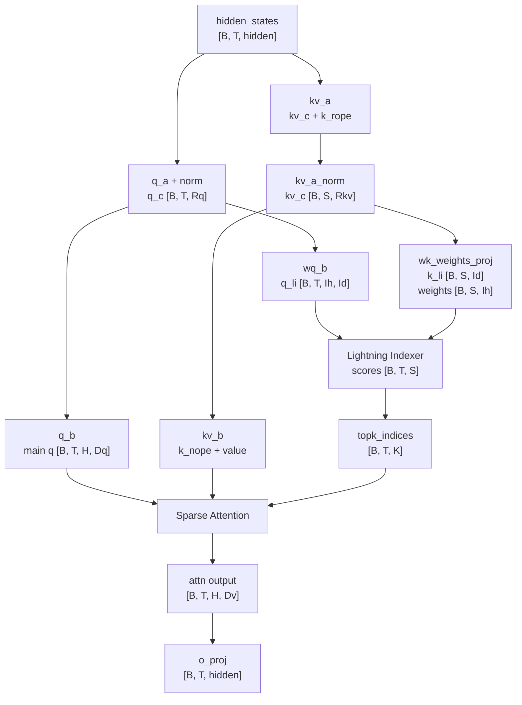
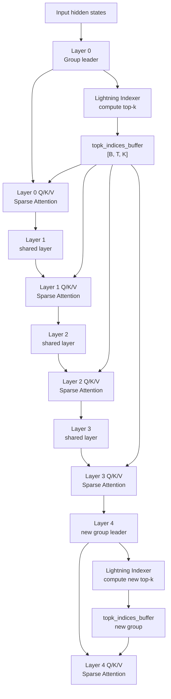
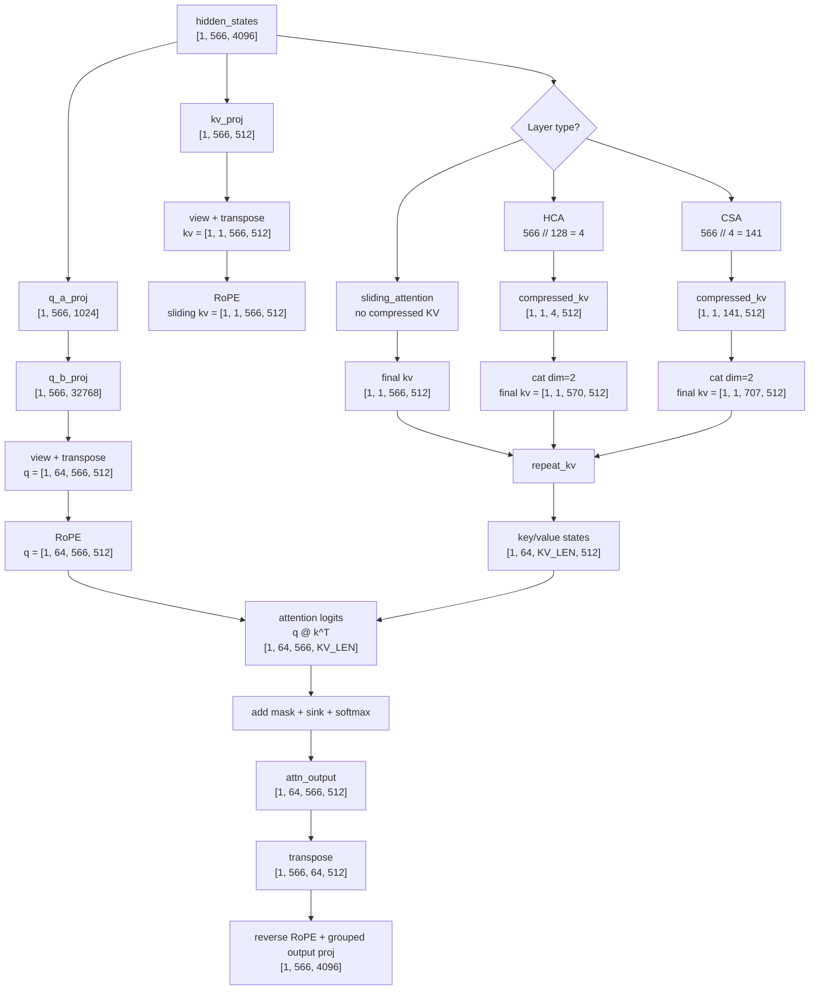
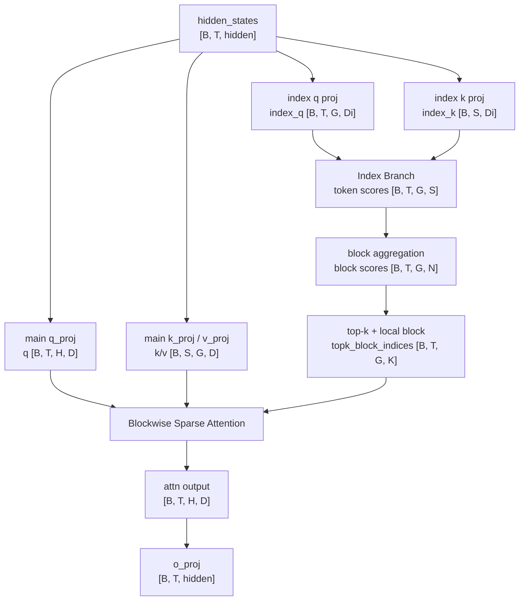

# Sparse Attention Notes

本文整理四类 sparse attention / long-context attention 结构：

1. 基础 DSA：DeepSeek-V3.2 / GLM-5 / GLM-5.1 的 MLA + Lightning Indexer + Sparse Attention。
2. GLM-5.2 DSA：在基础 DSA 上加入 IndexShare / idxcache，多层复用 top-k indices。
3. DeepSeek V4 attention：sliding window KV + HCA/CSA compressed KV。
4. MiniMax Sparse Attention：GQA group 粒度的 blockwise sparse attention，用 Index Branch 选择 top-k KV blocks。

重点关注 attention 中数据如何流动、shape 如何变化、mask 或 sparse index 如何约束可见性。

---

## 1. 基础 DSA：DeepSeek-V3.2 / GLM-5 / GLM-5.1

### 核心结论

基础 DSA 可以理解成：

```text
MLA projection + Lightning Indexer + Sparse Attention
```

它和 DeepSeek V4 的 compressed KV 方式不同。DeepSeek V4 是把 compressed KV 追加到 KV 序列后面；基础 DSA 则是先用 learned indexer 选出 top-k 历史 token，然后主 attention 只对这些 token 计算。

核心链路：

```text
hidden_states
  -> MLA 得到 q / k / v
  -> Lightning Indexer 给历史 token 打分
  -> topk_indices: [B, T, K]
  -> gather selected K/V
  -> sparse attention over K selected tokens
  -> o_proj
```

在 vLLM-Ascend 中，这条链路通常对应：

```text
npu_lightning_indexer
  -> topk_indices
  -> npu_sparse_flash_attention
```

DeepSeek-V3.2、GLM-5、GLM-5.1 主结构相同，差异主要在模型配置、RoPE 风格、GLM 的 `glm_moe_dsa` 分支以及工程算子细节。

### MLA 主路径

设：

```text
B = batch
T = query length / current sequence length
S = key length
H = main attention heads
K = top_k selected tokens
Dq = qk_nope_dim + qk_rope_dim
Dv = v_head_dim
R_q = q_lora_rank
R_kv = kv_lora_rank
```

输入：

```text
hidden_states: [B, T, hidden_size]
```

Q 路径：

```text
q_a(hidden_states)       -> [B, T, R_q]
q_a_norm                 -> [B, T, R_q]
q_b                      -> [B, T, H * Dq]
view                     -> [B, T, H, Dq]
split q_nope / q_rope    -> [B, T, H, qk_nope_dim], [B, T, H, qk_rope_dim]
RoPE(q_rope)             -> [B, T, H, qk_rope_dim]
```

KV 路径：

```text
kv_a(hidden_states)      -> [B, S, R_kv + qk_rope_dim]
split kv_c / k_rope      -> [B, S, R_kv], [B, S, qk_rope_dim]
kv_a_norm(kv_c)          -> [B, S, R_kv]
RoPE(k_rope)             -> [B, S, qk_rope_dim]
kv_b(kv_c)               -> [B, S, H * (qk_nope_dim + Dv)]
view                     -> [B, S, H, qk_nope_dim + Dv]
split k_nope / value     -> [B, S, H, qk_nope_dim], [B, S, H, Dv]
```

### Lightning Indexer

Lightning Indexer 用轻量的 indexer query/key 来选 token，而不是直接用主 attention 的 Q/K 做全量 attention。

常见形状：

```text
q_c: [B, T, R_q]
kv_c: [B, S, R_kv]
```

Indexer query：

```text
q_c -> wq_b                  -> [B, T, index_heads * index_dim]
view                         -> [B, T, index_heads, index_dim]
RoPE                         -> [B, T, index_heads, index_dim]
```

Indexer key 和 head weights：

```text
kv_c -> wk_weights_proj      -> [B, S, index_dim + index_heads]
split k_li / weights         -> [B, S, index_dim], [B, S, index_heads]
k_norm + RoPE(k_li)          -> [B, S, index_dim]
```

打分：

```text
q_li:       [B, T, index_heads, index_dim]
k_li:       [B, S, index_dim]
weights:    [B, S, index_heads]

head_scores = q_li @ k_li^T
head_scores: [B, T, index_heads, S]

weighted sum over index_heads
scores:      [B, T, S]
```

然后加 causal mask，选 top-k：

```text
topk_indices:   [B, T, K]
selected_valid: [B, T, K]
```

这里的 sparse 不是 block sparse mask，而是 token index sparse：每个 query token 只保留 K 个历史 token 位置。

### Sparse Attention

主 attention 只 gather `topk_indices` 指向的 K/V。

```text
k_nope:       [B, S, H, qk_nope_dim]
k_rope:       [B, S, qk_rope_dim]
value:        [B, S, H, Dv]
topk_indices: [B, T, K]
```

gather 后：

```text
k_nope_sel: [B, T, K, H, qk_nope_dim]
k_rope_sel: [B, T, K, H, qk_rope_dim]
v_sel:      [B, T, K, H, Dv]
```

拼出 selected key：

```text
q:     [B, T, H, Dq]
k_sel: [B, T, K, H, Dq]
```

attention：

```text
scores = q · k_sel
scores: [B, T, H, K]
prob:   [B, T, H, K]
out:    [B, T, H, Dv]
```

最后：

```text
reshape -> [B, T, H * Dv]
o_proj  -> [B, T, hidden_size]
```

### 数据流图



### 小 Shape 示例

假设：

```text
B = 1
T = S = 8
H = 2
Dq = 4
Dv = 4
index_heads = 2
index_dim = 4
top_k = 3
```

那么：

```text
q:             [1, 8, 2, 4]
k/value:       [1, 8, 2, 4]
q_li:          [1, 8, 2, 4]
k_li:          [1, 8, 4]
index scores:  [1, 8, 8]
topk_indices:  [1, 8, 3]

selected k:    [1, 8, 3, 2, 4]
selected v:    [1, 8, 3, 2, 4]
attn scores:   [1, 8, 2, 3]
attn output:   [1, 8, 2, 4]
final output:  [1, 8, hidden_size]
```

对比 dense causal attention：

```text
dense logits:  [B, H, T, S]
DSA logits:    [B, T, H, K]
```

当 `K << S` 时，主 attention 的计算和访存就从全历史变成 top-k selected history。

---

## 2. GLM-5.2 DSA：IndexShare / idxcache

### 核心结论

GLM-5.2 仍然是 DSA：

```text
Lightning Indexer + Sparse Attention
```

但它在基础 DSA 上加入了 IndexShare / idxcache：

```text
每 4 个 transformer layers 共享一份 top-k indices
```

也就是说，4 层中的第一层运行 lightning indexer，得到 `topk_indices`；后面 3 层不再重新跑 indexer，而是复用这份 indices。

关键点：

```text
复用的是 top-k token 的位置索引。
不是复用 attention output。
不是复用 K/V。
```

每一层仍然会根据自己的 hidden states 计算自己的 Q/K/V，并执行 sparse attention，只是省掉了部分层的 indexer dot product 和 top-k 操作。

### 和基础 DSA 的区别

基础 DSA：

```text
layer i:
  lightning_indexer -> topk_indices_i
  sparse_attention(topk_indices_i)
```

GLM-5.2 IndexShare：

```text
layer 0:
  lightning_indexer -> topk_indices_group0
  sparse_attention(topk_indices_group0)

layer 1:
  reuse topk_indices_group0
  sparse_attention(topk_indices_group0)

layer 2:
  reuse topk_indices_group0
  sparse_attention(topk_indices_group0)

layer 3:
  reuse topk_indices_group0
  sparse_attention(topk_indices_group0)

layer 4:
  lightning_indexer -> topk_indices_group1
  sparse_attention(topk_indices_group1)
```

工程实现中常见名字包括：

```text
skip_topk
topk_indices_buffer
use_index_cache
_get_indexcache_topk_indices
_update_indexcache_topk_indices
```

这些都指向同一个核心思想：部分层计算 top-k，其他层从 buffer/cache 复用 top-k。

### 单层 Shape

单层 sparse attention 的 shape 与基础 DSA 基本一致：

```text
hidden_states: [B, T, hidden]
q:             [B, T, H, D]
k:             [B, T, H, D]
v:             [B, T, H, D]
topk_indices:  [B, T, K]
selected k/v:  [B, T, K, H, D]
scores:        [B, T, H, K]
out:           [B, T, H, D]
output:        [B, T, hidden]
```

区别只在 `topk_indices` 的来源：

```text
Group leader layer: topk_indices = indexer(hidden_states)
Shared layer:       topk_indices = topk_indices_buffer[group_id]
```

### 4 层 Group 数据流



### Group 内部的执行模式

```text
Group: layers 4g, 4g+1, 4g+2, 4g+3

layer 4g:
  hidden_states
    -> lightning_indexer
    -> topk_indices_buffer
  hidden_states
    -> Q/K/V projection
    -> sparse_attention(topk_indices_buffer)

layer 4g+1:
  hidden_states
    -> Q/K/V projection
    -> sparse_attention(topk_indices_buffer)

layer 4g+2:
  hidden_states
    -> Q/K/V projection
    -> sparse_attention(topk_indices_buffer)

layer 4g+3:
  hidden_states
    -> Q/K/V projection
    -> sparse_attention(topk_indices_buffer)
```

### 小 Shape 示例

假设：

```text
B = 1
T = 8
num_layers = 8
index_share_group_size = 4
H = 2
D = 4
K = 3
```

执行模式：

```text
layer 0: run indexer  -> topk_indices [1, 8, 3]
layer 1: reuse layer0 -> topk_indices [1, 8, 3]
layer 2: reuse layer0 -> topk_indices [1, 8, 3]
layer 3: reuse layer0 -> topk_indices [1, 8, 3]

layer 4: run indexer  -> topk_indices [1, 8, 3]
layer 5: reuse layer4 -> topk_indices [1, 8, 3]
layer 6: reuse layer4 -> topk_indices [1, 8, 3]
layer 7: reuse layer4 -> topk_indices [1, 8, 3]
```

每一层自己的 attention shape 仍然是：

```text
q/k/v:          [1, 8, 2, 4]
selected k/v:   [1, 8, 3, 2, 4]
attn scores:    [1, 8, 2, 3]
attn output:    [1, 8, 2, 4]
```

### 计算意义

GLM-5.2 的优化重点不是改掉 sparse attention，而是降低 indexer 本身的成本。

```text
基础 DSA:
  每层都跑 indexer + top-k

GLM-5.2 IndexShare:
  4 层中只有 1 层跑 indexer + top-k
  后 3 层复用 topk_indices
```

因此大致可以省掉 3/4 的 indexer dot product 和 top-k 开销，但每层的 Q/K/V projection、selected K/V gather、sparse attention 仍然存在。

---

## 3. DeepSeek V4 Attention

### 核心结论

DeepSeek V4 的 attention 不是普通全量 causal attention，而是：

```text
局部 sliding attention + 压缩 KV attention
```

普通 token KV 和 compressed KV 会拼接到同一个 KV 序列维度上，然后一起进入 attention softmax。

默认配置大致是：

```text
sliding_window = 128
HCA compress_rate = 128
CSA compress_rate = 4
num_heads = 64
num_kv_heads = 1
head_dim = 512
```

KV 是 shared-KV MQA：

```text
q:  [B, H, S, D]
kv: [B, 1, T, D]
```

进入 attention 前，KV 会 repeat 到所有 query heads：

```text
kv -> [B, H, T, D]
```

### Sliding KV

sliding branch 只保留局部窗口：

```text
每个 token 最多看自己 + 前 127 个 token
```

decode 时，每加入一个新 token，最旧的 sliding KV 会被挤出 cache。

prefill 时，本次输入的完整 KV 会参与计算，但 mask 限制每个 query 只能看 sliding window 内的 token；cache 写回时仍只保留最近窗口，供后续 decode 用。

### Compressed KV

HCA 和 CSA 都会额外生成 compressed KV，并拼接到原始 KV 后面：

```python
kv = torch.cat([kv, compressed_kv], dim=2)
```

这里 `dim=2` 是 token/KV slot 维度。

HCA：

```text
每 128 token -> 1 个 compressed KV
未满 128 的尾段有 cache 时暂存在 buffer
```

CSA：

```text
每 4 token -> compressed entry
有效覆盖宽度约 8 token，步长 4 token
再由 Lightning Indexer 为每个 query 选 top-k compressed entries
```

compressed KV 和 sliding KV 不会在 tensor slot 上重叠，但语义上可能覆盖同一批 token。也就是说，最近 128 个 token 既可能以原始 KV 出现在 sliding window 中，也可能以压缩摘要形式出现在 CSA/HCA compressed KV 中。

### Mask 结构

拼接后的 mask 不再是单纯下三角矩阵，而是：

```text
[ sliding causal/local mask | compressed block mask ]
```

例如 HCA：

```text
原始 token mask:       [B, 1, S, S]
HCA block_bias:        [B, 1, S, C]
拼接后 attention mask: [B, 1, S, S + C]
```

前半部分是 sliding causal band，后半部分是 blockwise step mask。

### Shape 流动示例

假设 prefill：

```text
B = 1
S = 566
hidden_size = 4096
H = 64
D = 512
```



对应三种层的 `KV_LEN`：

```text
sliding_attention: KV_LEN = 566
HCA:               KV_LEN = 566 + 4   = 570
CSA:               KV_LEN = 566 + 141 = 707
```

### 小 Mask 示例

假设：

```text
seq_len = 8
sliding_window = 4
HCA compressed blocks = 2
c0 覆盖 k0..k3
c1 覆盖 k4..k7
```

拼接后 mask 是 `[8, 10]`：

```text
        k0   k1   k2   k3   k4   k5   k6   k7 |  c0   c1
q0       0 -inf -inf -inf -inf -inf -inf -inf | -inf -inf
q1       0    0 -inf -inf -inf -inf -inf -inf | -inf -inf
q2       0    0    0 -inf -inf -inf -inf -inf | -inf -inf
q3       0    0    0    0 -inf -inf -inf -inf |    0 -inf
q4    -inf    0    0    0    0 -inf -inf -inf |    0 -inf
q5    -inf -inf    0    0    0    0 -inf -inf |    0 -inf
q6    -inf -inf -inf    0    0    0    0 -inf |    0 -inf
q7    -inf -inf -inf -inf    0    0    0    0 |    0    0
```

整体 attention 是：局部 token-level 精细注意力，加上长程 block-level 压缩注意力，两者在同一个 softmax 里竞争权重。

---

## 4. MiniMax Sparse Attention

### 核心结论

MiniMax Sparse Attention（MSA）可以理解成：

```text
GQA Main Branch + lightweight Index Branch + blockwise sparse attention
```

论文：[MiniMax Sparse Attention](https://arxiv.org/abs/2606.13392)。

MSA 和基础 DSA 都是先用 indexer 找重要历史位置，再让主 attention 只看被选中的内容。关键区别是：

```text
基础 DSA:
  token-level top-k indices
  每个 query 选择 K 个历史 token

MSA:
  block-level top-k indices
  每个 query、每个 GQA group 选择 K 个 KV blocks
```

MSA 更偏 GPU 友好的 block sparse 设计：主 attention 仍然是精确 softmax attention，但 softmax 的可见范围被限制到被选中的 KV blocks，加上强制保留的 local block。

### GQA 主路径

设：

```text
B = batch
T = query length
S = key/value length
H = query heads
G = GQA groups / KV heads
R = heads per GQA group = H / G
D = head_dim
M = block_size
N = ceil(S / M)
K = selected top-k blocks
```

主 attention 的 Q/K/V 仍按 GQA 组织：

```text
hidden_states -> q_proj -> q: [B, T, H, D]
hidden_states -> k_proj -> k: [B, S, G, D]
hidden_states -> v_proj -> v: [B, S, G, D]
```

按 GQA group 看：

```text
q_group: [B, T, R, D]
k_group: [B, S, D]
v_group: [B, S, D]
```

如果是 dense GQA attention，每个 group 内的 R 个 query heads 会看同一组 KV：

```text
scores_dense: [B, T, R, S]
```

MSA 不改变 Q/K/V 的语义，只让每个 query 在每个 GQA group 内只看被选中的 KV blocks：

```text
selected_blocks: [B, T, G, K]
selected tokens: K * M
scores_sparse:   [B, T, R, K * M]
```

### Index Branch

Index Branch 是轻量的辅助分支，用来预测哪些 KV blocks 对当前 query 和当前 GQA group 重要。

常见形状可以抽象成：

```text
index_q: [B, T, G, D_i]
index_k: [B, S, D_i]
```

其中：

- `index_q` 按 GQA group 区分，每个 group 有自己的 index query 表示。
- `index_k` 是轻量 key 表示，可以被多个 group 共享。
- Index Branch 只负责选择 block，不直接产生最终 attention output。

token 级打分：

```text
index_scores_token = index_q @ index_k^T
index_scores_token: [B, T, G, S]
```

聚合成 block 分数：

```text
reshape S -> N blocks * M tokens

index_scores_block[b] = max(index_scores_token[j] for j in block_b and j <= query_pos)
index_scores_block:   [B, T, G, N]
```

也就是说，一个 block 是否重要，不看 block 内 token 分数的平均值，而是看这个 block 里所有 causally visible tokens 的最大 index score。只要 block 内有一个 token 对当前 query / GQA group 很重要，这个 block 就会被认为重要。

公式写法：

```text
S_idx[i, j, r] = Q_idx[i, r] · K_idx[j] / sqrt(D_i)

M_idx[i, b, r] = max_{j in block_b, j <= i} S_idx[i, j, r]
```

其中：

- `i` 是 query token 位置；
- `j` 是 key/value token 位置；
- `r` 是 GQA group；
- `b` 是 block index；
- 如果一个 block 内没有任何 `j <= i` 的可见 token，这个 block 分数为 `-inf`。

然后按 block 分数选 top-k blocks：

```text
topk_block_indices: [B, T, G, K]
```

local block 通常会被强制保留：

```text
selected_blocks = topk(index_scores_block, K) union local_block
```

这样可以避免 indexer 漏掉当前位置附近的高频短程依赖。

### 常见 Block 配置

MSA 论文中的部署配置是：

```text
block_size M = 128 tokens
K = 16 selected KV blocks
selected token budget = K * M = 2048 tokens / query / GQA group
```

论文也比较了 `M = 32 / 64 / 128`：

```text
M = 32:
  block 粒度更细，选择更精确，但 block 数更多，top-k / routing / metadata 开销更大。

M = 64:
  折中配置。

M = 128:
  粒度更粗，但更适合 GPU block-sparse kernel，MSA 最终采用这个量级。
```

这里的 `K = 16` 是总的 block budget，local block 包含在这个预算里，而不是额外再加一个 block。

### Blockwise Sparse Attention

主 attention 根据 `topk_block_indices` gather KV blocks：

```text
k:                  [B, S, G, D]
v:                  [B, S, G, D]
topk_block_indices: [B, T, G, K]
```

每个 block 有 M 个 token，因此 gather 后：

```text
k_sel: [B, T, G, K, M, D]
v_sel: [B, T, G, K, M, D]
```

把 group 内的 query heads 展开：

```text
q_group: [B, T, G, R, D]
k_sel:   [B, T, G, K * M, D]
v_sel:   [B, T, G, K * M, D]
```

attention：

```text
scores = q_group @ k_sel^T
scores: [B, T, G, R, K * M]
prob:   [B, T, G, R, K * M]
out:    [B, T, G, R, D]
```

最后 reshape 回普通 multi-head attention 输出：

```text
out -> [B, T, H, D] -> [B, T, H * D] -> o_proj
```

### 数据流图



### 小 Shape 示例

假设：

```text
B = 1
T = S = 16
H = 4
G = 2
R = 2
D = 4
block_size M = 4
N = 4 blocks
K = 2 selected blocks
```

主 Q/K/V：

```text
q: [1, 16, 4, 4]
k: [1, 16, 2, 4]
v: [1, 16, 2, 4]
```

Index Branch：

```text
index_q:            [1, 16, 2, Di]
index_k:            [1, 16, Di]
token scores:       [1, 16, 2, 16]
block scores:       [1, 16, 2, 4]
topk_block_indices: [1, 16, 2, 2]
```

Sparse attention：

```text
selected tokens per query/group = K * M = 8
scores_sparse: [1, 16, 2, 2, 8]
out_grouped:   [1, 16, 2, 2, 4]
out:           [1, 16, 4, 4]
```

这里 `[1, 16, 2, 2, 8]` 可以读成：

```text
[B, T, G, heads_per_group, selected_tokens]
```

也就是说，MSA 的选择粒度是 GQA group，而不是单个 query head；同一个 group 内的多个 query heads 共享 block selection，但 attention logits 和 softmax 仍按各自 query head 独立计算。

### 训练和工程意义

MSA 的 top-k block selection 不可导，因此训练时需要让 Index Branch 学会接近主 attention 的真实重要性分布。常见做法是：

```text
先用 full attention / dense teacher 得到参考 attention distribution
再用 KL alignment loss 训练 Index Branch
训练稳定后切换到 sparse attention
```

工程上，MSA 的优势不只是减少理论 FLOPs，还包括：

- block 粒度选择比 token 粒度更适合 GPU sparse attention kernel；
- GQA group 共享 block indices，减少 indexer 输出和 gather 元数据；
- local block 强制保留，降低近邻依赖被漏掉的风险；
- 主 attention 仍是精确 softmax，只是 softmax 的候选 KV slots 变少。

---

## 5. 四类 Attention 对比

| 类型 | 稀疏/压缩对象 | 主 attention 看什么 | 是否拼接 KV | 是否使用 learned indexer | 复用 top-k |
| --- | --- | --- | --- | --- | --- |
| 基础 DSA | 原始历史 token 的 top-k indices | top-k selected original tokens | 否，gather selected K/V | 是，每层运行 | 否 |
| GLM-5.2 DSA | 原始历史 token 的 top-k indices | top-k selected original tokens | 否，gather selected K/V | 是，但 group leader 才运行 | 是，每 4 层共享 |
| DeepSeek V4 HCA/CSA | 压缩后的 block KV | sliding KV + compressed KV | 是，拼到 KV token 维 | CSA 有 indexer 选 compressed entries；HCA 无 | 否 |
| MiniMax MSA | 原始历史 KV blocks 的 top-k block indices | top-k selected KV blocks + local block | 否，gather selected KV blocks | 是，Index Branch 选 blocks | GQA group 内共享 |

### 直观区别

基础 DSA：

```text
先选 token indices
=> 只 gather top-k token 做 sparse attention
```

GLM-5.2 DSA：

```text
先选 token indices
=> 4 层共享同一份 top-k indices
=> 每层仍用自己的 Q/K/V 做 sparse attention
```

DeepSeek V4：

```text
原始局部 token KV + 额外 compressed KV
=> 拼接后一起 softmax
```

MiniMax MSA：

```text
先选 KV block indices
=> GQA group 内共享 block selection
=> 主 attention 只对 selected blocks + local block 做 softmax
```

### Dense Attention vs 四类 Sparse Attention

```text
Dense causal attention:
  logits: [B, H, T, S]
  每个 query 对所有可见历史 token 打分

基础 DSA:
  index scores: [B, T, S]
  topk_indices: [B, T, K]
  main logits:  [B, T, H, K]

GLM-5.2 DSA:
  group leader 产生 topk_indices: [B, T, K]
  group 内各层 main logits:       [B, T, H, K]

DeepSeek V4:
  logits: [B, H, T, S_local + C]
  S_local 是 sliding window 或 prefill 中受 sliding mask 约束的 token KV
  C 是 HCA/CSA compressed KV 数量

MiniMax MSA:
  index token scores:  [B, T, G, S]
  index block scores:  [B, T, G, N]
  topk_block_indices:  [B, T, G, K]
  main logits grouped: [B, T, G, R, K * M]
```

### 总结

这四类方法都在减少长上下文 attention 的成本，但切入点不同：

```text
基础 DSA:
  用 learned indexer 从全历史中选 top-k token，主 attention 只算这些 token。

GLM-5.2 DSA:
  沿用 DSA，但把 top-k indices 缓存/共享到多个层，降低 indexer 开销。

DeepSeek V4:
  用 sliding window 保留局部精细信息，用 compressed KV 保留长程摘要。

MiniMax MSA:
  用 learned Index Branch 选择 top-k KV blocks，在 GQA group 粒度共享稀疏选择。
```

